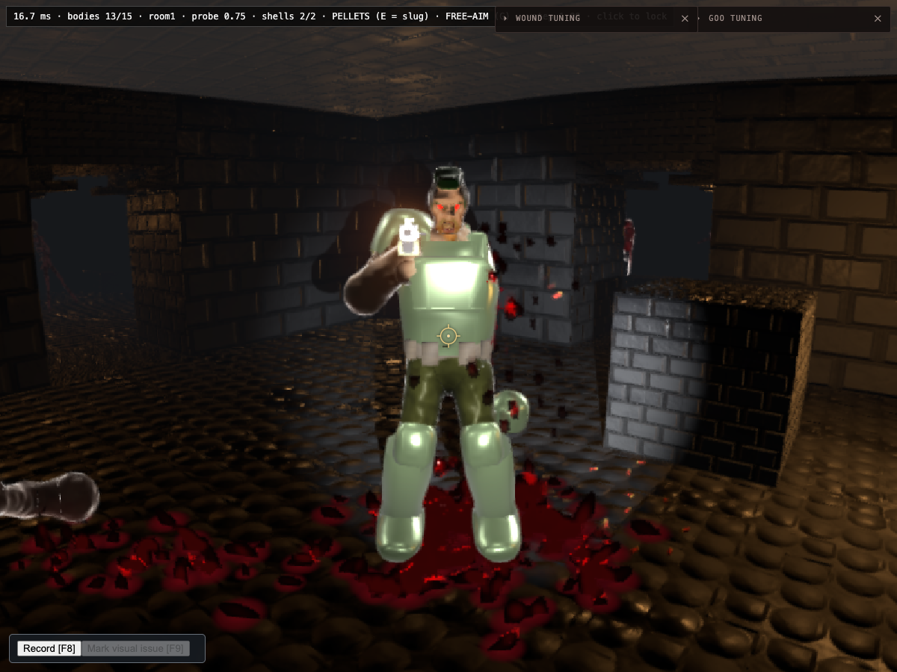
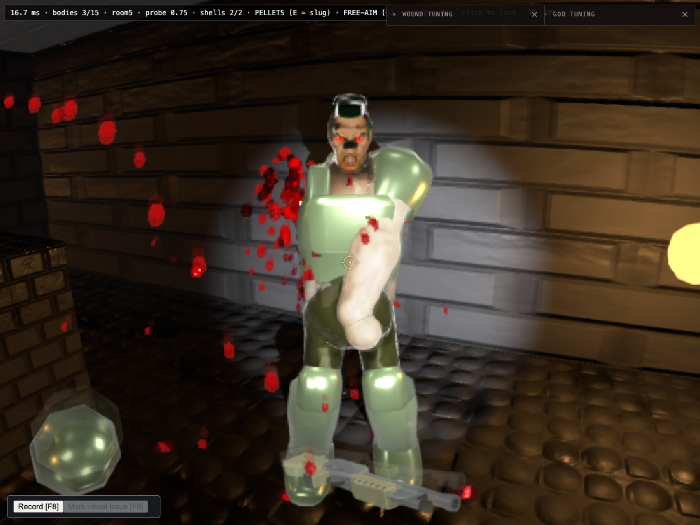
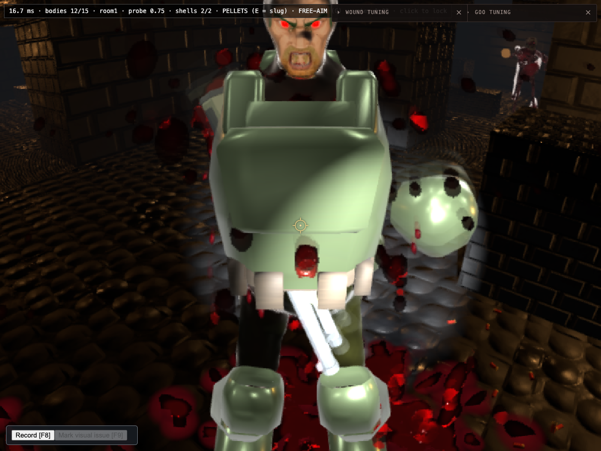

# Soldier reactions verification

Branch: `codex/soldier-reactions`, based on `7a5b65e3`.

## Combat checks

The parent agent ran 260 tests across the Soldier injury/brain, shared motion/attack, enemy mind, encounter director, actor, weapon, and explosion suites. All passed. These are deterministic logic checks, not a gameplay-quality or performance measurement.

Controlled browser checks used the active `/sdf-game.html` entrypoint, WebGPU, and the default mesh skeleton. The dedicated browser used port 9274; the isolated Vite preview used port 5274. Render counters in screenshots are not benchmark evidence.

- A slug head wound left a healthy Soldier standing. A real two-barrel trigger pull produced six head pellets from one shot, with both barrel indices represented, and the Soldier fell.
- Eight forearm hits removed the support arm; the Soldier stayed upright and continued firing one-handed. Subsequent gun-arm loss left him upright and produced a body-shove contact.
- Gun-arm loss alone produced a left-arm hook. Contact count changed from zero to one across the contact phase.
- A torso hit interrupted aim, displaced the gun and arms, and returned to aim. The gun remained attached to the right hand. An intermediate near-vertical barrel silhouette was identified for a recovery-path follow-up; there was no established head intersection.

These checks were made on the Task 1/2 increments before the final visual pass. Final visual checks are recorded separately below when complete.

## Combat captures

## Integration boundary

The active game has no player-health integration for existing enemy bullets. Disarmed attacks therefore emit a once-per-swing contact event with range, line-of-sight, and fatal-state gates; they do not introduce a health subsystem. The diagnostic contact count is exposed in `__sdfGame.brains()`.

## Final visual and build checks

Pending completion of the visual pass.
