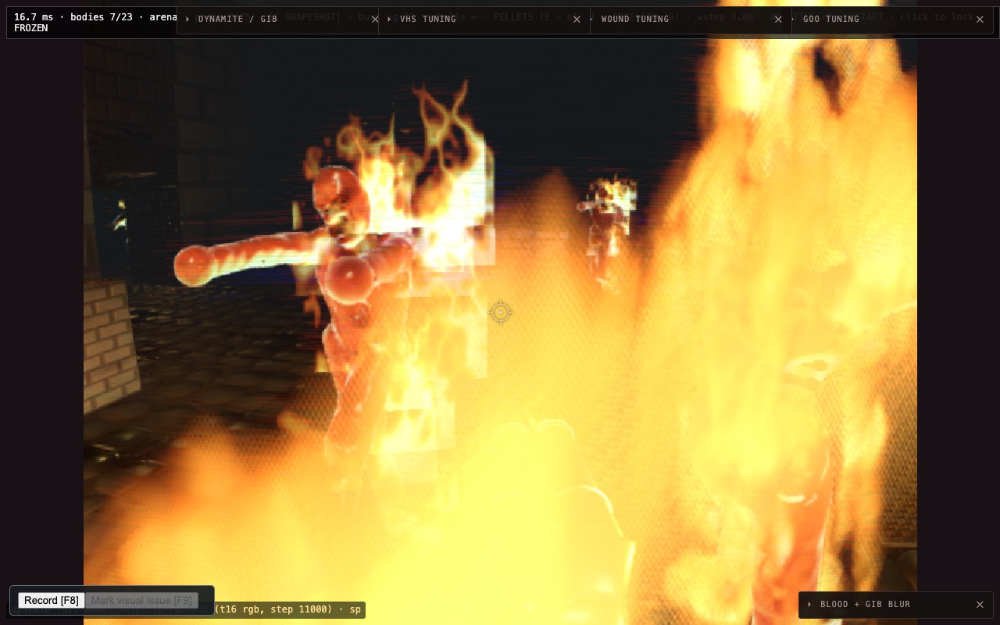

# The melee close-up harness (2026-09-21)

`scripts/sdf-game-melee-bench.sh` — the perf scene the owner says hurts in play: **several
zombies in melee range, wounded, on fire.** Started by a dispatch agent
(`zai/glm-5.3-flash:high`, hit its 60-minute cap with the staging broken), finished by hand.

```bash
LAB_VITE_PORT=5412 LAB_CDP_PORT=9412 scripts/sdf-game-melee-bench.sh
# A/B a seam without editing the script (a missing seam is skipped, not fatal):
MELEE_LEGS='gate=__sdfGame.setOwnerRefoldGate(true);mask=__sdfGame.setOwnerRefoldMask(true)' scripts/sdf-game-melee-bench.sh
```

Env: `MELEE_BODIES` (6), `MELEE_GATHER_RADIUS` (3.0 m), `MELEE_GATHER_FRAMES` (2400),
`MELEE_WOUNDS_PER_BODY` (6), `MELEE_FIRE_FRAMES` (45), `MELEE_REPS` (3), `MELEE_FRAMES` (60),
`MELEE_ROOM` (6, the arena), `MELEE_LEGS`, `BENCH_OUT` (`/tmp/sdf-melee`).
Outputs `melee.json`, `melee.md`, and a screenshot per phase.

## How the scene is built

The game builds it. The player is stood 0.9 m off the wall farthest from the arena's cast,
the cast is thawed, and the sim is stepped until 6 bodies have **walked** to within 3 m
(1140 frames with `?seed=1`; nearest 1.12 m). Then freeze, and a 7 x 3 yaw/pitch search keeps
the framing with the most flesh. Phases are sequential because wounds cannot be undone:
`clean` → `wounded` (6 planned stamps per body over chest/head/arm/thigh, stamped only when
the predicted hit is the intended body) → `wounded+fire`. Inside a phase the seam legs
alternate; each leg restores the boot state first. One page, `setFrameCap(0)`.

## First quiet-machine run (load 2.2-2.9) — [run-2026-09-21.md](run-2026-09-21.md)

| phase | frame p50 | `sdf:march` | walk only (`flat`) | re-fold off | fire march |
| --- | ---: | ---: | ---: | ---: | ---: |
| clean | 17.0 | 13.2 | 11.8 | — | — |
| wounded (3-4 rows/body) | 22.8 | 19.3 | 13.7 | 14.8 | — |
| wounded + fire | **36.7** | **27.7** | 22.3 | 25.2 | 5.1 |

- **It reproduces the problem:** 36.7 ms is over the 33.3 ms budget, against the owner's
  telemetry episode of march 28-38 ms. 
- Wounds: +6.1 ms of march for only 3-4 rows per body; **the owner re-fold is ~4.5 ms of it**.
- Fire costs twice: `post:fire-march` 5 ms, and the body march itself rises 19.3 → 27.7 ms
  once bodies burn (the walk-only leg rises too, 13.7 → 22.3 — it is in the field, not the
  shading). Not investigated. `compute:tile-bin` also appears at 2 ms in the ship leg only.
- Flesh covers only 11 % of the march target; 21 % is rasterised. **Rays that hit nothing
  take 46-50 % of all walk steps** here (32 % in the one-body scene).

## Traps found (all cost real time)

- **Bodies added after boot never march.** `spawnDebugCharacter` / `spawnCrowd` attach a new
  crowd type (`zombie@1:4` in `crowdInfo()`) but occupancy hits stayed bit-identical for
  170 s. The shipped game spawns everything at boot. The agent also saw one spawn zero the
  whole scene's hits in the arena; I did not reproduce that part. **Probably a real bug in the
  debug-spawn path since the defer-compile work** — `BENCH_CROWD` in `sdf-game-bench.mjs`
  depends on it.
- **`zombieNudge` is not a teleport.** It moves the sim position; a frozen cast pins the view
  upload, so flesh kept drawing at the boot position 6.6 m away. After a thaw the bodies drew
  as floating torsos at the wrong range. It is also `canTravel`-gated, so long hops refuse
  silently. Let bodies walk.
- **`applyShipDefaults` (closeup stage) is NOT the ship state** — it sets the march scale to
  1.0 and turns the hull exit bound off (it predates the upscaler). This bench uses the boot
  state and only zeroes `spillChance`.
- **Fire needs the sim running.** `igniteAll()` on a frozen cast tracks 23 burning bodies and
  renders no fire pass. The fire phase thaws 45 frames, holding the player, then re-freezes.
  Bodies move during that thaw, so compare legs INSIDE the fire phase, not across phases.
- **The mode-4 census reads 0 hits in the fire phase** (every rasterised pixel: steps 1,
  hit 0). The bench marks that census `unreliable` rather than printing 0 %. Unexplained.
- `Page.captureScreenshot` returns `result.data`; a backtick inside a page-side template
  string ends the template (twice).

## Not done

Only ~60 % of planned stamps land (3-4 rows per body, where a shotgun fight reaches the
16-row cap quickly); the scene is zombies only (the arena's boot cast); no gib/blood phase.
