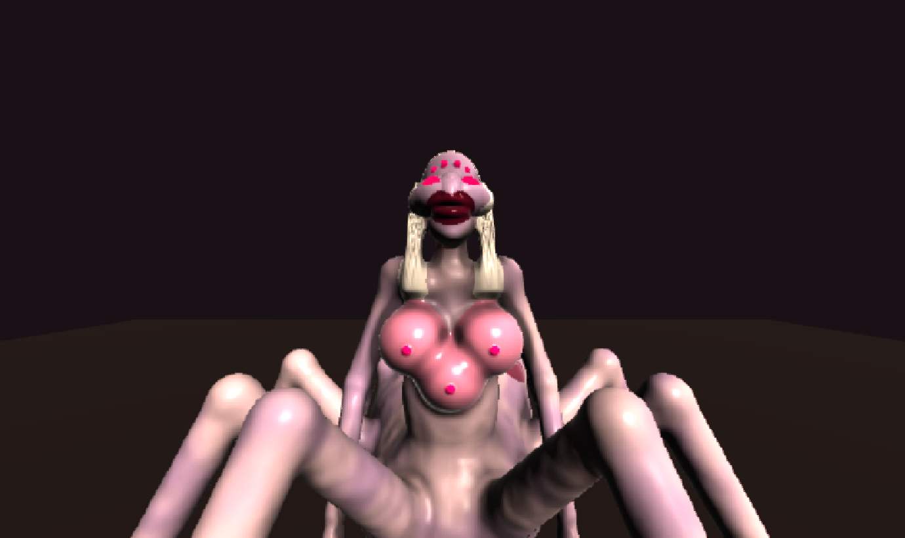
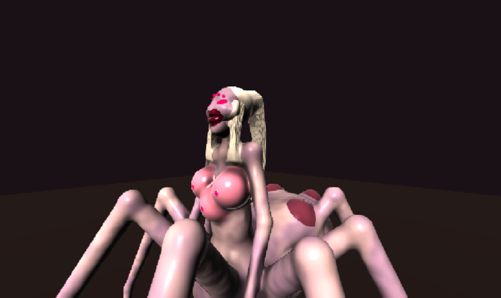
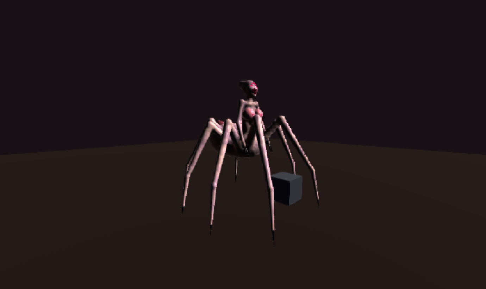
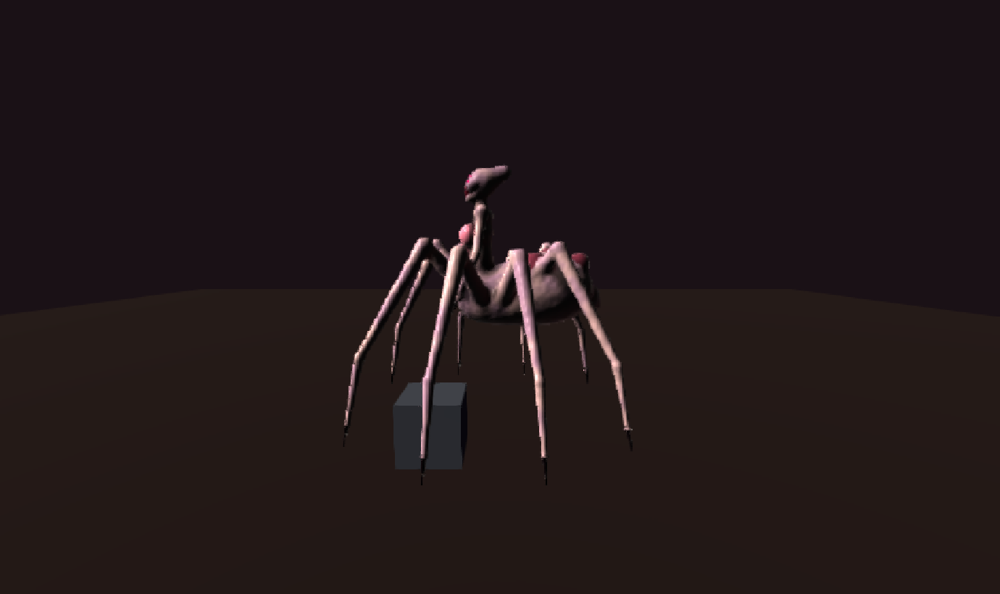

# Broodmother — spider-bodied temptress, first pass (2026-09-22)

Owner brief (prose, no reference): *"female enemy monster — she is like a bimbo so like big
mammary orb glands but like three of them. her face is grotesque but somewhat beautiful, big
lips but slim nose and glowing eyes. she is slim but the bottom half her body is like a spider.
its kinda like the vore from quake 1 but more fleshy. the purpose of this character is to
represent a certain psychosexual tension within the body horror motifs."*

## What exists

| Piece | Source | Built into |
| --- | --- | --- |
| SDF body (88 flesh prims + 36 bone = 124 of 128) | `src/lab/sdf-zombie/characters/broodmother.blob` | runtime (Blobforge) |
| Registry entry (flesh only, no kit, no decal) | `src/lab/sdf-zombie/character-registry.ts` | lab / game |
| Tests (14) | `src/lab/sdf-zombie/characters/broodmother-blob.test.ts` | |

Look at her: `npm run dev`, then `/sdf-lab-webgpu.html?character=broodmother`, or
`npm run blob:shot -- broodmother`. The lab's front is **yaw 0** for her, and it is the unlit
side by default. These frames were lit with
`BLOB_PROBE="(window.__sdfLab.uniforms.lightDir.value.set(0.35,0.6,0.72), 1)"`.

## Design: the tension is the brief

Every beat is **attractive at the top and wrong by the second look**. Neither half wins.

1. **Hourglass on eight legs.** Wasp waist (semi 0.095) between a narrow ribcage (0.13) and
   flared hips (0.16). The hips do not end in legs: they melt into a cephalothorax. Her torso is
   long (spine 0.32 + chest 0.27) so the whole bust clears the knee crowns.
2. **Three orbs**, two high and one lower in the middle. A triangle, because a row of three
   merges into one bolster on a slim ribcage. Taut, glossy, flushed paint (overstretched skin),
   and each carries a small glowing **gland pore** in the eyes' magenta, so the eye moves
   between face and chest.
3. **The face is beautiful in its parts and wrong in its sum.** A fine chamfered nose, high
   sharp cheekbones and a pointed chin sit on a narrow jaw. Against that go lips too full and
   too wide for the face (dark wet plum), slanted glowing almond eyes, **four spider eyes**
   beaded across the forehead, and a bald cranium swept back into a crest. Every feature is a
   prim. The face block is a nub and the generated sheet is **off** (`sheet enabled 0`).
4. **Fleshy legs, not the Vore's chitin.** Spider geometry: femur up to a knee at y ~1.3,
   tibia down, tarsus to a point. The legs are skin, with swollen knuckles (each segment starts
   fatter than the last one ended), and only the last 28% of each foot is a dark nail.
5. **An egg-sac abdomen** behind her, with a pedicel waist and three congested pustules pushing
   out. There is also a blunt spinneret.

6. **Hair (owner ask, same day): platinum, on `strand=` hairlock prims** (schoolgirl-described's
   road: a mass for the volume, strands for every hanging edge). The crest is painted as a
   slicked-back ponytail root, with a scalp cap set back behind the spider eyes. A 10-strand
   ponytail falls 0.45 m down her back, and two 6-strand locks frame the face down to the
   collarbones, stopping above the orbs. `c9b99a` rendered gold after the sRGB lift, so the
   colour is now `ddd6cc`. Four prims, no bones (the skull bone is authored).

Palette: cool porcelain-grey skin, a bruise-**violet** mottle, high translucency and wetness.

## Things found on the way

- **The 128-prim ceiling is flesh + bone.** The first pass (7 prims a leg, with separate coxa
  and knuckle balls) came to 106 flesh + 68 derived bone = 174. What fixed it:
  - legs down to 4 prims, with the knuckles built into the tapers;
  - leg nails under half their tarsus radius, so `deriveBones` (MASS_FRACTION 0.5) grows no
    bone in them;
  - torso bones authored (3, where auto-derive would make ~9, including a bone in every orb);
  - one authored bone each on `upperArm` and `femur2`. An authored bone replaces derivation
    for its whole bone name (`build-body.ts`).
- **Fuse probes start at the cluster core's centre.** With a femur bar as `core`, the probe
  began mid-air beside the knee and reported both leg clusters "disconnected". One coxa ball
  on leg2, marked `core` and seated in the cephalothorax, fixed it. The test also pins every
  socket-to-centre segment inside flesh, because `fusedOf` only probes the core.
- **Another session's Vite on the default lab port serves ITS checkout.** `blob:shot` and
  `blob:render-check` "reuse" any server already on 5233, or on whatever `LAB_VITE_PORT`
  names. Twice this session another worktree owned that port, so the lab rendered that
  checkout's zombie and reported the zombie's bone-containment errors as hers. Check
  `lsof -a -p $(lsof -ti tcp:<port> -sTCP:LISTEN) -d cwd` before believing a lab error that
  the offline build does not reproduce. Use an unusual `LAB_VITE_PORT`/`LAB_CDP_PORT`.
- **No sheet block means the default sheet**, and on a prim face it paints white greasepaint
  round the eyes. `sheet` / `enabled 0` turns it off in both the lab and the game.
- Paint that is too warm reads as a costume. The first orb paint (`d9a3a0`) went ORANGE
  against the cool skin, and saturated pustules (`8a3a44`) read as stickers. Both are now her
  own skin tone, flushed.

## Open / next

- **She does not walk.** `gait.ts` `jointNamesForBody` knows humanoid hip/knee/foot only, so
  the spider bones map to no gait joint and she is static in the lab. Next job: a spider gait,
  meaning an alternating-tetrapod leg cycle (L1 R2 L3 R4 against R1 L2 R3 L4) with a small body
  bob, the torso swaying counter to it, and the arms reaching.
- A faint silver seam outlines each painted orb where the paint boundary crosses the blend.
- From behind, the pustules and spinneret on the abdomen can read as a face. That may be a
  feature. Decide on purpose.
- From the front, the high cheekbones over a narrow jaw read as a slight shelf at eye level.
  They were already pulled in once (`wide` 1.35 -> 1.10). Pull them further if it reads as a
  mushroom cap rather than as sharp.
- Not done: attacks, sounds, a brain, gib tuning, and a spawn in `sdf-game.html`.
