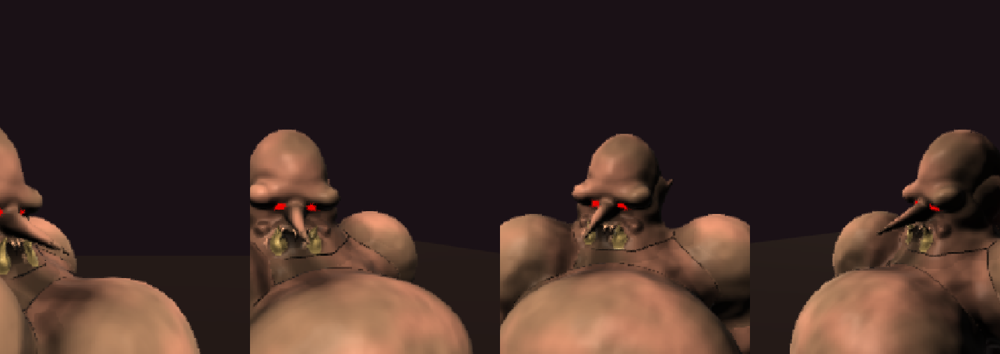
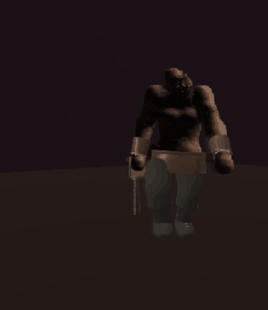
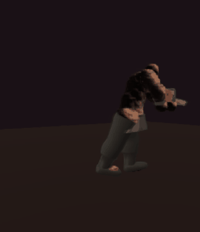
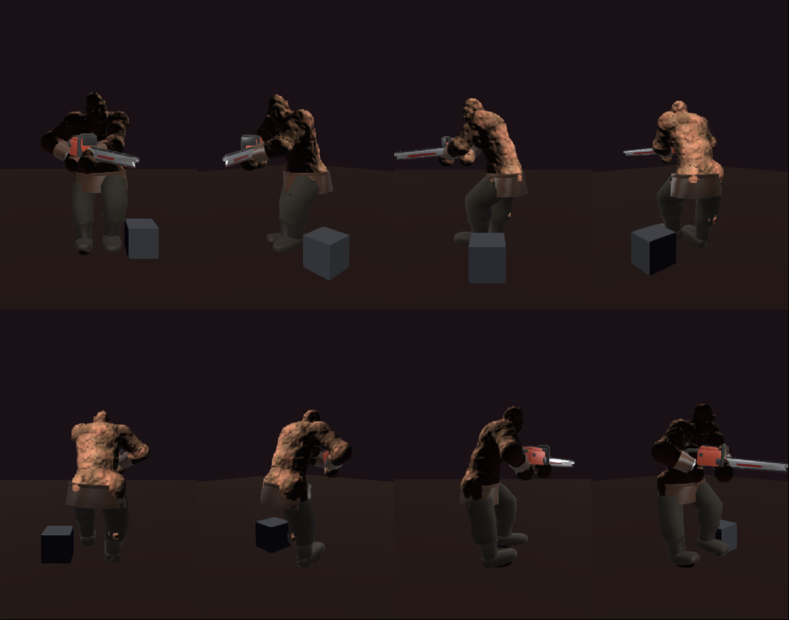
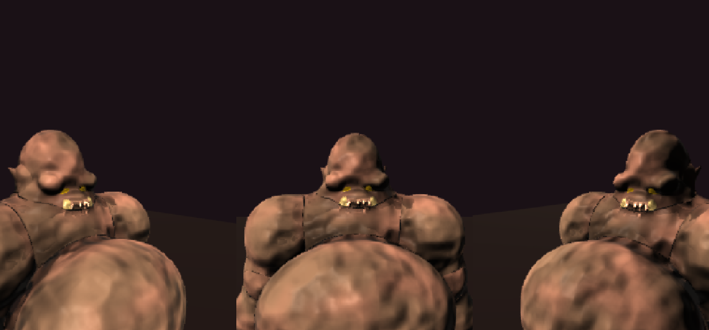
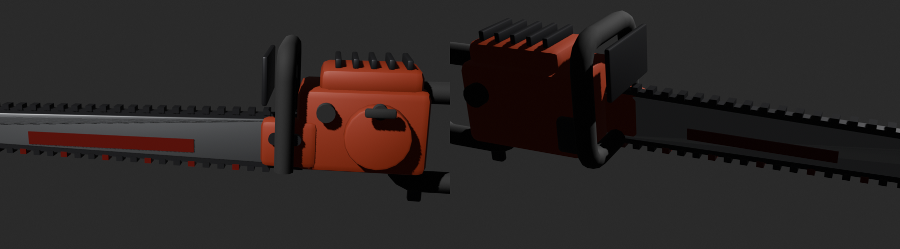
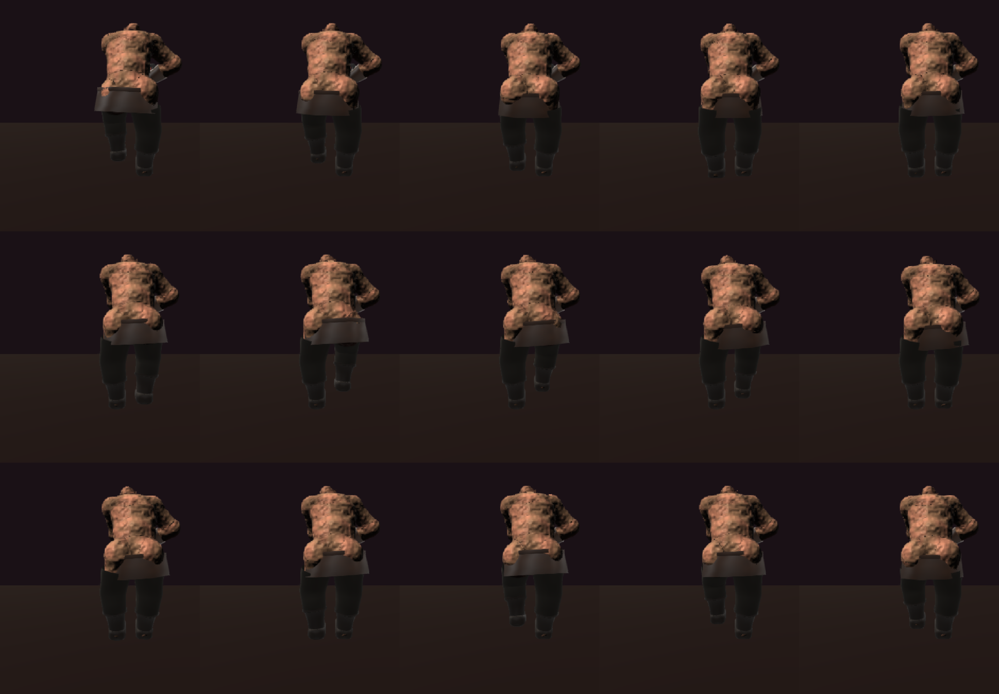

# Ogre — chainsaw brute, first pass (2026-09-22)

Owner brief (prose, no reference): *"basically like the chainsaw ogre from Quake 1 — a big
brutish hunk of primordial flesh hunched over lugging a big chainsaw. Body and flesh SDF, kit
and chainsaw mesh. Goal is the base character and maybe a basic walk cycle."*

## What exists

| Piece | Source | Built into |
| --- | --- | --- |
| SDF body (44 prims) | `src/lab/sdf-zombie/characters/ogre.blob` | runtime (Blobforge) |
| Mouth decal | `scripts/make-ogre-face.py` (PIL, original art) | `public/assets/lab/faces/ogre-face.png` |
| Kit: belt+buckle, hide kilt, breeches, boots, bracers | `characters/ogre-kit.wam` | `scripts/build-wam-kit.sh ogre` → `public/assets/lab/ogre-kit.gltf` |
| Chainsaw prop | `scripts/make-ogre-chainsaw.py` (Blender, headless) | `public/assets/lab/ogre-chainsaw.glb` |
| Walk: `STOMP` gait + `saw` carry + `OGRE_PROFILE` | `gait.ts`, `carry.ts`, `motion-profile.ts` | runtime |
| Tests | `characters/ogre-blob.test.ts` (18), `characters/ogre-kit.test.ts` (7) | |

Look at it: `npm run dev` then `/sdf-lab-webgpu.html?character=ogre` (lab), or
`npm run blob:shot -- ogre` (turntable). Regenerate assets:

```
python3 scripts/make-ogre-face.py
scripts/build-wam-kit.sh ogre
blender -b --factory-startup --python scripts/make-ogre-chainsaw.py
```

## Design (the three beats — full reasoning is in the .blob header)

1. **Hunch** — spine/chest pitched 20°/28° (world), neck forward 32°, skull tipped back. The
   face hangs ~0.5 m ahead of the hips. Low and ape-like ON PURPOSE (owner likes it; a 14°/18°
   "less gorilla" stoop was tried the same day and reverted). The yoke is kept FLAT so the face
   clears it; the hide's noise was halved so it reads as skin, not fur.
2. **Yoke** — a trapezius mass wider than the pelvis; the small bullet head sits set into it.
3. **Arms** — ham forearms, jaw-sized fists, LONG ape arms (0.46 + 0.46 m, fists near the
   knees) — "he should in some ways knuckle drag".

Face: all structure is prims (bullet cranium, underbite jaw, brow shelf, long pointed nose, thick parted lips, cheek slabs,
pointed ears, two ivory tusks, two glowing red emissive eyes); the decal carries only the
grimace. Eyes are RED at glow 0.9. The nose is a long pointed goblin-style spike run nearly
horizontal (the first hooked try dropped onto the mouth). The lips are two bent bars, parted,
the lower one fatter (underbite) — UNPAINTED: see "renderer bug" below. Palette: sickly tan with
grey-green bruise mottle.



## Walk cycle

He **drags the chainsaw behind him one-handed** (the Quake ogre's walk). The saw is a held prop
on the soldier's carry machinery with a new ONE-HANDED `drag` carry: the right fist holds the
rear handle beside his hip, the bar trails back and down outboard of the right leg with its nose
near the floor, and the left arm is free and swings counter to the left leg. The first pass held
it two-handed like a gun (`saw` carry, still in carry.ts for a future attack raise).

`STOMP` is procedural (no clip): 0.8 Hz, long stance, high knee, deep bob, a side roll with the
shoulders following. Measured on the CPU with real travel: ~1 m foot range, 16 cm lift.



Earlier two-handed version, for comparison:



**`holdPose('walk')` marches IN PLACE for every character** (no travel, so planted feet never
slide back) — judge a procedural gait from live wander, not from `BLOB_POSE=walk` stills.





## Things found on the way

- **One-handed carries needed three motion-layer additions** (carry.ts / motion.ts):
  `oneHanded` (skip the left-hand FABRIK, swing the free arm), a per-carry `rightPole` for the
  elbow swivel, and both flags carried through the per-frame carry smoothing (which rebuilt the
  spec field by field and silently dropped them).
- **The drag's fist left the handle by 20-25 cm, for three different reasons in turn:** the arm
  hung dead straight at full reach (any verlet shoulder drift showed at the fist), the grip sat
  inside the thigh-root flesh (body collision shoved the fist forward), and the default
  out-down elbow pole swivelled a near-straight arm into hyperextension, which the rig's elbow
  limit clamps. Fixed with a kept elbow bend, a fist >= 12 cm clear of the flesh, and
  `rightPole` pointing the elbow BACK. Now 2 mm.
- **Renderer bug: paint does not follow a large bend.** A painted (`color=`) bar with a 3.6 cm
  bow on a 1.6 cm radius painted only its two END caps (four dark balls at the mouth corners);
  the CPU field and the same prim UNPAINTED both have the full curve. The lips ship unpainted.
- **`low` carry is not portable.** Carry angles are relative to the AUTHORED arm hang; the
  ogre's forearms hang 30° forward, so the soldier's `low` lifted the saw to his face. `saw` was
  grid-solved against the ogre rig for grip-at-belly, bar level and angled across the body,
  and the hoop within the left arm's reach.
- **Kit skeleton drift is silent.** Lengthening the .blob's arms without the .wam put the kit's
  wrists 60 mm off. `ogre-kit.test.ts` now pins every kit bone head within 10 mm of the .blob's.
- **Kit sized to the wrong cluster.** The belt/kilt were first sized to the torso cluster; the
  thigh-root masses are the widest flesh at hip height and stood 66 mm through. The test caught it.
- **Dark kit albedos render as silver** under `LOOK_DEFAULT` (env 0.9, rough 0.35): added
  `cloth` / `boot` looks to `kit-overlay.ts`.
- **`follow=thigh` split the kilt** at the crotch in the lab (rig pose ≠ bind). Kilt is rigid.
- **Turntable framing for held poses:** `blob-turntable.mjs` now re-runs `focusBody()` after a
  non-rest pose; before, a walk pose was framed ~1 m off-centre.
- **Lab front is yaw 180, and it is the unlit side** — frames here were lit with
  `BLOB_PROBE="(window.__sdfLab.uniforms.lightDir.value.set(0.45,0.72,-0.53), 1)"`.

## Fixed after the first look (same day)

- **Calf through the breeches, from behind, mid-stride.** At rest a ray probe from the shin axis
  found >= 8 mm of cloth over the flesh in every direction, so it was a MOTION-only gap at the
  breeches-hem / boot-cuff join. Fix: deeper BACK half (`dbot`) on the knee-to-hem and cuff
  rings, and 12-sided rings there. A back-view strip across a full stride shows no flesh.
- **Kilt V at the back hem.** Gone with the belt/kilt refit to the thigh-root width (the kilt now
  clears the trailing thigh); confirmed on the same back-view strip.

## Open / next

- From behind, the thigh-root masses read as two lobes (buttocks) sitting ABOVE the belt. Either
  raise the belt onto the spine bone or shrink/lower the thigh-root blobs.
- In the hunch, the yoke and chest hide much of the mouth/lips from above head height. A longer
  neck (pushing the head further out) would show more face without losing the hunch.
- The saw nose floats a few cm off the floor rather than scraping it (arm-reach limited); a
  floor-contact clamp on the prop, or tilting it with the ground, would make it truly drag.
- The gut reads as a separate ball from some angles; a bigger `blend` on it or a flank prim.
- Not done by design: attacks (chainsaw swing, the grenade launcher), sounds, gameplay/brain,
  gibbing tuning, a spawn in `sdf-game.html`. He uses the default brain via the registry.


