# Cultist — cloaked zombie + SDF-cloth viability spike (2026-09-23)

Owner brief (prose, left running overnight): *"one of the schoolgirls has her clothes as an SDF
cloth that can be animated fairly easily, like blowing in the wind — could that tech make a cloaked
zombie figure, basically like the cultists in Blood/NBlood?"*

**Short answer: yes.** A whole robed costume (hood, cowl, floor-length skirt, bell cuffs) builds
out of the existing `shell` primitive, and it animates convincingly. That took three small engine
additions, because the schoolgirl's cloth had only ever been trim on a figure standing still.

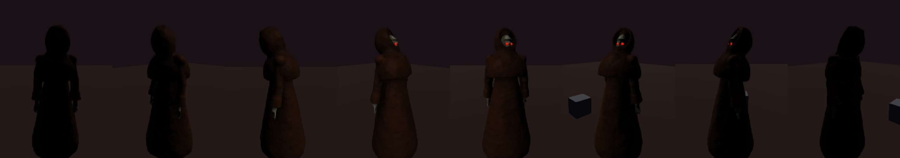
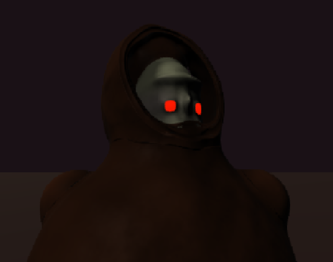

## Face pass 2 (same day)

Owner: *"the eyes are positioned too low relative to the brow ... a bit featureless ... a big pointy
nose (see goblin or the ogre)"*. The face block now provides only the gaunt head and jaw masses
(`browHeavy`/`noseLength` 0). Every feature is an authored prim, placed against the face
ellipsoid's surface:

- **Brow:** two chamfered arches making a scowl V. The single straight ridge read as a cap brim.
- **Eyes:** raised 2.4 cm so they sit 1.5 cm under the brow instead of 6 cm, and set in dark
  painted sockets.
- **Nose:** long, hooked and pointed, the goblin/ogre spike, reaching 11.5 cm forward. It pokes out of
  the hood opening, so from the side the silhouette reads hood, then nose.
- **Cheekbones:** gaunt. **Mouth:** a thin dark slit, mostly lost in the hood's shadow.

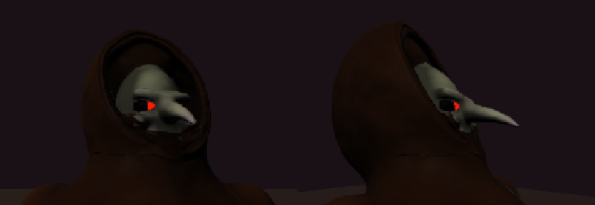
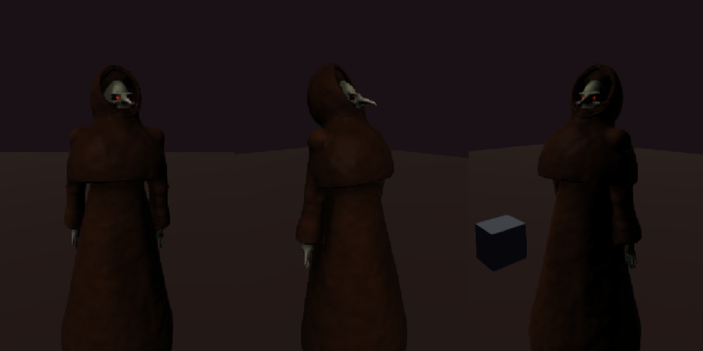

## Face pass 3: jaw, teeth, hood and cowl opening (same day)

Owner: *"add some teeth and a heavier jaw ... most of his lower face is hidden by the bottom of the
hood or cloak."*

- **Jaw:** the face-block jaw is wider, taller, lower and further forward (jawWidth 0.86, jawHeight 0.92,
  jawDrop 0.082, jawJut 0.050), with a flattened chin shelf.
- **Mouth:** a dark gap bowed with the jaw.
- **Teeth:** four snaggled pairs, two hanging down and two jutting up from the underbite, in dirty
  ivory. Eight thin clean-ivory teeth read as one yellow clump.
- **What was hiding the lower face:**
  - Mostly the **cowl**. Its neck opening rose to y 1.57, and the head bows (chin posed at y ~1.49),
    so the chin sank into it. The cowl now starts 5.5 cm lower and 2.5 cm further back, and still
    covers the shoulders.
  - Partly the **hood**. Its opening plane was tipped back, which kept the hood's under-chin bowl in
    front of the jaw. It now leans forward 20° at the top: the brim still overhangs the brow, and the
    bottom is cut back behind the jaw.

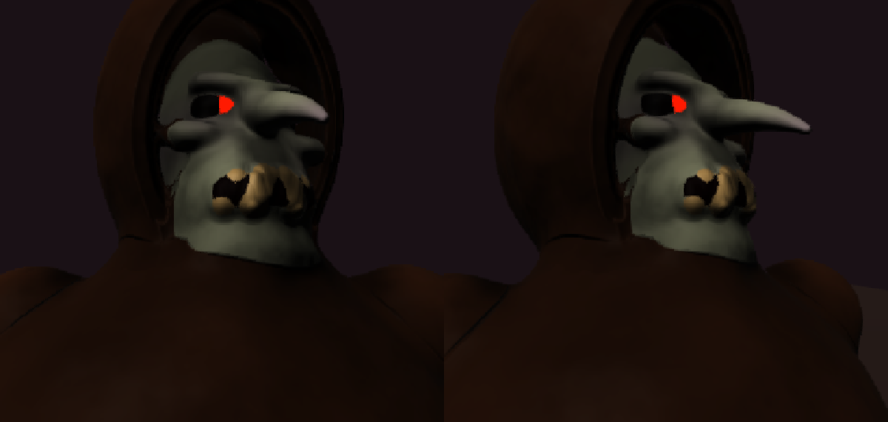
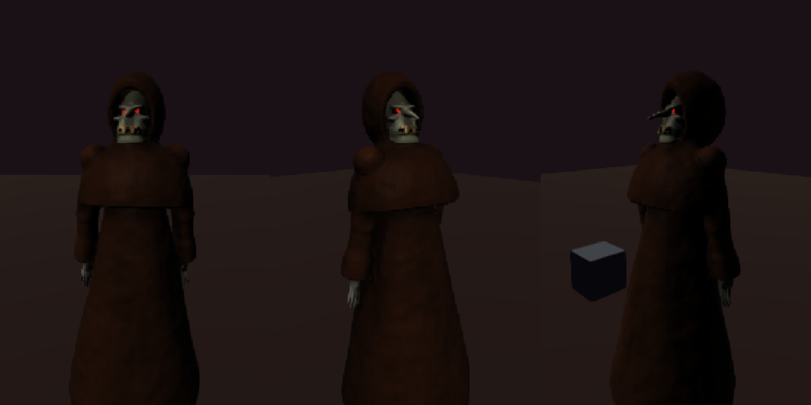

## Tan robes + two variants (same day)

- **Robe colour:** khaki tan `6e5c40` on both (owner: "a more tan colour, like Blood's cultists, to
  make him easier to see"). `a08058` read as bright orange after the sRGB lift.
- **Two variants, both kept (owner):**
  - `cultist`: the jaw-and-teeth head with the lowered cowl. Its shoulder balls were shrunk to 0.062,
    because at the lighter colour they stood out of the cowl as round epaulettes.
  - `cultist-cowled`: face pass 2, with the high cowl and the back-tipped hood hiding the lower face.
  - Same body, cloth and pendulum; tests pin the shared parts.

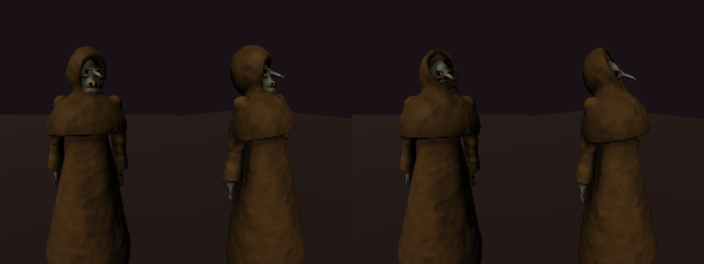

## Cloth hit reactions (2026-09-23)

Owner: *"a pistol or SMG will just make a small hole or bullet decal on the clothes, but a large
shotgun slug would actually reveal wounds ... it's all about differing visceral effects."*

**The rendering trick:** the renderer barely needed anything new. A wound already carves the
blended body, cloth and flesh together, so a hit through a thin robe sheet already cut a real hole.
What was wrong was the shading: paint overwrote the crater. Four changes fixed it:

1. **Paint yields inside a wound** (`paint-char.wgsl.ts`). Inside the lip you see the wound; just
   outside it the paint is scorched to 28% (a frayed edge); beyond that the paint is untouched. Metal
   is exempt. This applies to every painted prim, since a painted limb is "cloth" to a player.
2. **`clothifyWound`** (`damage.ts`) is a stamp-time rewrite for hits on cloth (a shell, or a
   painted non-metal, non-glowing prim):
   - `heavy` (shotgun pellets, the slug): a ragged edge, marked `tear`, gore unchanged. The wound
     shows through.
   - `small` (pistol/SMG; none exist in the game yet): shrunk to a 1.4 cm bullet hole, no lip, no
     cavity or spill, marked `hole`. The GPU gets a hole bit (flags.x bit 1) and shades the inside
     near-black: a punched hole, not a pale pit. `registerBleed` skips the trickle and gout for a
     hole.
3. **Size-scaled carve fillet.** The global 1.5 cm blend dissolved about 5 cm of an 8 mm sheet round
   a small wound. `k` now scales with `clamp(r/0.05, 0.1, 1)`, so every stock profile (≥ 5 cm) is
   unchanged. It is mirrored in `normal-gradient.wgsl.ts`, `humanoid.wgsl.ts` and the soundness
   test's CPU mirror, which now also checks a bullet-hole case.
4. **Hem kick.** A hit on the skirt shoves the hem pendulum (`kickHem`) as well as the nearest joint,
   so the robe jerks.

**Lab controls:**
- Click = pellet tear; Shift-click = blast/slug.
- Ctrl-click = small-calibre bullet hole (a preview of the SMG look).
- `__sdfLab.wound(n, seed, type, 'small')` stamps from the console, and `BLOB_WOUND_CALIBRE=small`
  does the same for turntables.

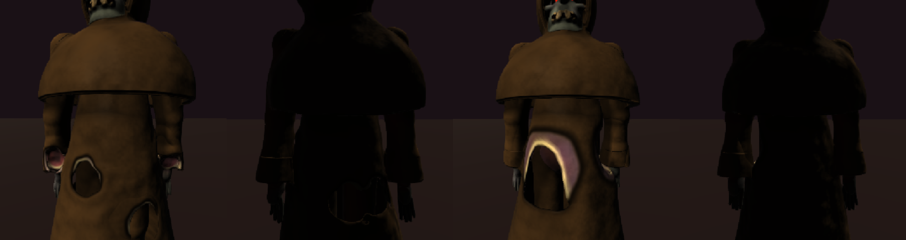
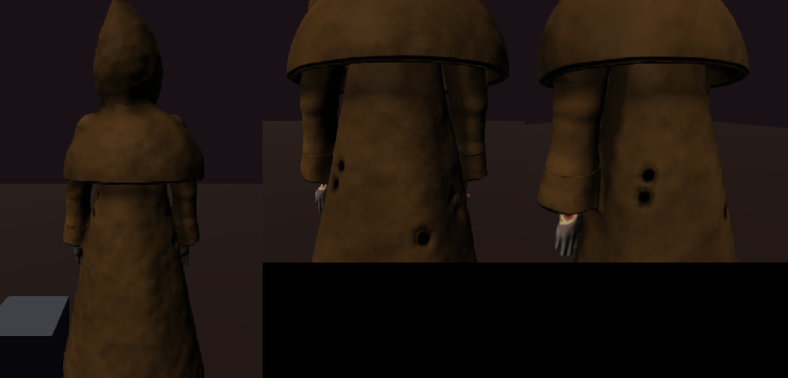

Still to come with the SMG: a cloth-fibre puff in place of the blood gout for holes. Also, 16 wound
slots per body will fill fast under SMG fire (the oldest holes vanish).

## The tommy gun (2026-09-23)

The cultist is now a ranged enemy with a Thompson-style SMG.

- **Model:** `scripts/model-cultist-smg.py` (headless Blender, based on the soldier-shotgun script)
  builds `public/assets/lab/cultist-smg.glb`: finned barrel, Cutts compensator, 50-round drum,
  vertical foregrip, walnut furniture, 1,876 triangles. It is built around the shared `GUN_GRIP`
  hand points: the rear grip takes the right hand and the foregrip top takes the left.
  - The steel is dark and only half metallic, because the held-prop environment map turned a 0.70
    metallic into bright silver.
- **Carry:**
  - `GLIDE_CARRY` gait: the carry table only engages when the *gait* has
    `armStyle: 'carry'`; `MotionProfile.armStyle` is never read.
  - Carries: `low` when walking, `aim` when firing. On his arm hang, `aim` measures +4° barrel pitch.
  - `gripReach` is 0.02, because his fist is authored past the wrist.
- **Brain:** a new `MotionProfile.gunner: { weapon }` field says "this enemy shoots"; a prop alone
  doesn't, since the ogre's chainsaw is a prop. The game gives gunners the soldier's brain, on
  `SMG_TUNING` for the cultist:
  - Up to 7 rounds a burst at about 7 rounds/s, then a longer settle and cooldown.
  - 7 m range; he prefers to stand 3.4 m off.
- **Recoil climb:** each fire kick lifts the gun, and the first bursts walked into the ceiling. The
  barrel still climbs on screen, but SMG rounds now keep the gun's heading (the aim error, so they can
  miss sideways) while their vertical comes from the player's chest height.
- **Game generalisations** (these were soldier-only):
  - Spawning keys off `profile.gunner`.
  - The gun re-seats onto the solved hand, honouring `gripReach`.
  - `canHold` (no right arm, no gun).
  - Gib set and burn kit radius key off the character name, not the brain.
  - Every non-zombie uses its own `.blob` palette and sheet settings. Without this the cultist
    played in the game as wet black latex wearing the zombie's painted face.
- **Playtest:** `sdf-game.html?spawn=cultist` makes every zombie slot a cultist. Room 1's only slot is
  the soldier, so teleport to room 2 (`__sdfGame.teleport(2)`). `__sdfGame.spawnDebugCharacter('cultist')`
  also works now.

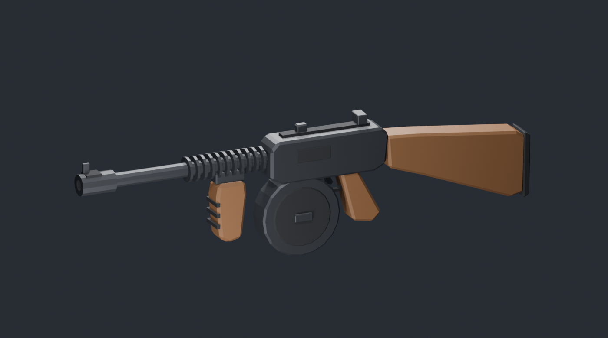
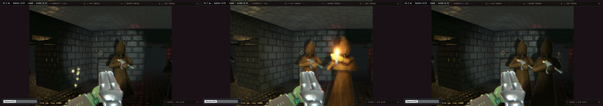

**Not done:**
- Enemy rounds still hit nothing: the player has no health yet (soldier included).
- No gunshot sound (no enemy audio exists).
- No shell casings (soldier-only).
- The aim hold's left hand sometimes reaches past the foregrip. A cultist-solved `aim` carry is the
  next polish.

## Fixed 2026-09-24: faceless cultists in the game

**Symptom (owner):** in the game the cultists had no faces, as if facing backwards. The hood rendered
CLOSED, with only the nose tip poking through.

**Cause:** `translate.ts` `translateBody`, which moves a body to its spawn point, shifted every
endpoint, cluster and bone, but not shell clip planes. Every garment in the game was therefore cut by
a plane still at the origin. The lab never translates its body, so it never showed there. The
schoolgirl's collar and skirt had the same latent bug in any room away from the origin.

**Fix:** the plane offset moves by `dot(n, offset)`. `translate.test.ts` checks that the translated
field equals the shifted rest field exactly, and fires a ray at the eye of a cultist placed in a room.

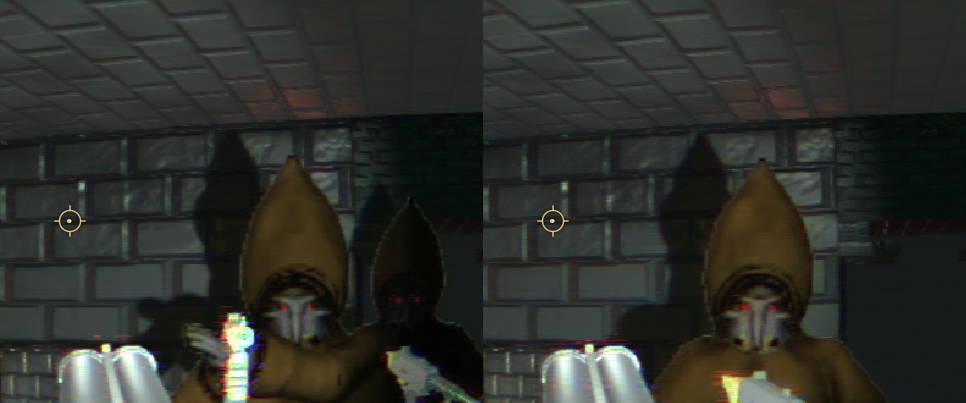

## What exists

| Piece | Where |
| --- | --- |
| Character (flesh + 5 shell garments, 44 prims, zombie skeleton + `hem` bone) | `src/lab/sdf-zombie/characters/cultist.blob` |
| Registry entry, `CULTIST_PROFILE` + `GLIDE` gait | `character-registry.ts`, `motion-profile.ts`, `gait.ts` |
| Tests (11): costume, rigging, swing under real motion, knees vs skirt, wind | `characters/cultist-blob.test.ts` |
| Shell clip planes follow the pose (test) | `rig-bind.ts` `poseShellPlane`, `rig-bind.test.ts` |
| Live wander/wind capture tool | `scripts/cloth-capture.sh` / `.mjs` |

Look at it: `npm run dev`, then `/sdf-lab-webgpu.html?character=cultist`. In the console,
`__sdfLab.setWind(0.8, 0, 0)` starts a gusting breeze; `setWind(0,0,0)` stops it.

## How the cloth works

1. **Garments are shells.** `abs(base) - thick` off a closed capsule, cut by one plane with a rounded
   rim. The hood is a hollow ellipsoid opened at the front, and the face sits inside it. The skirt is
   a hollow flared cone. The cowl is a round cone cut at the chest. The cuffs are flared cones cut
   past the wrist.
2. **Cloth that tracks a limb exactly is paint, not a shell.** The torso, sleeves and legs are the
   flesh prims painted robe colour. When a leg pushes against the skirt, it reads as fabric bulging.
3. **The skirt swings on a pendulum.** The new `bone hem parent=pelvis dir=down` is a real rig point:
   - Its gait target gets the hips' bob but never their sway (`gait.ts` joint `'hem'`).
   - It springs to that target at `HEM_REST_SCALE` = 0.15 of a joint's stiffness (the new per-point
     `RigState.restScale`).

   The skirt rides it as one piece via the new `rigid` word. Result: the waist sways over a hem
   that lags, trails when he sets off, overshoots when he stops, and settles in about a second.
   There is no cloth solver: it is one Verlet point on the rig that already exists.
4. **Wind** does two things:
   - It still scrolls the fold pattern (`warp=`, the schoolgirl's mechanism).
   - It now also pushes the pendulum: `RigState.clothForce`, applied only to loose points and gusted
     in the lab by two sines. At 0.8 m/s the skirt leans 3–10° downwind and breathes with the gusts.

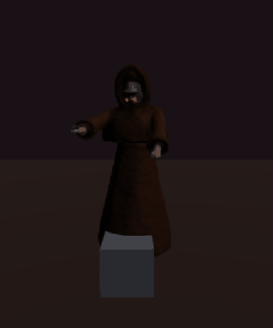 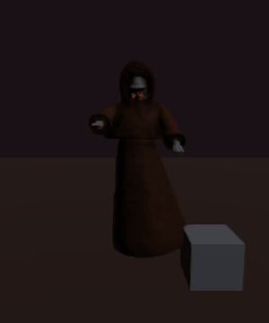

## Engine changes (all opt-in, zero effect on existing characters: 5271/5271 sdf-zombie tests)

- **Shell clip planes now follow the pose** (`rig-bind.ts` `poseShellPlane`). Before, they were packed in
  rest space regardless of the pose. A hood's face opening kept facing rest +z when the body turned,
  and a z-plane (the schoolgirl's collar) was wrong on any turned body. At rest the plane is
  bit-identical.
- **`rigid` bare word** on a prim: both ends ride the bone it is declared `on`, turned by that bone's
  segment rotation. Without it, each end binds to its NEAREST joint, so a floor-length skirt's hem
  end bound to an ankle.
- **`hem` gait joint + `RigState.restScale` + `RigState.clothForce`.** Any character can have a
  cloth pendulum by adding a `hem` bone. `bindRig` makes its tail loose.
- **`GLIDE` gait**: the shamble with short, low steps (see below).

## Things found on the way

- **Legs through the robe.** On the zombie shamble, a knee reached **13.7 cm** outside the skirt cone
  mid-stride. Side-on frames showed a thigh and shin breaking the cloth (`legs-shamble-pokethrough.gif`).
  `GLIDE` (stride 0.18, foot lift 0.06, no knee lift) plus a deeper skirt brought the knee joint
  within **1.7 cm**, which renders as a robe-coloured knee bulge (`legs-glide.gif`). The gliding step
  is also the creepier read. Pinned in the test (< 3 cm).
- **A clip plane that cuts nothing.** The first cowl was a squat ellipsoid whose bottom sat above its
  own clip plane, so it rendered as a closed saucer round the neck. Check `clipd` against the base's
  real extent.
- **Cloth needs a matte palette.** The latex preset turned wool into black vinyl. The palette is now
  clay-like: spec 0.18, roughness 0.8, wetness 0.15.
- **No shadow ray.** The hood cannot shade the face (AO only), so a pale face glows inside the cowl.
  The skin was darkened to compensate. It still reads a little mask-like close up.
- **Motion joints are all-or-nothing.** Any rig point without a gait name makes `makeMotionJoints`
  return null, and the character loses ALL motion. That is why `hem` had to become a real
  `GaitJointName`. A future "free" joint class would avoid this.

## Cost

`benchGpu`, single body, full-frame at 2.2 m, 1280×800, medians of 3:

| zombie | cultist | cultist, no shells | schoolgirl | ogre |
| --- | --- | --- | --- | --- |
| 8.4 ms | 24–30 ms | 16.7 ms | 17–22 ms | 35–38 ms |

- The cultist costs about 3× the zombie at close range, which is inside the cast's range.
- The shells account for about 8 ms. The skirt is the biggest single piece (about 5 ms; it covers the
  most pixels).
- Neither the fold warps nor the skirt being hollow changes the cost: a SOLID cone skirt benches the
  same.
- Caveat: the GPU heats during a run (the zombie drifted 8.4 → 10–12 ms on a rerun), so per-garment
  numbers are ±3 ms.

## Open / next

- Perf: the whole body, not only the cloth, is 2× the zombie. Worth a `gDebugMode` step-count
  heatmap before a crowd of cultists.
- One pendulum = one rigid cone tilting. A second pendulum (front/back panels), or bending the skirt
  axis (`bend=` driven by the lag), would give real hem flare rather than tilt.
- The game page has no wind (only the lab's `setWind`). `clothForce` is ready for a level-driven wind.
- Face: still pale under a close key light, because there is no shadow ray.
- **Cloth hit reactions (design needed):** today a shot on the robe carves the FLESH crater (red
  interior) into an 8 mm sheet. See TASKS.md.
- Not done: attacks (Blood cultists shoot: tommy gun / shotgun on the soldier's carry machinery),
  brain, sounds, gib tuning, spawn in `sdf-game.html`.
- The shell cuffs use `rigid` on the forearm; hands come out of them cleanly in all frames seen.
  Not stress-tested under the reach pose's extreme angles.
