# Bride — sword enemy, Task 1: the flesh body (2026-09-24)

Spec: `docs/superpowers/specs/2026-09-24-bride-sword-enemy-design.md`.
Body: `src/lab/sdf-zombie/characters/bride.blob` (the header is the design brief).
Pins: `src/lab/sdf-zombie/characters/bride-blob.test.ts`.

Flesh only. No shells, hair, kit, sword or face sheet yet (Tasks 2-5).

## Numbers (CPU field, `sdBody` probes)

| What | Value | Spec |
| --- | --- | --- |
| Prims | 73 flesh + 27 bone = 100 | ≤ 108 (128 − 20 for Task 3's cloth) |
| Flesh crown | 1.814 m | ~1.85 once the hair and veil are on |
| Hip joint / height | 1.04 / 1.814 = 0.57 | ≥ 0.54 |
| Waist half-width | 0.086 | ≤ 0.095 |
| Hip half-width | 0.171 | ~0.16 (must stay < 0.18, or the hips touch the forearms) |
| Thigh | 0.068 semi at the root, 0.052 at mid-thigh, 0.035 at the knee | a woman's taper (look pass) |
| Neck bone | 0.140 m | ≥ 0.13 |
| Forearm R − L | 0.04 m (0.30 vs 0.26) | > 0.03 |

## Frames

Shot with `LAB_TMP=.lab-tmp LAB_VITE_PORT=5271 LAB_CDP_PORT=9271 npm run blob:shot -- bride`.
The probe was `BLOB_PROBE="(window.__sdfLab.uniforms.lightDir.value.set(0.35,0.6,0.72), 1)"`
(the broodmother's light). **Yaw 0 is her face** (frame 00 of 8), as the broodmother notes
say. Earlier passes shot at yaw 180 with the light's z negated. That was a lab bug, not a
convention; see "Second look pass" below.

- **Use private ports.** Another worktree's Vite was already on 5233. `lab-servers.sh`
  reuses any listener, so the first "bride" shot was that checkout's zombie.
  Sanity-shoot `cultist` on the same ports first.

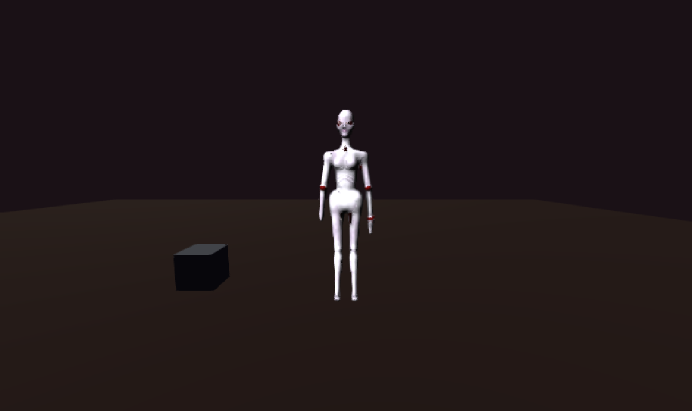 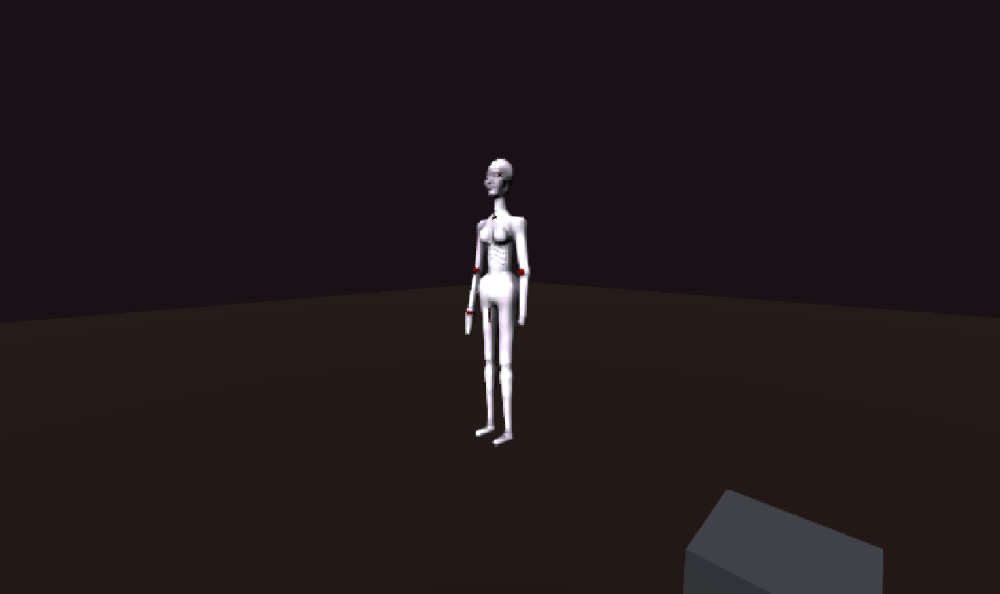 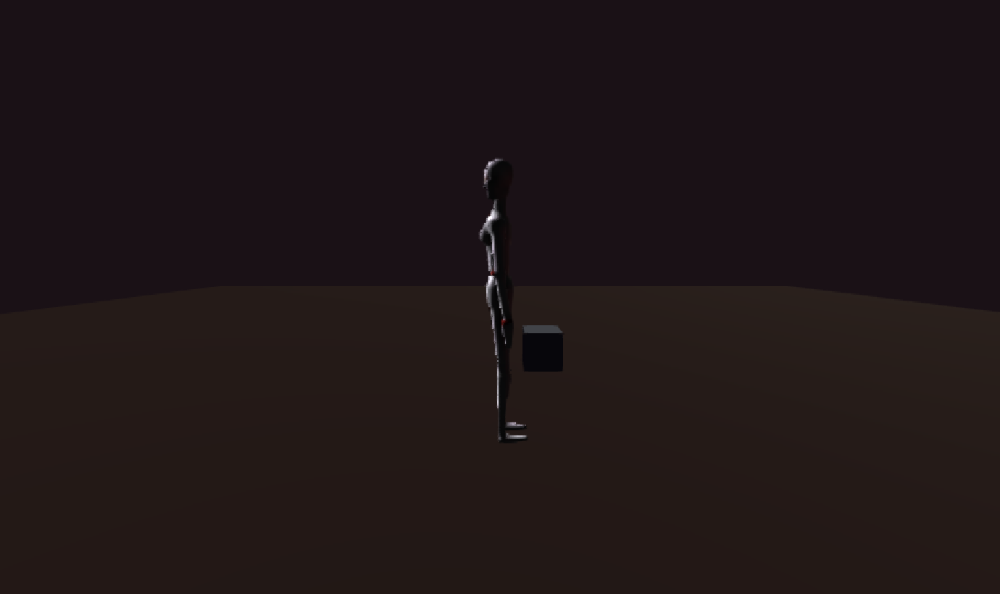 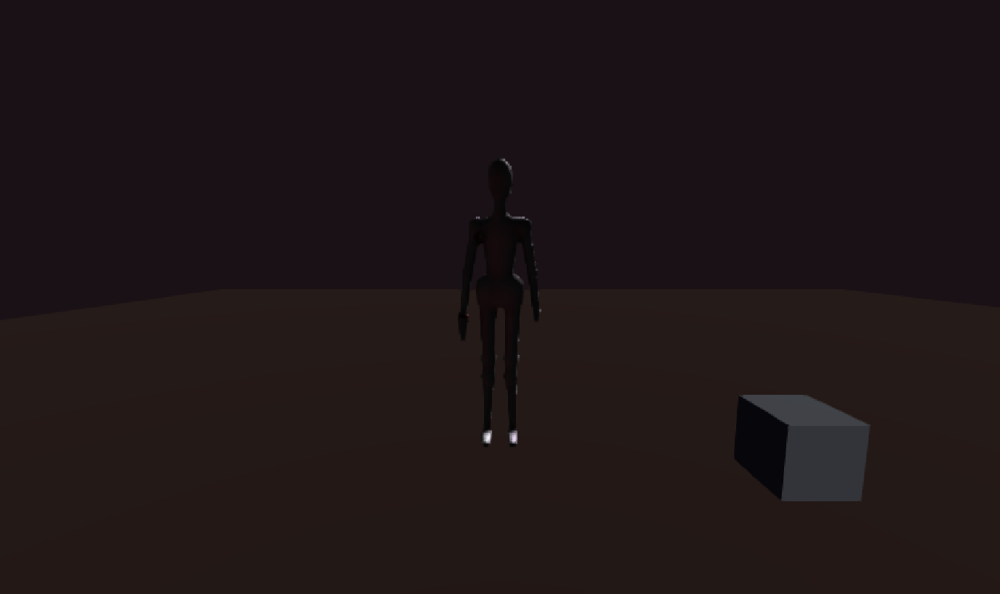
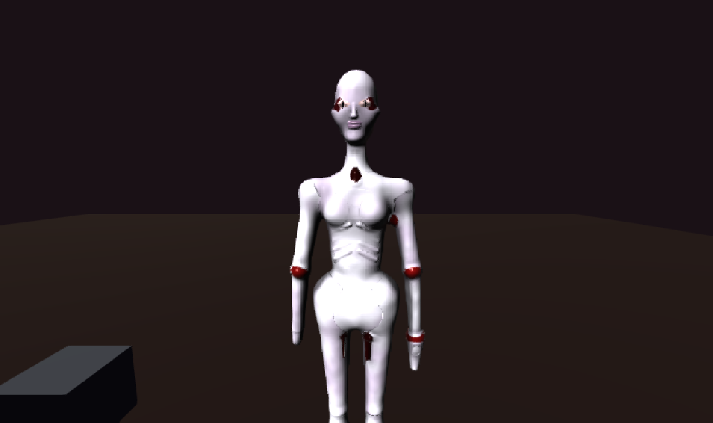 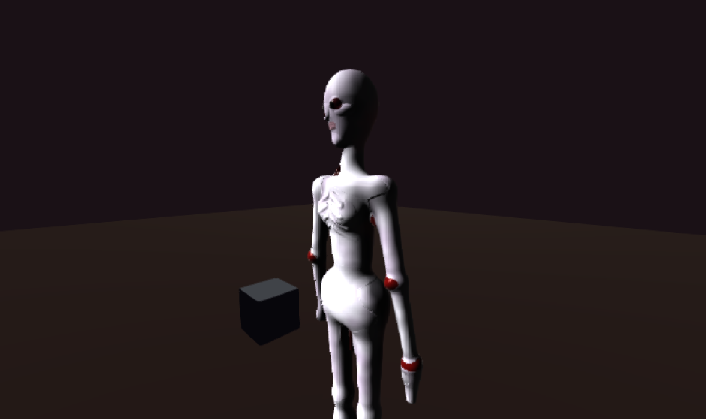 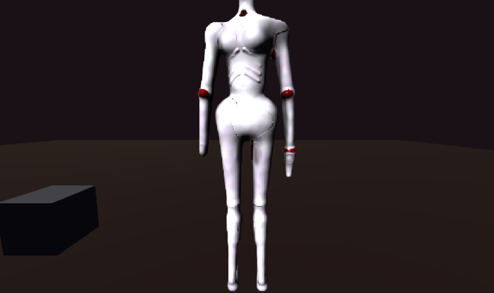
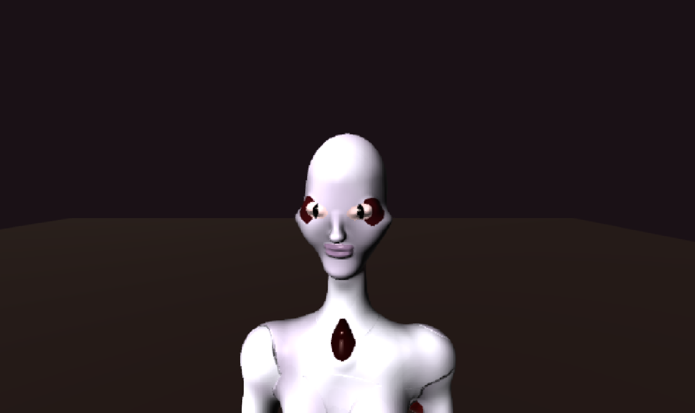 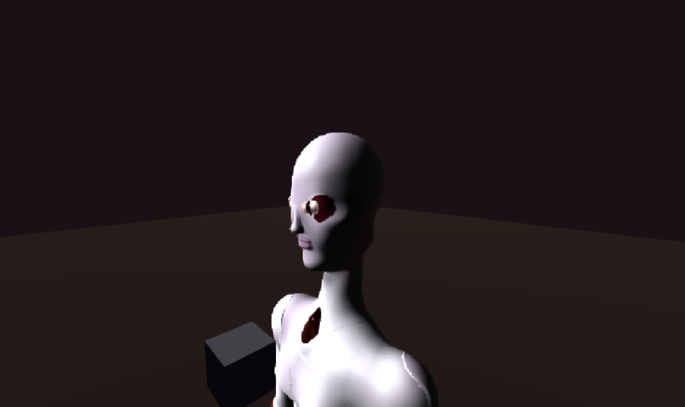 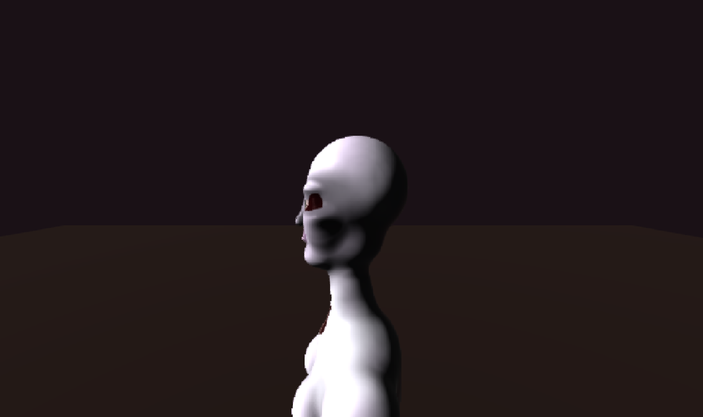 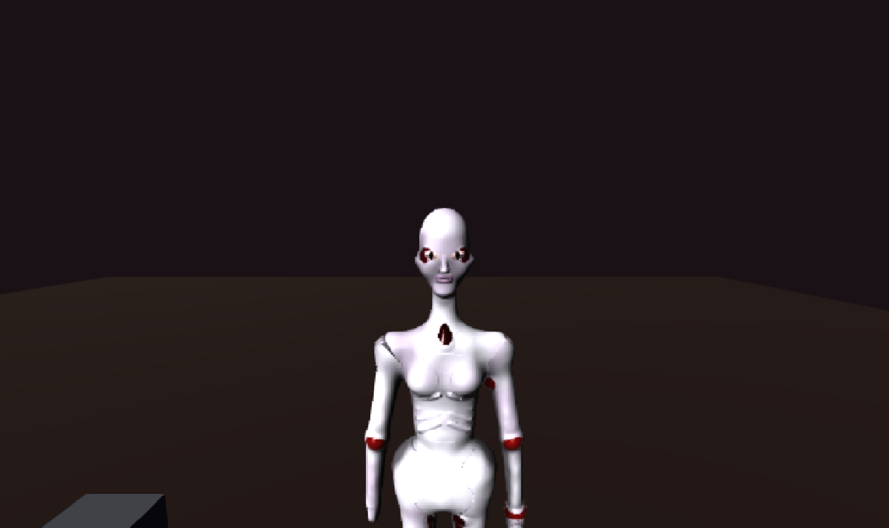 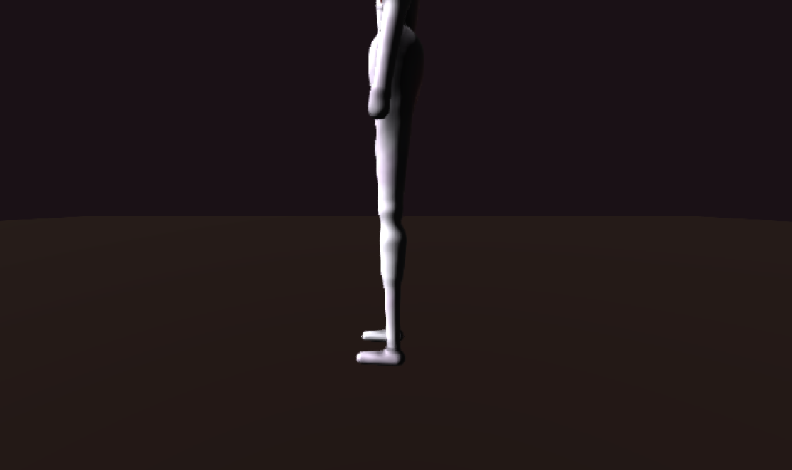

## Things found on the way

- **A mirror block cannot make an asymmetric pair.** A bone outside the block cannot parent
  to `upperarm.r`, and it cannot carry arm prims. So the grammar gained `lenR=`, the `.r`
  copy's length (`blob-parse.ts` → `BoneDef.lengthR` → `mirror.ts`), with tests. The motion
  rig already measures each arm on its own (`makeMotionJoints` `arm.L` / `arm.R`), and the
  test pins that the long arm reaches it.
- **Chamfer reach is 4 × `blend`, and `buildBody` does not halve it.** Only round unions
  get `roundBlendScale` 0.5. The cheekbones' chamfer at 0.008 bevelled 3.2 cm of air into
  the head. With the other head blends, that grew a 0.092-wide "goggle" band at eye level
  with a shadow "moustache" under it. Smooth-min swell also accumulates across prims: four
  prims each ~2 cm away folded the field 1.9 cm negative.
- **Hips belong to the leg cluster.** Torso and leg meet at a hard seam between clusters.
  So a torso-owned hip flare always reads as a light bulb hung over two sticks. The flare
  is now a thigh prim, which is where the trochanter is anyway.
- **Paint is taken from the hit's nearest prim** (`prim-material.wgsl` `hitBest`). A
  buried lip painted a ~4 cm pink trapezoid, so the lip tint stays a step off the skin. A
  2 mm painted cross still reads as a dark drop at 1 m, not as a cross.
- **`stance humanoid` is enforced by the lab.** A shin pitched +1 put the knee 4 mm behind
  the hip-to-ankle line, and the lab then refused to load her. The test now pins
  `checkStance`.

## Honest read (first pass, superseded by the look pass below)

- **At distance:** a tall, very thin, long-legged pale figure with a wasp waist and a long
  neck. It reads as graceful-strange and more mannequin than woman. The hair, veil, bodice,
  skirt and boots (Tasks 3-4) have to carry "female" and "bride".
- **Up close:** the rib window reads clearly. The raw-red seams read as red bands at both
  elbows and as lumps under the right shoulder. The flesh cuff tapers past the right fist.
- **The face:** large dark eyes with red-rimmed bruised sockets, a fine pointed nose, pale
  lips and a pointed chin. Uncanny and doll-like. The wrong half is the Task 2 sheet.

## Look pass (same day)

The owner and controller's verdict on the first frames was **"an alien mannequin"**. A
later note: **"i kinda like it but its a bit too alien"**. So the target is the middle:
a pretty, doll-like young woman first, slightly otherworldly second. The frames above
were re-shot after this pass.

- **Head**
  - A human cranium: rounded back, forehead narrower than the cheeks, back of the head at
    z −0.096. It is a touch long, the one alien trace kept.
  - The face mass is one tapered capsule, flush with the cranium, narrowing to a slim jaw
    and a soft chin. The face now fills the lower ~60% of the head.
  - Small upturned nose (a slim bridge and a tip ball, ~1.5 cm of projection) in place of
    the chamfered beak.
  - Full pale-lilac lips with a cupid's-bow bend.
  - Round, broad cheekbones set outside and below the eye corners, with soft cheeks under
    them.
- **Eyes**
  - Almond eyes with a dull off-white sclera and a dark iris a touch too large, set a touch
    too wide (x ±0.034). An all-black almond read as a grey alien's eye; it was the
    loudest alien cue.
  - The sockets are flat bruised makeup ovals, sat ~0.5 mm off the face. At 2.7 mm proud
    their rims were ridges.
  - The upper lids and under-eyes are clean surfaces, per the owner's ask, so the Task 2
    sheet can paint liner, lashes and running mascara on them.
  - The brow fill is gone; it rendered as a ridge.
- **Body**
  - A modest bust: two r 0.044 forms at y ~1.345, ~2 cm proud.
  - The rib window moved BELOW and between the bust: sternal ends at y 1.303 to 1.207, the
    costal arch at y ~1.17–1.31. Task 3 must clip the bodice over that band, not the
    plan's 1.25–1.40.
  - Softer shoulders and a touch more arm.
  - Thighs taper 0.068 → 0.035 to a slim knee. The shin bar overlaps the thigh at the joint,
    and a long tapered calf replaces the knee ball and the calf ball.
- **The thigh stigmata moved** from thigh at=0.22 to at=0.34. At 0.22 the fattened thigh
  tops buried them 3 cm deep; the new placement was probed with `sdBody` at every painted
  prim.
- **Renderer bug (not fixed here).** A 10 cm × r 0.0024 drip on the thigh (length/radius
  ~50) drew dark-red lines 30+ cm out into the AIR on both sides of the body. Tapered or
  not made no difference, and the CPU field is empty there. Removing the drip removed the
  lines. The drip is now 6 cm at r 0.0025 (ratio 24) and the lines are gone.
  `blob:render-check` passes, because it only looks for holes. This belongs in `webgpu/`,
  probably in the cull or bounds for long thin prims.
- **Honest read**
  - At 3 m she reads as a tall, slim woman with an hourglass, a small bust, long legs and a
    long neck.
  - At 1 m, a porcelain doll-like face: dark-ringed eyes with whites, a small nose, full
    pale lips. The bald, slightly long cranium still leans alien until the Task 3 hair and
    veil go on.
  - The throat cross still renders as a ~2 × 4 cm dark teardrop, bigger than its prims. It
    is paint claiming past thin prims, and possibly the same thin-prim renderer issue.

## Second look pass (same day): feet, lids, profile

- **"Her feet point backwards" was a LAB bug**, and it had been skewing every frame in
  this folder.
  - `blob:shot` freezes the rig with `setMotionEnabled(false)`. That reset `rig.bodyYaw`
    and `restPose` to the authored facing (yaw 0), but left two things behind:
    `heroMotion.lastBodyYaw` at the wander's last heading (2.94 rad in one probe), and the
    rig points where the wander had put them.
  - `applyRig(current, bound, lastBodyYaw)` then rotated every offset-placed prim and the
    rigid head by that stale yaw. The bone-bound prims (legs, feet) stayed at the rest
    heading.
  - Result: the face, bust and ribs pointed one way and the feet the other, the "front"
    fell at whatever yaw the wander ended on, and the face looked a few degrees turned.
    `schoolgirl-described` showed the same backwards feet.
  - Fix in `webgpu/lab-main.ts` `setMotionEnabled(false)`: zero `lastBodyYaw` and snap the
    rig points onto the rest pose. Two back-to-back shots now give the same orientation,
    and green marker prims on the nose and the toes agree in every view.
  - The `.blob` was right all along (`foot dir=fwd`, toes at +z). `bride-blob.test.ts`
    now pins that toe.z > ankle.z on both feet (rest skeleton and motion-rig base pose), and
    that the face is on the same side.
  - Everything judged before this fix was judged on a half-rotated render. The re-shot
    frames are the first honest ones.
- **Heavy upper lids**: the almond capsule raised 8.3 mm, ~0.5 mm proud and flattened, so it
  caps the top ~third of each eye. The lids are unpainted skin with a small blend, leaving a
  clean upper edge for Task 2's liner and lashes.
- **Eyes set into the head**:
  - Sclera, iris, lid and socket all moved back 8.5 mm.
  - A small brow arc sits over each eye (probed front z 0.080 at x 0.03, y 1.72, with the
    eye ~3 mm under it), plus a nasal root between the eyes.
  - The cranium moved 5 mm back: its lower front rim overhung the eyes as a shelf across the
    whole forehead.
  - The face-mass capsule's top dome was lowered for the same reason.
- **Bust enlarged** (r 0.044 → 0.052, blend 0.012). With the render fixed, r 0.044 read as
  pectorals.
- **Honest read** (from the fixed render):
  - At 3 m: clearly a tall, slim woman, with bust, hourglass, long legs and long neck. The
    feet point forward in every view.
  - At 1 m: a sleepy-lidded porcelain doll, with eyes under a soft brow, a small nose and
    full pale-lilac lips.
  - Still alien-leaning: the bald, slightly long cranium, and a fairly strong brow line in
    front light. The ribs read hard (a xylophone) at 1 m; that is the hook, though the
    bodice will frame it.
  - Now that it renders right side out, the throat mark reads as a cross with a drip rather
    than a teardrop.

## Task 2: the corpse-makeup face sheet (same day)

Painter: `scripts/make-bride-face.py` (PIL, seeded `random.Random(24)`, byte-identical on
rerun) → `public/assets/lab/faces/bride-face.png`. Worn by the `.blob`'s `sheet` block;
the registry's `face` declares the measured mean. Pins in `bride-blob.test.ts`, including
one that the painter's four projection constants equal the sheet block's.

- **Projection, solved from the built body, not guessed.** `headShape()` normalises by
  the cranium (centre y 1.7223, semi 0.07097 × 0.09118). The prim positions converted to
  head-space: iris (±0.479, −0.247), lash line ≈ −0.21, mouth −0.955 with corners at
  ±0.275, cheekbone (0.747, −0.483). `projScale 0.40/0.40`, centre `0.50/0.70` (hs −0.5,
  mid-face, lands at uv 0.5).
- **Checked with a banded diagnostic sheet** (coloured bands at known hs, vertical lines at
  the iris and mouth-corner x; `face-sheet-diag-bands.png`). The lines hit the irises and the
  mouth corners, the cyan/magenta bands hit the lips, and the red band hits the lash line.
- **Painted prims ignore the sheet.** The same diagnostic showed that the sclera, iris,
  socket ovals and lips (all `color=`) are overwritten after the face pass
  (`paint-char.wgsl`), so the green band vanished across the eyeball. The sclera prim also
  covers down to hs ≈ −0.37, lower than its prim radius suggests. So the smoke is painted on
  the skin AROUND those prims: the lid, the under-eye below −0.37 and the brow valley. The
  `lips()` layer only greys the margin round the lips.
- **Blend: `decal 0` with `blendLuma 0` (rgb multiply), NOT the house luma default.**
  - There is no true overlay mode in `face.wgsl.ts`. The modes are 1 rgb multiply,
    2 replace, and 3 luma multiply, the "overlay-style" default the owner preferred.
  - Luma mode exists because a skin-toned bake times skin-toned flesh compounds hue. This
    sheet's base is neutral grey, so rgb multiply adds no hue to the skin. The makeup's hues
    are the point (bruise red, violet hollows, blue veins), and luma would flatten them to
    grey.
  - Dark goes dark enough under multiply, but only because of the base. The shader divides
    by the mean luma of every texel with alpha ≥ 8. Ink with nothing around it (the ogre's
    alpha-0 layout) is its own mean and multiplies by ~1, so it is invisible.
  - The sheet therefore lays a neutral grey (206) base over the face at alpha 1. Mean
    0.7212: the base multiplies by 1.12 (a faint pale powder) and the ink by 0.045.
- **The game does not measure the mean** (`game-vfx-leaves.ts faceFor` uses the registry
  value). So the registry declares `mean: 0.721241`, as the soldier's entry does, instead of
  `bakedFace`'s fallback 1, which would darken her face ~28% in game. The ogre, cyberdemon
  and gargoyle decals carry mean 1 in the game and a dark-only measured mean in the lab. That
  is worth a look separately.
- **`texRelief 0.3`.** The luminance relief at the 1.4 default (and still at 0.6) embossed
  every thin ink line: the stitches read WHITE in the 3/4.

### Numbers (close-up, `face-sheet-luma-boxes.png`: eye boxes include sclera, iris, lid and socket prim)

| crop (mean sRGB luma) | sheet on | sheet off | Δ |
| --- | --- | --- | --- |
| socket, viewer-left / right | 0.194 / 0.288 | 0.339 / 0.461 | −0.145 / −0.173 |
| cheek, viewer-left / right | 0.537 / 0.739 | 0.606 / 0.787 | −0.069 / −0.048 |
| **cheek − socket** | **0.343 / 0.451** | 0.267 / 0.326 | |

The task's bar is socket ≥ 0.15 darker than cheek. It passes with the sheet on (0.34 / 0.45).
The prims alone already passed it, so the sheet's own contribution is the Δ column:
≈ 0.15–0.17 darker at the eyes.

### Frames

Shot on private ports with `LAB_TMP=.lab-tmp LAB_VITE_PORT=5271 LAB_CDP_PORT=9271`, cultist
sanity shot first. The probe was
`(window.__sdfLab.uniforms.lightDir.value.set(0.35,0.6,0.72), window.__sdfLab.setSdfScale(1), 1)`.
`setSdfScale(1)` renders the SDF layer at full resolution. The default scale made the lashes
a smear.
Close-ups: `BLOB_TARGET_Y=1.675 BLOB_DIST=0.26 BLOB_PITCH=0`.

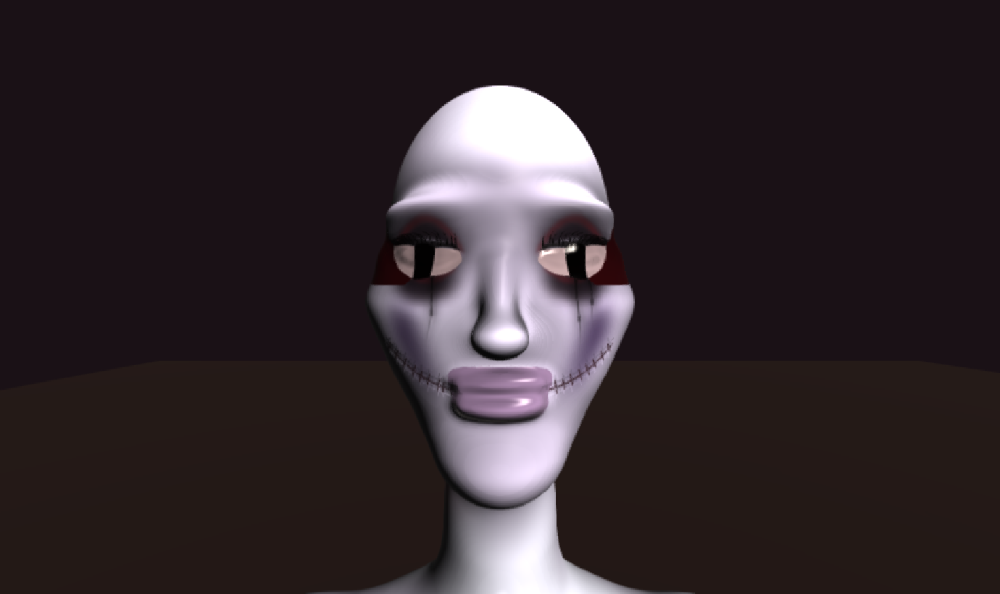 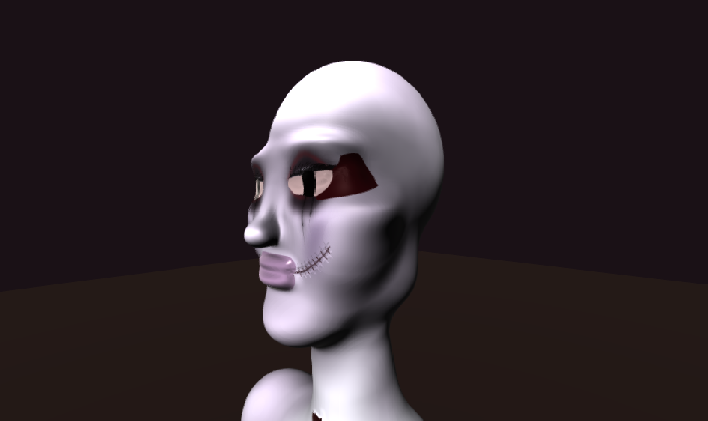 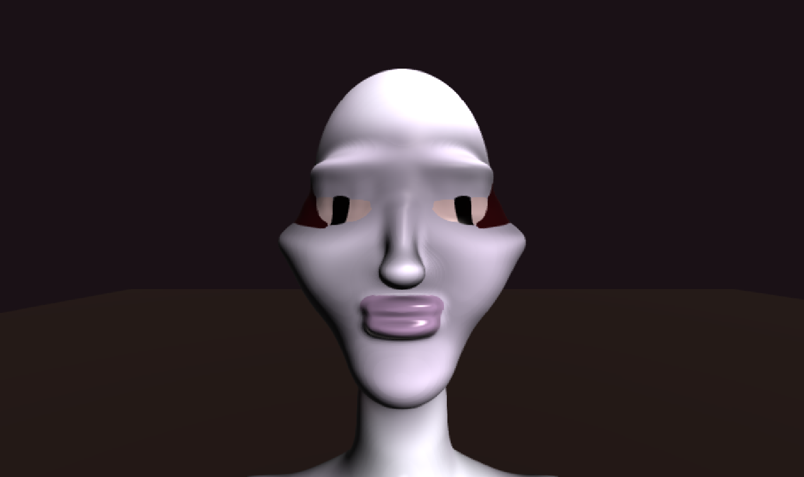
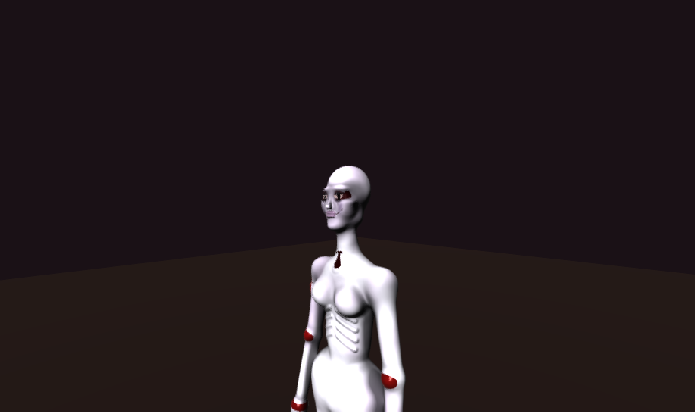 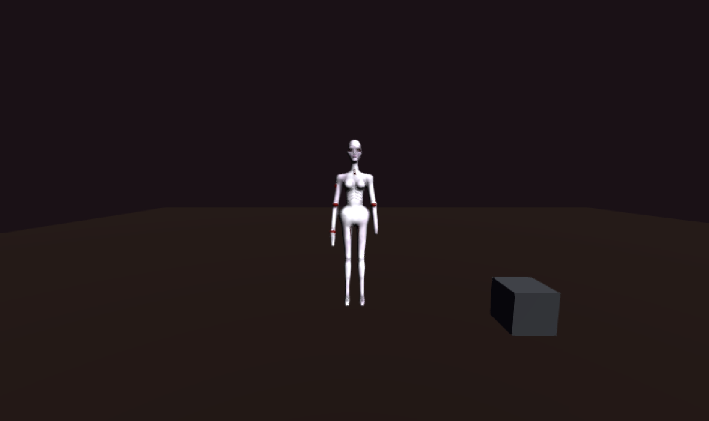 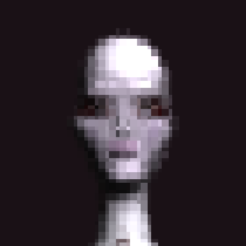
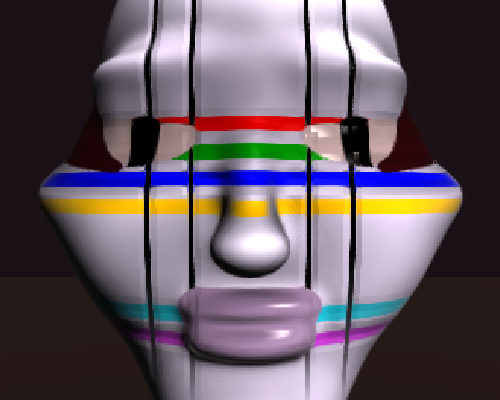

### Honest read

- **Close-up:** a pale doll with heavy black liner and lashes on the hooded lids, smoke on
  the lid and under the eye, two mascara tear-tracks, and a stitched Glasgow smile from both
  mouth corners. The hollows are a soft lilac shadow under the cheekbones. They are there
  but quiet: shading carries more of the hollow than the paint does.
- **3/4:** the suture reads, and fades out toward the ear with the facing fade. The runs
  read. On the near eye the liner's wing is lost where the surface turns away: the outer
  corner is the red socket prim, which the sheet cannot paint.
- **3 m:** she reads as dark-eyed, and the eyes are the darkest thing on the head. Most of
  that darkness is the socket prims plus the under-eye smoke. The mascara runs are at best
  a one-pixel darker trace, even with the ~7 mm smudge under each streak. At 3 m one lab
  pixel is ~9 mm of face, so a painted tear that thin cannot carry at that range.
- **Concerns for the owner:** the eye makeup is capped by the Task 1 painted socket ovals
  (dark red `6a2632`), which dominate the outer corners as red wedges and ignore the sheet.
  If the smoky eye should be blacker, the lever is that prim's colour (Task 1 found `4a1a26`
  merged the eye into a goggle), or unpainting it and letting the sheet own the socket.

### Review pass: deeper cheek hollows (owner: "wow big difference, looking good" + one ask)

The owner asked for deeper hollows and nothing else. The red socket ovals and the
slit-looking eyes stay exactly as they were.

- **Geometry (`bride.blob`).** The face widened sharply at the cheekbones, and that flare
  fought the painted hollow. The cheekbone's outer reach went 0.077 → 0.0636 (x 0.053 →
  0.046, wide 1.50 → 1.10, −17%), with height and depth unchanged so the cheekbones stay
  high. The soft cheek went 0.064 → 0.054 (x 0.040 → 0.032, r 0.024 → 0.022, −16%). The
  cranium is still the fattest head prim, so the head frame, and with it the projection, is
  unchanged. The painter/blob parity pin passes.
- **Paint (`make-bride-face.py`).**
  - The hollow core alpha went 0.55 → 0.85, and the colour 4a3c55 → 3a2c46.
  - The band moved 0.03 in to follow the narrower cheekbone.
  - The cheekbone highlight went 0.20 → 0.25 and still rides the hollow's top edge.
  - The sheet mean is now 0.7125, and the registry declares it.
- **Numbers** (close-up, same framing and boxes: `face-sheet-hollow-boxes-before.png` /
  `-after.png`):

| crop (mean sRGB luma) | before | after |
| --- | --- | --- |
| hollow, viewer-left / right | 0.371 / 0.552 | 0.201 / 0.389 |
| upper cheek, viewer-left / right | 0.541 / 0.696 | 0.458 / 0.725 |
| **hollow − upper** | **−0.170 / −0.144** | **−0.257 / −0.336** |

  The hollow-to-upper-cheek contrast is 1.5× (left) and 2.3× (right) what it was.
- **Read.**
  - Front: the face no longer winged at the cheekbones, and a clear violet shadow runs
    under each cheekbone toward the sutures, under a lit cheekbone band.
  - 3/4: it reads as a violet shadow band under the cheekbone. The silhouette itself is not
    hollow; that is paint, as the owner asked.
  - 3 m: the hollows now show as two darker violet patches under the eyes, which help the
    gaunt read. At that size they could also pass for bruising.

## Task 3: cloth shells, strand hair, laces, stockings (same day)

Perf census deferred (owner, 2026-09-24).

Owner direction mid-task: build for the look first and optimise later; stay under
`MAX_PRIMS` 128 (a hard validator limit today) without raising it.

### What she wears (`bride.blob`, pins in `bride-blob.test.ts`)

| Part | How | Prims |
| --- | --- | --- |
| Corset bodice, ivory | one `shell` round cone on `chest`, `rigid`, clipped open down the sternum | 1 |
| Laces | five dark thin bars zig-zagging across the slot, ends sunk into the sheet's probed edges | 5 |
| Ruffle skirt, two tiers | two `shell` cones on a new `hem` pendulum bone, `rigid`, warped; the upper tier stops at y 0.945 | 2 |
| Veil | one `shell` round cone on `skull`, `rigid`, clipped at the face | 1 |
| Hair | scalp mass + strand bundles: face-framing locks (x2), side-back locks (x2), back curtain | 6 |
| Stockings | knee-down prims painted e8e0d0; a thigh overlay (+1 mm) and a darker lace-top band from y ~0.80 | 4 |
| Bust | painted the bodice's ivory (the cultist's rule), no new prim | 0 |

Budget: 92 flesh + 31 bone = **123 / 128**. Four of the bone prims are auto-derived from
the stocking overlays (a thigh-sized prim grows a femur, `bone-derive.ts`).

### Numbers (CPU field)

- **Sternum slot** (the bodice sheet's edge, probed): 6.7 cm wide at y 1.16, 6.0 at 1.22,
  5.6 at 1.25, 4.8 at 1.28, 2.7 at 1.31, 1.0 at 1.34, shut at 1.36. The plane was
  grid-searched against target half-widths (11 degrees off vertical). The cut is a few mm
  into a gently curved front, so a few mm of `clipd` moves the width by centimetres.
- **Skirt hem** y 0.855 (under the crotch at ~0.88); upper tier hem 0.945. Stocking top
  ~0.80, so the inner-thigh wounds sit under the hem and their drips run out into the
  3.5 cm of bare thigh above the stocking tops.
- **Face frame held:** every hair/veil prim's radius × max scale stays under the
  cranium's 0.0912. `game-main.ts` `headShape` takes the fattest head prim over ALL prims
  (the lab skips painted ones), so a bigger hair mass would re-centre the Task 2 sheet in
  the game only. Pinned.

### Things found on the way

- **A squashed shell under-reports its distance, and paint follows the field.** A shell's
  base distance is taken in the scaled space and comes back multiplied by the smallest
  axis. At `tall 0.35` (to flatten the bodice's top cap into a lid) two things broke:
  - `thick 0.004` became a 19 mm slab in z;
  - `nearestPrim` / `hitBest` saw the bodice as nearer than the ribs 2-3 cm behind it, so
    the whole rib window was painted ivory.
  At `tall 0.60` the slot's skin and ribs own their paint from y 1.16 up (probed). `thick`
  and `warp` are divided the same way; the `.blob` comments give the world sizes.
- **The hem pendulum stole the stocking tops (fixed, `rig-bind.ts`).** The stocking
  overlay's top end (y 0.78) was nearer the hem bone's tail (y 0.64, centreline) than the
  hip or knee. At rest nothing showed; in the walk frame each stocking rose off the leg
  as a tube to the swinging hem. Fix: the hem tail joins the DISTAL set (only prims on
  bones sharing its joints may bind to it), and `hem` is excluded from the axial joints
  and segments (the pelvis bone sits exactly on the hem segment). New pin: no flesh or
  bone prim binds to the hem tail. This built on main's `cab14582` (distal joints bind
  only their own limb's prims), cherry-picked onto this branch because it was not here yet.
- **Rigid veil, non-rigid hair.** The veil is `rigid` on the skull. Without that its low
  end bound to the upper back and the face could turn inside the opening. It turns with
  a body yaw (pinned). The hair strands are NOT rigid: their tops ride the head, their
  ends ride the chest, which reads as hair lying on the shoulders.
- **Width is boxed in by the hanging arms.** The hip flare is 0.171 wide and the forearm's
  inner edge is ~0.19 at y 1.0, so the skirt can only flare front to back.

### Frames

Lab: private ports (`LAB_TMP=.lab-tmp LAB_VITE_PORT=5271 LAB_CDP_PORT=9271`), cultist
sanity shot first, probe `lightDir (0.35,0.6,0.72)` + `setSdfScale(1)`. The back frames use
`lightDir (-0.35,0.6,-0.72)`. The walk is `BLOB_POSE=walk`, on the ZOMBIE profile she still
falls back to (hence the arms-out shamble; `BRIDE_PROFILE` is Task 8).

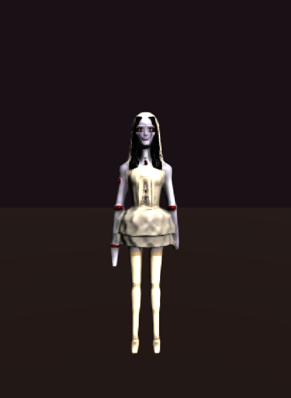 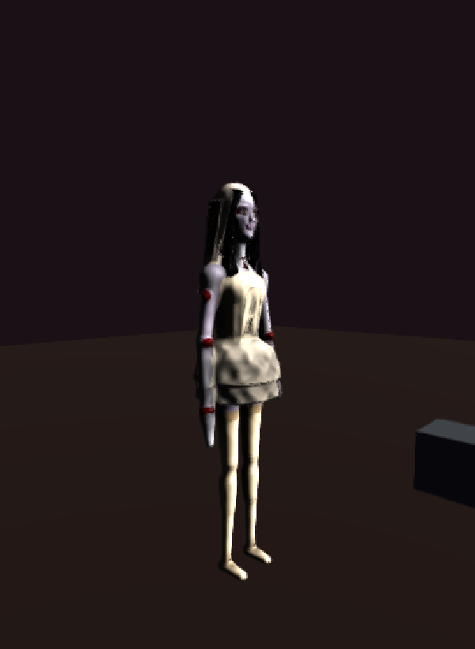 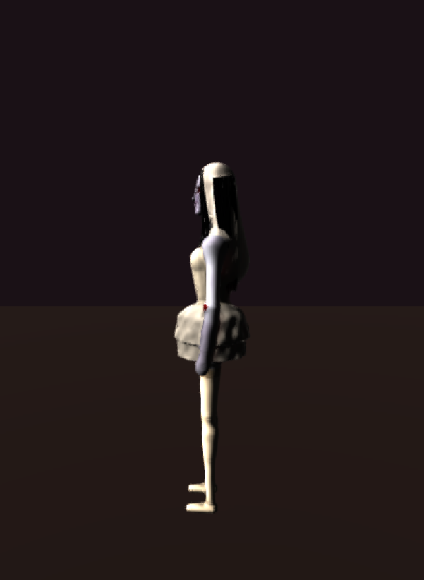 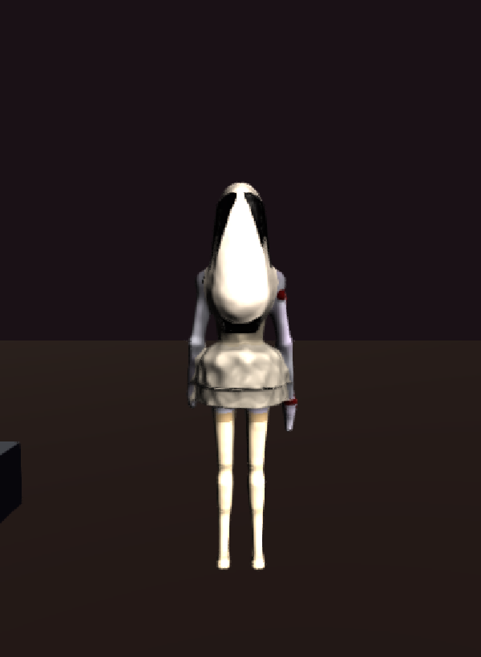 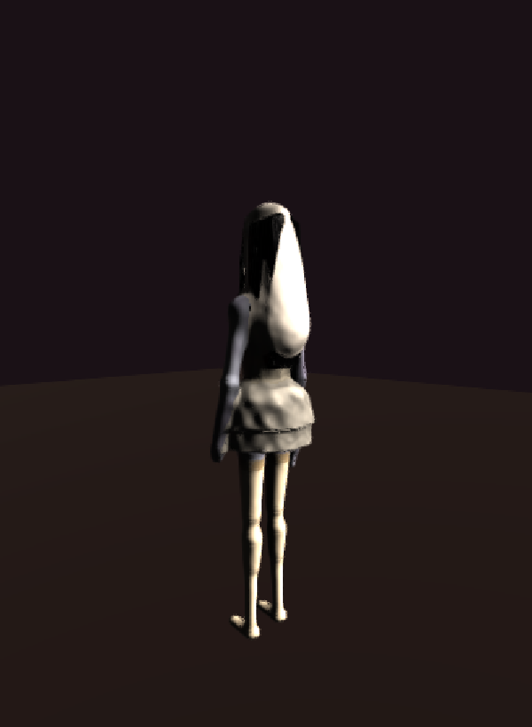
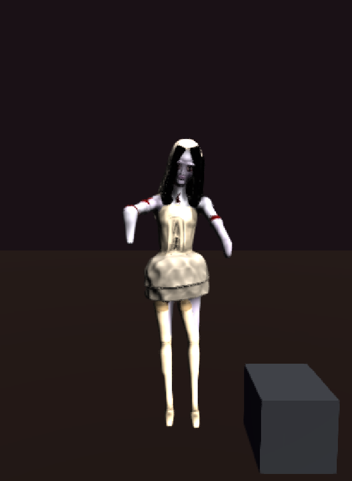 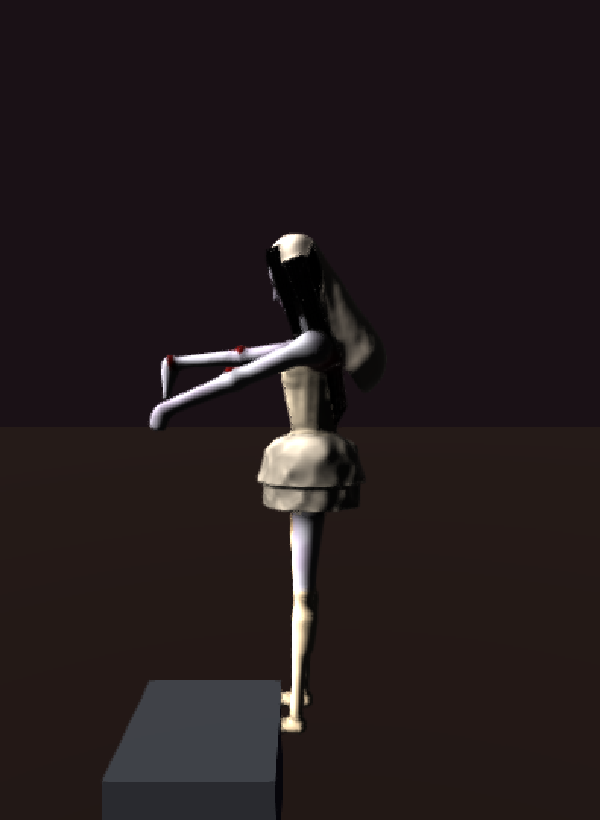
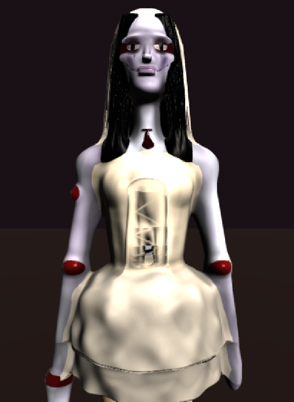 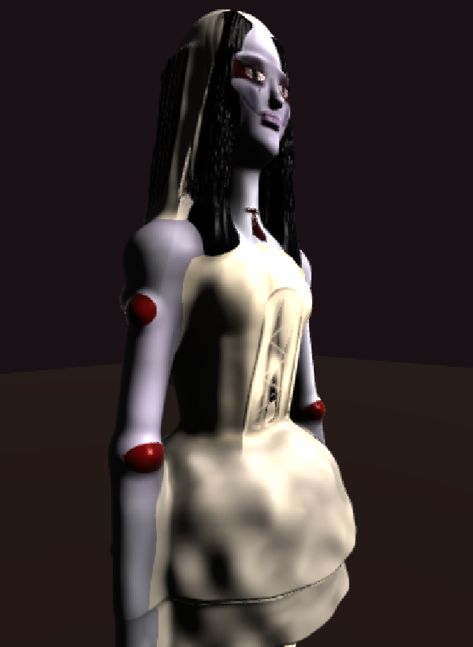
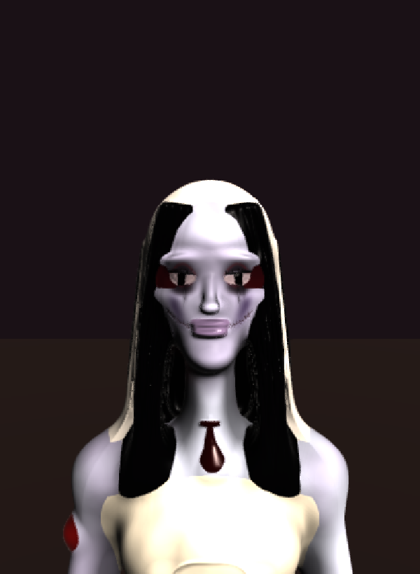 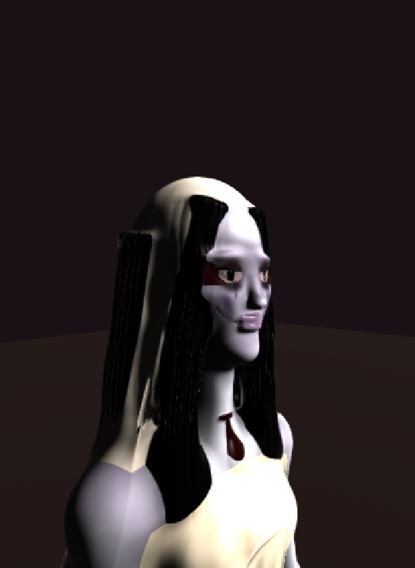 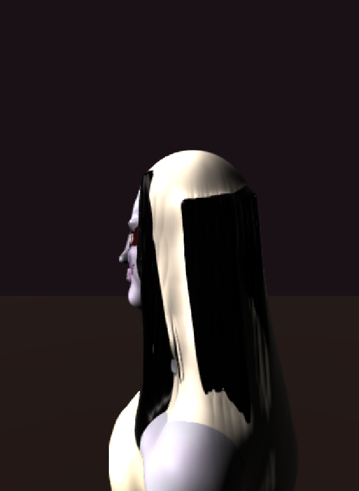

Game (`node scripts/bride-game-frames.mjs 5271 9271 <out>`: `?spawn=bride&frozen=1&seed=1&vhs=off`,
`teleport(2)`, `placePlayer` 2.6 m round the first bride). The veil, bodice slot and both
skirt tiers render **uncut** at her spawn position, and the face sheet sits on the face (so the
game's face frame is still the cranium):

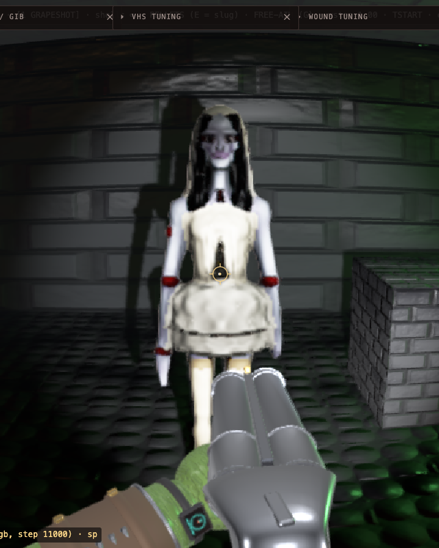 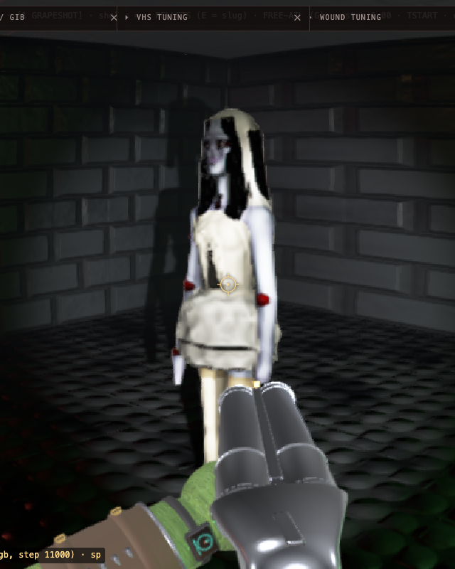 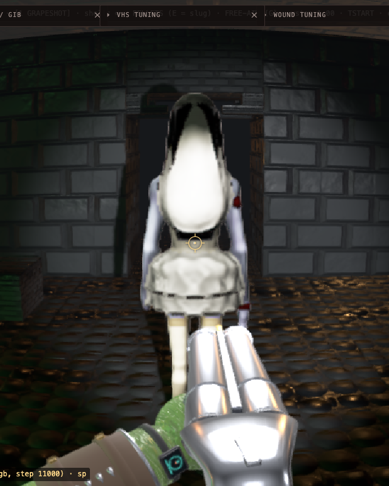

### Honest read

- **3 m:** a tall pale woman in a white strapless corset and a short ruffled skirt, long
  black hair, a white veil down her back, ivory stockings. Bride first. The bald/alien
  cranium read is gone: the veil and the hair cover it.
- **1 m:** the laced slot down the bodice with ribs behind the laces reads as the
  reliquary hook. Between the breasts the bodice is smooth; the painted bust gives it cups.
- **Weak spots:**
  - The skirt reads as crumpled, tiered fabric rather than lace ruffles. The warp is a
    product of Cartesian sines, so it cannot make ruffles periodic around the waist.
  - From the front the veil's crown reads a little like a nun's coif, with a black centre
    stripe (the hair mass between the locks) as the part.
  - In game resolution the laces merge into a dark slot.
  - At rest the skirt comes within ~1 cm of the forearms.

### With more prims (owner: the controller raises MAX_PRIMS separately)

- +2-4: a third skirt tier, or petticoat layers, for a fuller tiered ruffle.
- +4-6: more strand bundles (a second back layer, fuller side falls), for hair volume
  under the veil.
- +2: a separate front hair part (two small strand sweeps from the part) instead of the
  mass showing as a stripe.
- +2: a veil hem layer, so the bottom ends in a free edge rather than a round cap.

## Task 4: the WAM kit (plate, boots, chains, crosses) + the armoured flag (same day)

Source: `src/lab/sdf-zombie/characters/bride-kit.wam` (the header holds the measured flesh
table and every reason). Built with `scripts/build-wam-kit.sh bride` into
`public/assets/lab/bride-kit.gltf` (committed): 1247 vertices, 1940 triangles, 4 materials.
Pins: `characters/bride-kit.test.ts`.

| Material | Pieces |
| --- | --- |
| `plate` (dull steel, breakable) | vambraces on both forearms; couters cupping the BACK of each elbow; a fingered gauntlet with pointed plate claws on the left hand; a back-of-hand plate on the right, whose short fingers sink into the flesh cuff; a domed pauldron with a haute-piece flange on the RIGHT (sword) shoulder only |
| `boot` | cream suede thigh-highs (12-sided), sole on the floor, top at y 0.759 |
| `chain` | a girdle round the skirt's waist; a choker; a long necklace down to the top of the bodice slot |
| `iron` | three Latin crosses: one on the necklace over the laces, two hanging off the girdle |

### The uneven forearm

`bride.blob` says `forearm len=0.26 lenR=0.30`, and a WAM mirror block gives `.l` and `.r`
one length. A ten-line test `.wam` confirmed that WAM accepts sided bones OUTSIDE a mirror
block that parent to a mirrored bone (`bone forearm.r parent=upperarm.r`: `find_parent`
resolves the literal name). So `forearm.l` / `forearm.r` are explicit bones with their own
lengths, and `.r`'s tilt is negated by hand, since nothing reflects it. The hands go back
into a second mirror block, whose `parent=forearm` resolves to the suffixed bones. WAM itself
was not edited.

### Numbers (CPU: `sdBody` against the compiled glTF's rest vertices)

- **Skeleton parity:** every blob bone head is within 1.8 mm of the kit's (worst: hands,
  1.6 / 1.8 mm; the pitch+tilt resolution difference the ogre test notes). The test bar is
  10 mm.
- **Tuck:** the deepest vertex per material is within the 45 mm `TUCK_MAX`. The deepest are
  the right-hand plate fingers, which sink 25 mm into the flesh cuff on purpose (hook 4). The
  pauldron's inner rim sits 21 mm into the yoke, which is forced the way the soldier's is.
- **Boots:** sole at y 0.0011. The top is at y 0.759, 1-3 cm under the stocking's lace band
  (0.77-0.79), so stocking, band and bare thigh show between the boot and the hem (0.855).
- **Skirt clearance (the controller's check).** With Task 1's arm hang (upperarm tilt 11,
  forearm 6), the forearm FLESH already ran 5-14 mm into the ruffle skirt at y 0.94-1.04,
  probed at the forearm's own z. The plate could only punch through. **The fix was the blob:
  the arms now splay to 14 / 12.** Flesh-to-skirt air is now ≥ 13 mm at rest, and the
  closest plate vertex is 4.4 mm off the skirt (the rings beside the skirt also sit 3 mm
  outward and 2 mm narrower). `bride-blob.test.ts` still passes unchanged. In the walk frames
  the zombie profile's arms-out shamble keeps the plate well clear.
- **Handedness settled.** `.r` is −x in both languages. In the lab's yaw-0 frame (facing
  her) the pauldron, the longer forearm and the red wrist cuff are all on SCREEN-LEFT, which
  is her right. The close-up at yaw 270 shows the pauldron side with the two red swellings.

### Registry and sparks

- `CharacterEntry.armoured?: boolean` is set on the soldier and the bride.
- `character-view.ts` keys armour sparks and `loadKit`'s breakable flag on
  `entry.armoured === true`, where both used to check `entry.name === 'soldier'`.
- Shotgun casings stay soldier-only.
- **Spec deviation (as planned):** the spec says armour hits leave no wound. The existing
  soldier mechanism sparks, sheds a plate after two or three hits, and lets the flesh under it
  take the wound. That bares the raw fused seams, which suits her brief better.

### Things found on the way

- **Inside a WAM `group`, `offset=` is silently ignored.** A part is placed with
  `at=(x,y,z)`. Every cross box stacked on the group origin, so the crosses read as T's until
  the boxes moved to `at=`.
- **Frozen game captures never pose a kit.** `?frozen=1` skips the body block, and
  `character.pose` (the kit's rig ride) only runs there. So every kit sits at its bind pose
  at the world origin, and the bride stood in flesh only in the first game frames (the
  soldier would too). `scripts/bride-game-frames.mjs` now unfreezes for `KIT_STEPS` (2)
  ticks after the teleport, then freezes again.
- **`chain` joins kit-overlay.ts's LOOK table** (iron's numbers). Unlisted, it fell to
  LOOK_DEFAULT's near-dielectric sheen. `LOOK` is keyed by material name across every kit, so
  her `boot` shares the ogre's dull suede-ish entry, and her breakable `plate` gets `loadKit`'s
  own duller armour look.
- The couters began as 45 mm domes, which read as steel BALLS from behind. They are now
  shorter and taper to a point. The girdle went from 10 to 16 mm: at 10 mm it read as a sewn
  seam round the skirt.

### Frames

Lab: `LAB_TMP=.lab-tmp LAB_VITE_PORT=5271 LAB_CDP_PORT=9271`, cultist sanity shot first,
probe `lightDir (0.35,0.6,0.72)` + `setSdfScale(1)`. The body is `BLOB_DIST=2.1 BLOB_TARGET_Y=0.95`
and the close-ups are `BLOB_DIST=0.75 BLOB_TARGET_Y=1.24`. The walk still uses the zombie
profile. Game: `node scripts/bride-game-frames.mjs 5271 9271 <out>`.

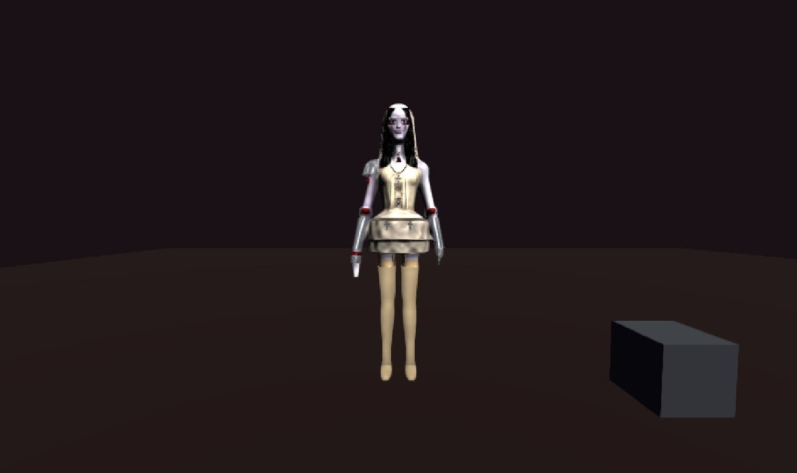 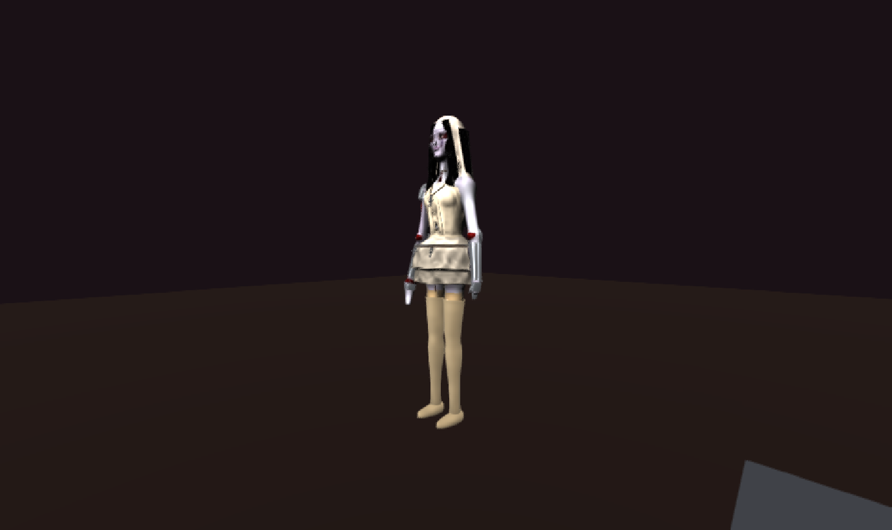 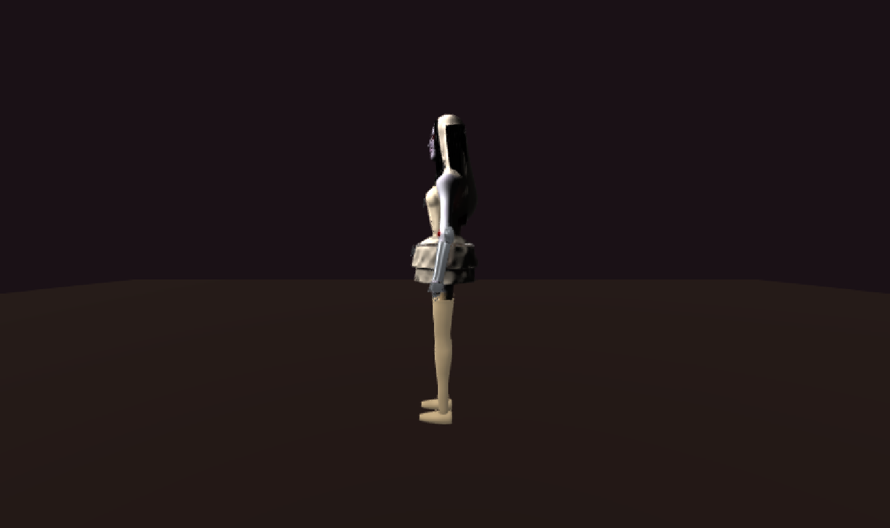 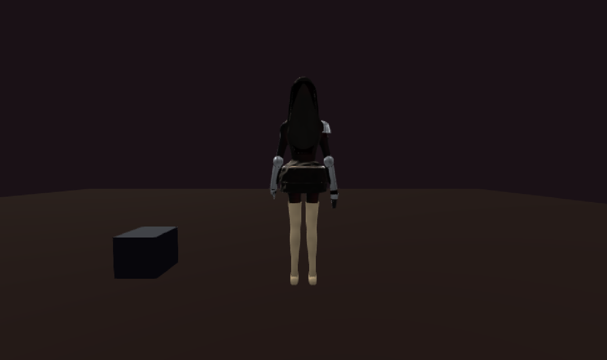
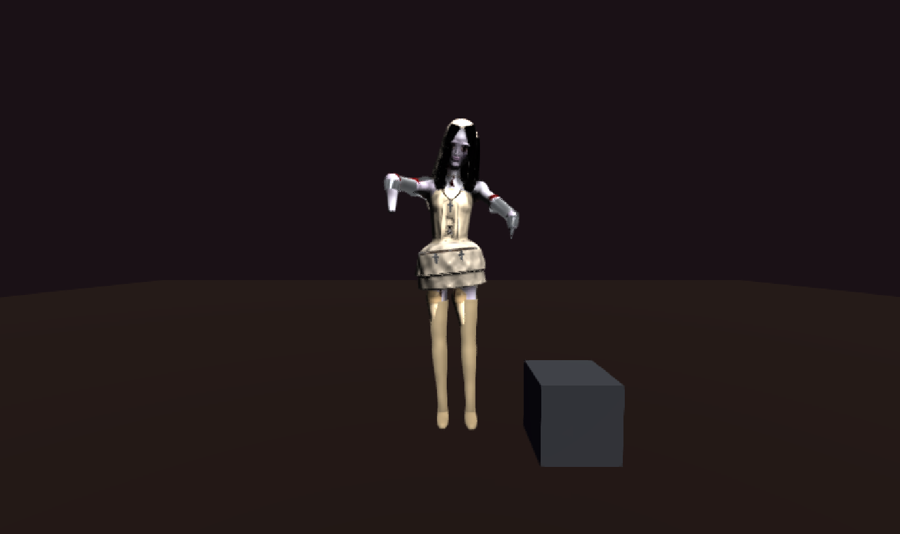 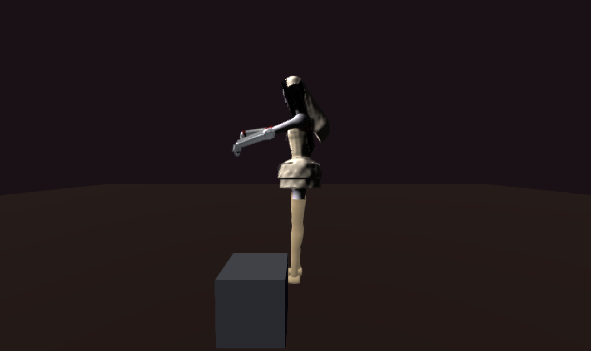
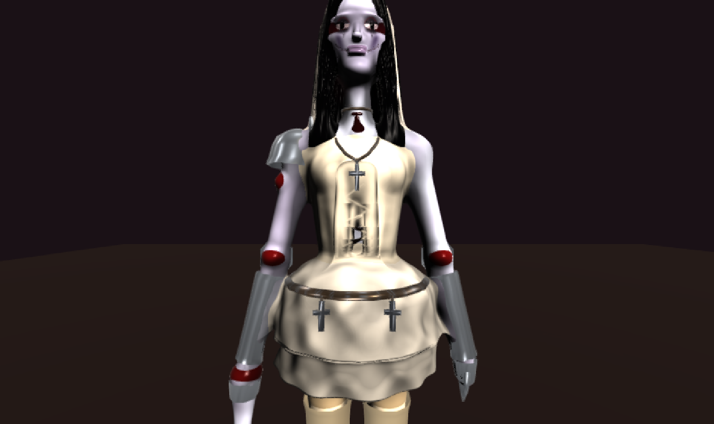 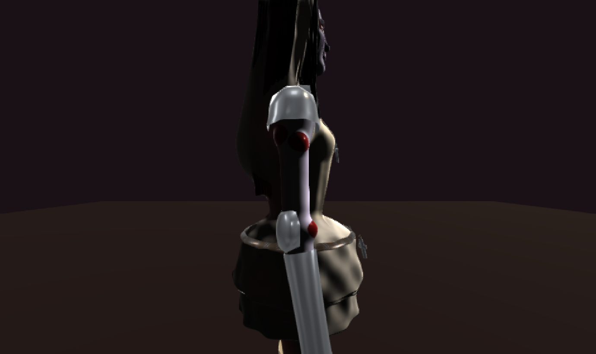 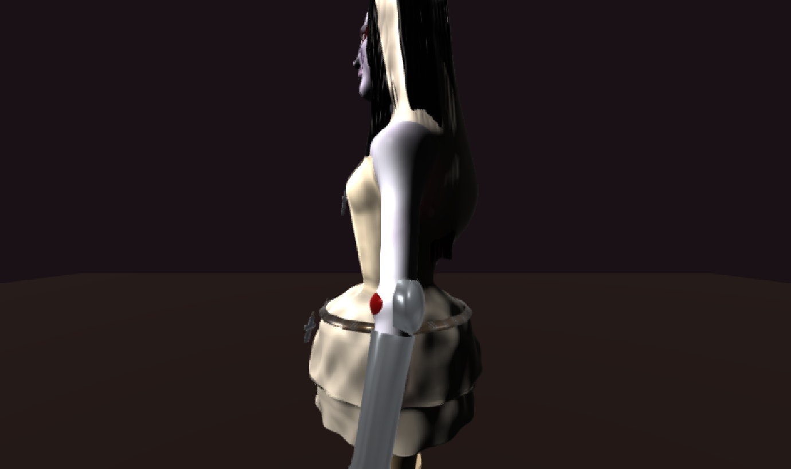
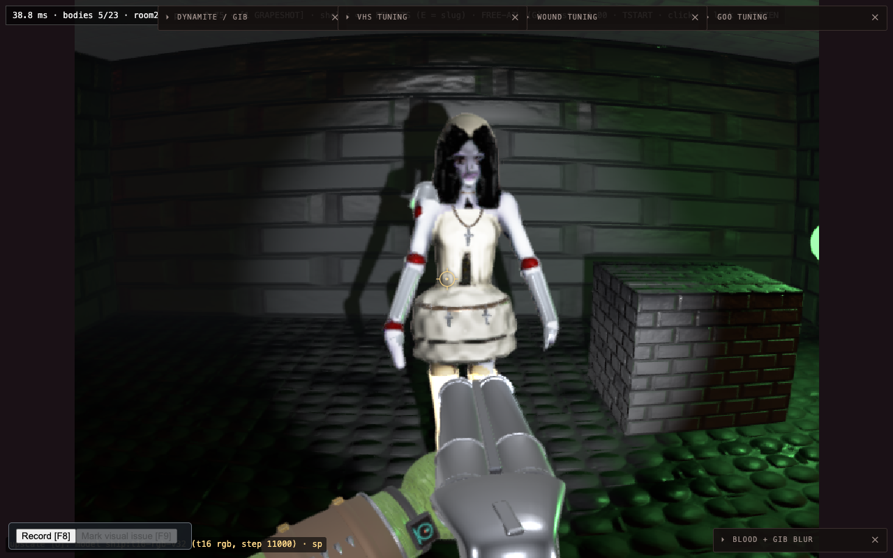 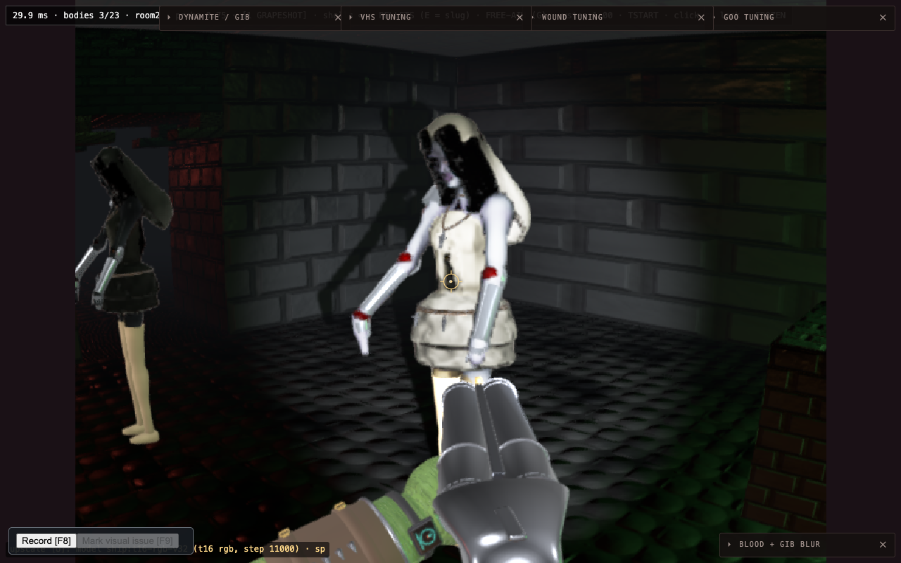

### Honest read

- **3 m / game:** she now reads as an armoured bride. The steel forearms and the single
  pauldron make the knight half legible, and the cream boots give the long legs a line. In
  game she reads well at 2.6 m, and the crosses and necklace carry there. The plate rides her
  rig correctly (no placement bug) and renders uncut.
- **Close:** the fused-gauntlet hook works. Raw-red bulges sit in front of both elbows,
  between the couter and the vambrace. Two red swellings push out from under the pauldron's
  lip. A red ring shows at the sword wrist, and the flesh tendril grows on past the right hand.
- **Weak spots:**
  - The plate is smooth, round, tube-like steel, closer to "robot arm" than to articulated
    armour. There are no lames, rivets or edge rolls.
  - The couters still read a little like ball joints from behind.
  - The boot and stocking are close in value, so the boot top reads as a seam, not a hard
    edge.
  - The chain girdle reads as a metal band rather than as links (the links are texture only).
  - The back view is dark, which is the lab key, not the kit.
  - The haute-piece flange is barely visible from the front.

## Task 8: sword carries, the STALK gait, BRIDE_PROFILE (same day)

`BRIDE_PROFILE` (motion-profile.ts): `STALK` walk / `RUN` run, `swordGuard` for walk, stand
and fire, `swordTrail` for the run, the sword at scale 1, `melee: { kind: 'sword' }`. The
registry picks it up through `motionProfileFor('bride')`.

### Solved carries (grid-solved through `makeActorMotion`, scratchpad script)

| Carry | right pitch / yaw / fold | gunPitch | Pins, measured |
| --- | --- | --- | --- |
| `swordGuard` | 0.30 / 0.70 / 2.70 | 0.70 | fist-to-grip 0.8 cm, left hand to Fore_Hand 0.8 cm, tip 0.86 m over the head point, blade 24 cm from it, both elbows ≥ 9 cm outside the torso |
| `swordTrail` | -0.55 / 0.10 / 0.30 (plan's start) | -0.90 | fist-to-grip 0.9 cm, tip y 0.21 (pin: < 0.35), right elbow 2.5 cm and left 0.6 cm outside the torso |

- The guard's grip sits at body-local ~(-0.22, 1.47, 0.15), just over her right shoulder.
  The top (left) hand is beside the jaw at (-0.25, 1.67, 0.05). The blade leans ~27° back of
  vertical and ~9° out.
- The first solve (0.80 / 0.50 / 2.20, gunPitch 0.65) passed every pin. In the front frame,
  though, the left forearm lay across her eyes. The re-solve scored the top hand's height
  (jaw, not eyes) and kept the left forearm 13 cm or more off the face. It lowered the grip
  8 cm.
- The plan's starting guard (1.9 / 0.30 / 1.60) put the hands above her head, with the left
  hand 15 cm off Fore_Hand.

### Found on the way: the hand did not turn with the forearm

- `motion.ts` only TRANSLATES the hand tip with the wrist, and `actor.ts pinTips` snaps it back
  to the yawed rest hang. So with the forearm raised, the fist hung 4 cm BELOW the wrist while
  the grip rode above it. The fist-to-grip gap was 7 cm and no carry angle could close it.
  Every gun carry so far keeps its forearm low enough that nobody noticed.
- The fix is opt-in: `prop.fistOnGrip`. The carry block lays the right hand bone along the
  forearm, the line the grip is seated on. `pinTips` takes an `only` set, so it points just
  that tip along its motion target, and every other tip keeps its rest hang. The soldier,
  cultist and ogre are unchanged; their tests pass untouched.
- `gripReach` 0.04 is the middle of her 0.08 m hand bone (the fist prim is at `hand
  at=0.45`), with the flesh cuff running on to ~13 cm past the wrist. Fist-to-grip,
  guard / trail: 0.03 gives 0.9 / 1.7 cm, 0.04 gives 0.8 / 0.9 cm, and 0.05 gives
  1.6 / 0.8 cm.
- The plan's `torsoLean: 0.04` is in DEGREES in `GaitProfile` (RUN uses 12, and gait.ts
  converts). `STALK` uses 2.3° (≈ 0.04 rad, the intent).

### Frames

Lab: `LAB_TMP=.lab-tmp LAB_VITE_PORT=5271 LAB_CDP_PORT=9271`, cultist sanity shot first,
probe `lightDir (0.35,0.6,0.72)` + `setSdfScale(1)`, `BLOB_DIST=2.6 BLOB_TARGET_Y=1.15`.
`BLOB_POSE=aim` gives the standing guard (the `fire` carry at speed 0), and `walk` / `run`
give the treadmill poses. The frames are crops of frame 00 (yaw 0, her front), frame 01
(3/4) and frame 02 (side).

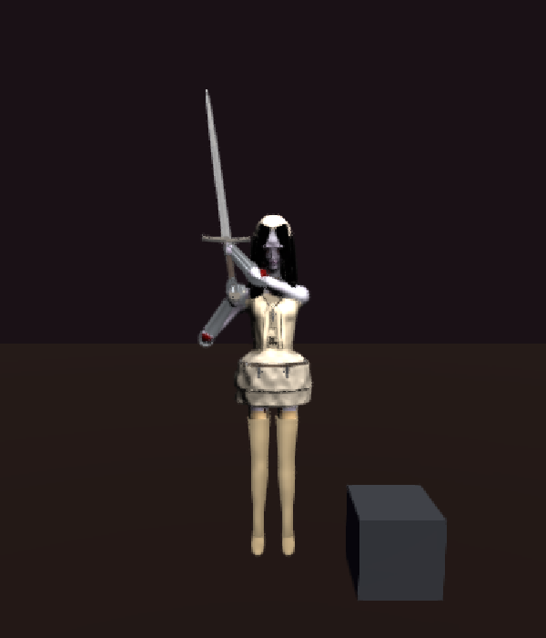 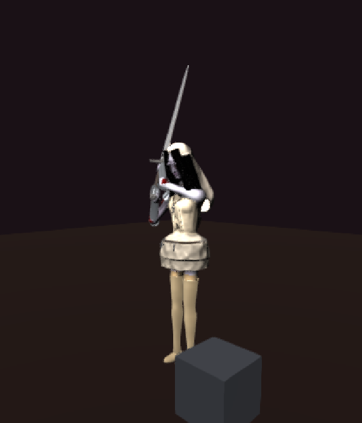 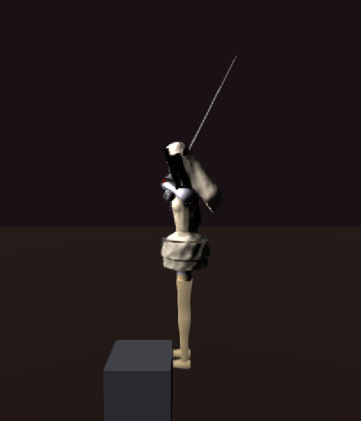
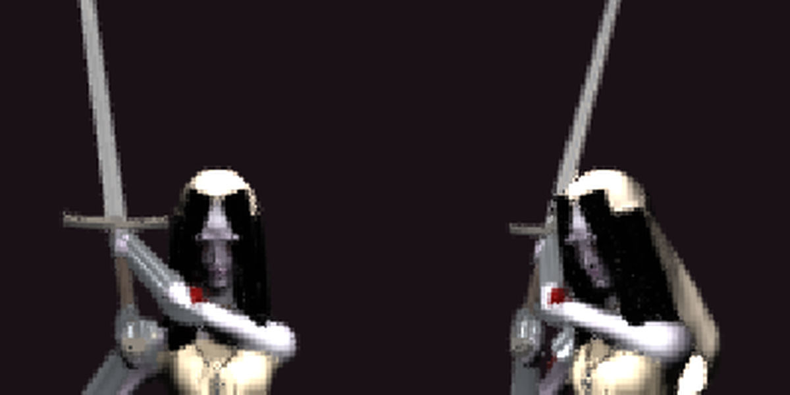
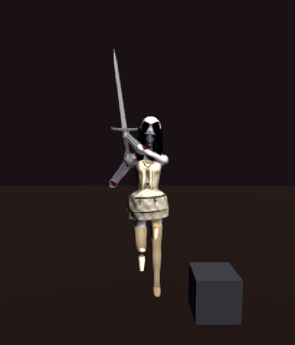 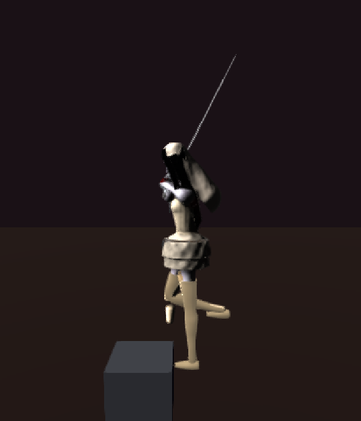
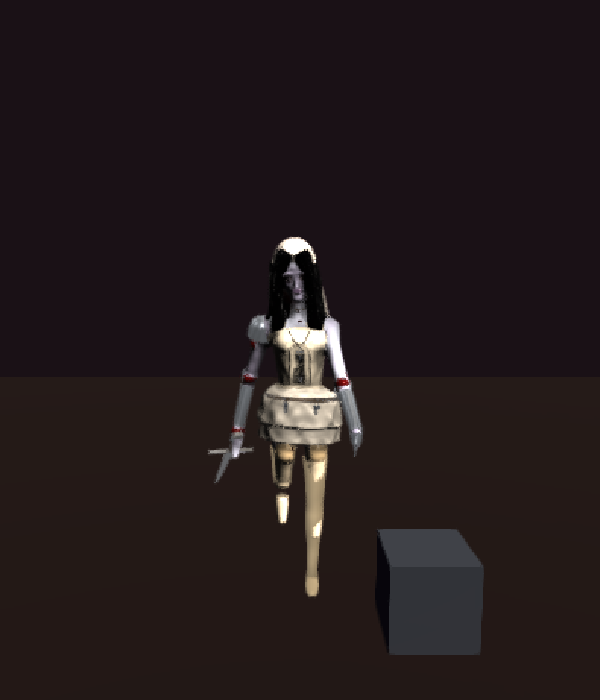 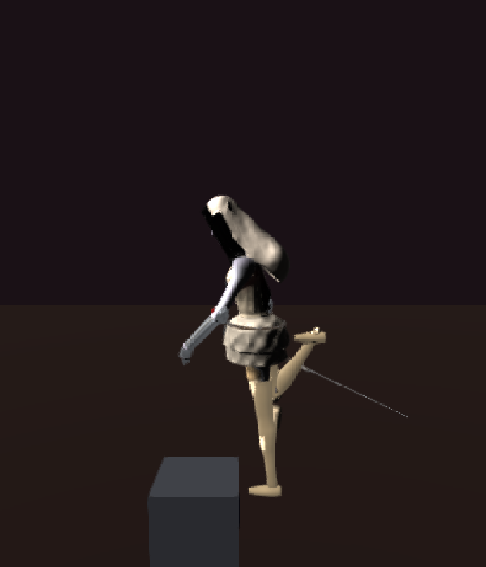

### Honest read

- **Guard:** it reads as the reference's high guard. The blade stands up and back over her
  right shoulder. In the close crop, both hands are on the grip: the left under the
  cross-guard, the right plated fist at the bottom. Her face is clear. The right elbow juts
  out and down at about 45°, which is right for vom Tag but a little puppet-like at 3 m. The
  blade is long: the point is at 2.64 m, about 0.8 m over her crown. It clears everything,
  but a low game ceiling would clip it. That is the `prop.scale` knob if the owner wants it.
- **Walk:** she holds the guard steady while stalking; the blade barely moves with the bob.
  The STALK legs are the march clip slowed. The trailing foot kicks up behind her to about
  knee height, which reads brisker than a stalk. Tuning that is a gait-curve job, not a carry
  job.
- **Run:** the blade trails low behind her right hip and outboard of the leg, and the left arm
  swings free. From the front only the hilt shows at her hip (the blade is behind her), so it
  reads as a dagger at 3 m.
- **Game:** not checked in `sdf-game.html`. The bride has no mind yet, so she is not a gunner
  or a sword mind. game-actor.ts re-seats the prop on the solved wrist ONLY for gunners and
  the soldier, and its rig loop never calls `pinTips`: the fist follows its target through the
  soft rest pull only. Task 10 wires the game side.

## Task 9: the sword follows the swing (same day)

- `actor.ts` `ActorStepInput.attack` is forwarded to `stepMotion` only when set, so existing
  callers step bit-identically.
- In `motion.ts`, the carry block uses `swordCarryAt(phase, variant, CARRIES[carries.walk])`
  UNSMOOTHED while a sword swing is live (`profile.melee.kind === 'sword'` + a sword variant).
  Downstream (armPivot, gunPoseFromArm, fistOnGrip, the left-hand FABRIK) is unchanged.
- **Found on the way: the verlet let go of the grip.** With the track wired, the fist-to-grip
  gap reached 21 cm mid-cleave. The prop is seated on the motion TARGETS, and the rig's soft rest
  pull lags a 1 s swing, so `|rig hand − target hand|` was the whole gap. The fix: while a sword
  swing is live, `frame.posePins` pins both arms (elbow, hand, hand tip, L and R) to their
  targets, the way the soldier pins his legs. A stagger or recoil releases the pins. Only the
  bride can reach this path.
- `rig-bind.test.ts`: `pinTips(…, only)` moves just the listed tip (Task 8 review follow-up).

### Re-solved `SWORD_KEYS` (CPU grid + coordinate descent, then a joint pass over 8 in-between phases)

| Variant | windup pitch / yaw / fold, gunPitch | strike pitch / yaw / fold, gunPitch |
| --- | --- | --- |
| cleave | 1.60 / 1.15 / 1.20, 1.15 | 0.25 / 0.75 / 2.10, -1.15 |
| sweep | -0.75 / -0.20 / 2.05, 0.95 | 0.40 / 1.40 / 1.10, -0.55 |
| lunge | -1.20 / 1.15 / 1.60, 1.25 | 0.45 / 0.75 / 2.00, -1.20 |

The scores were: fist on the grip, left hand on Fore_Hand, elbows ≥ 5 cm outside the torso,
the blade clear of her head, torso and legs (`sdBody` along the blade), and the cleave, sweep
and lunge strike tips at 1.2–1.5 m about 1.5 m out. The plan's starting cleave drove the point
into the floor (tip y −0.23 m).

Measured over a 60-frame swing (body-local: +x her left, +z forward, pelvis origin):

| | max fist gap | max left-hand gap | min blade clearance | wind-up tip | strike tip |
| --- | --- | --- | --- | --- | --- |
| cleave | 0.0 cm | 2.2 cm | 4.6 cm | (0.15, 2.71, −0.66) | (0.25, 1.34, 1.53); drops 1.37 m |
| sweep | 1.1 cm | 4.6 cm | 4.6 cm | (−0.81, 2.19, 0.81) | (1.51, 1.21, 0.65); x flips sign |
| lunge | 1.2 cm | 1.8 cm | 2.7 cm | (0.21, 1.35, 1.26) | (0.19, 1.41, 1.57) |

### The sweep and its shape pin

The `sword-swing.test.ts` pin wants the sweep's arm YAW to change sign. A two-handed grip cannot
cock the blade flat out to her right with the arm yawed OUT: the left hand has to reach
Fore_Hand 23 cm past the grip, and it runs out of arm (≥ 8 cm off in every yaw < 0 solve). The
unpinned solve cocks it flat to the right with yaw +1.6, the upper arm across the chest. Under
the pin, the wind-up stands the blade up and out to her front-right, so the sweep is a
descending diagonal into a flat pass. The flat part is the strike half, where the hit lands.

### Frames

Lab: `holdPose('aim', 90, { phase, variant })` pins the swing for the last 30 frames, and
`blob-turntable.mjs` gets `BLOB_SWING=<variant>:<phase>` (ports 5271/9271, cultist sanity shot
first, `BLOB_DIST=3.4 BLOB_TARGET_Y=1.35`). Each strip runs phases 0, 0.15, 0.25, 0.4, 0.5,
0.7 and 1.0. The top row is the side view (yaw 90°: she faces left), and the bottom row is the
front view.

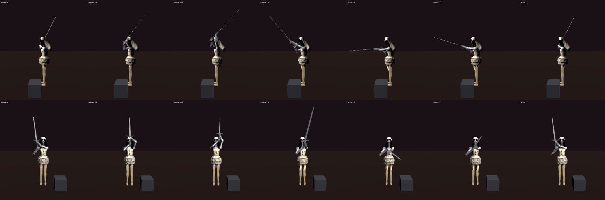
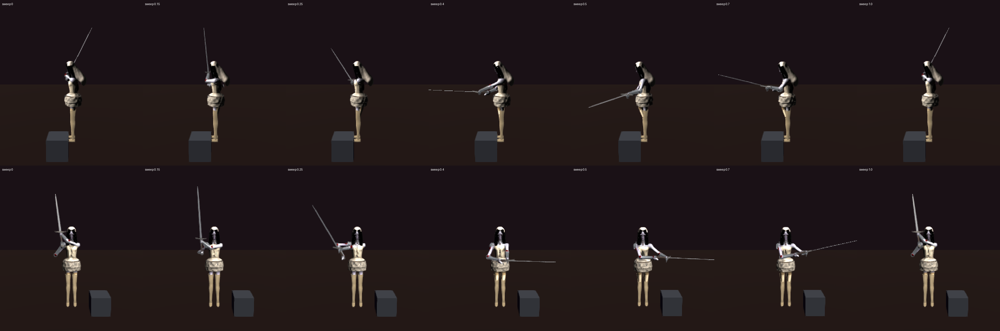
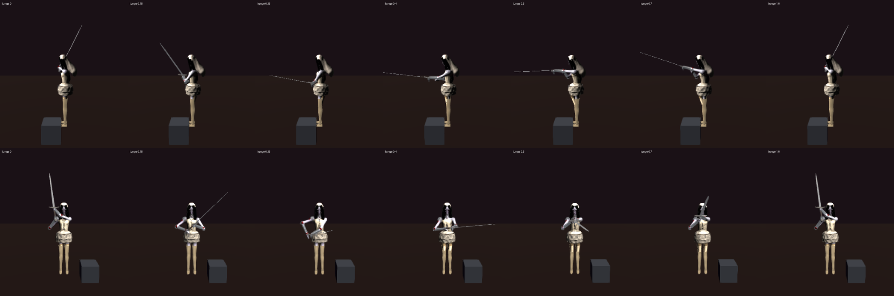

### Honest read

- **Cleave:** reads as overhead. The sword goes up at 0.15–0.25, with the hands over the crown
  and the blade leaning back. At 0.4 it comes over the top, and at 0.5–0.7 it is level at the
  player's chest. It ends LEVEL, a chop that stops on the target rather than following through
  to the floor. The wind-up blade leans back about 40°, not laid flat behind her head.
- **Sweep:** from the front it reads as flat. At 0.25 the blade is up and out to her right.
  From 0.4 to 0.7 it is level at chest height, pointing out to her left. It is a
  diagonal-into-flat, not a pure horizontal (see the pin above).
- **Lunge:** from the side it reads as a thrust. The point drops to level at the hip at 0.25,
  then the arms drive out with the blade level at chest height at 0.5. From the front, at 0.4
  the blade swings out to her LEFT on the way (the angle interpolation arcs it about 0.85 m off
  the centreline), so mid-strike it looks like a small sweep.
- **Contact timing (Task 10):** `SWORD_CONTACT.phase` is mid-strike (0.375). The cleave's tip
  is still OVERHEAD then (y 2.88 m). The blade is at the player at about 0.45–0.5.

## Task 11: game wiring — mind, hit feedback, the fight in `sdf-game.html` (same day)

- **Mind:** `game-main.ts` gives any `profile.melee.kind === 'sword'` body `makeSwordMind()`.
  Every actor gets `onMeleeContact`. The zombie mind never reports contact, so it is a no-op there.
- **Hit feedback** (`player-hit-feedback.ts`, pure, tested): a hit sets the flash to 1, starts the
  variant's shake (cleave 6 cm, lunge 5, sweep 4) and bumps the counter. Both fade linearly to exactly 0
  in 0.45 s of sim time. The state lives on `ctx.player.hitFeedback`; the overlay element is
  `ctx.player.hitFlashEl`, a fixed `#8a0000` multiply div at up to 0.55 opacity. The shake offsets the
  eye and the look target together, so the view shakes rather than swivels. The seam is
  `__sdfGame.playerHits()`, and `brains()` now also reports `carry`, `fistGrip` and `fistGripAuthored`.
- **No sound.** The plan asked for one reused existing sample, but the SDF game loads no audio at
  all (no `Audio`/`AudioContext` anywhere under `src/lab/sdf-zombie/`), so there is none to reuse, and
  new assets are out of scope.

### The sword in her hand, in the game (the Task 8 review's findings)

- **(a) Prop seating.** `game-actor.ts` re-seated the held prop on the solved hand only for the
  soldier and gunners. It now also seats any profile with a `prop` AND a `melee`. **The ogre is
  unchanged:** he has a prop but no `melee`, so his chainsaw keeps riding the motion target.
- **(b) Fist-to-grip, measured on the game path** (`webgpu/game-actor-bride.test.ts`, CPU, the real
  `createZombieActor`): **3.1 cm at the guard and 4.8 cm mid-swing**, over the 3 cm bar. The missing
  `pinTips` was not the cause. Pinning the tip the lab's way (`only` = the fist) moved it < 0.2 mm.
  - **The cause:** motion.ts seats the grip on the forearm line, then `alignElbow` swivels the
    elbow out. The solved forearm is no longer the line the grip and the hand bone were laid on, and
    the game re-seat used that swivelled line. The hand stood ~46° off the solved forearm.
  - **Fix:** a `fistOnGrip` prop seats on the FIST (the middle of the solved hand bone, wrist to
    tip), which is exactly where the lab measures it. The `only`-tip pin stays in the game step for
    `fistOnGrip` profiles, so that tip points along its target like the lab's.
- **(c) The arms lagged in the guard.** The first gate run caught an AUTHORED gap (solved fist to the
  grip where motion.ts put it) of **13.6 cm** at the guard. The soft rest pull let the arms trail
  their targets whenever she turned or set off. With the sword seated on the lagging fist, the left
  hand came off Fore_Hand. `motion.ts` now pins both arms (`posePins`) for the whole two-handed sword
  carry, not only mid-swing. The one-handed `swordTrail` keeps its free left arm, and a stagger or
  recoil still releases the pins. Re-measured: 0.60 cm.

### The run-to-swing snap (Task 9 review)

The brain does NOT always halt and settle before swinging. A lunge can start on the very frame she
enters the ring from `pursue`, still walking. But **she never runs in the game.** Her wander speed is
capped at `cruise` 1.1 m/s, or 1.375 with the burning-panic ×1.25, and `runBand.from` is 1.6. So
`runWeight` is 0 and the live carry is always `swordGuard`, the pose the track starts from. Only the
lab's `forceSpeed` reaches `swordTrail`. There is no snap to fix in game, so the track still starts
from `CARRIES[carries.walk]`.
- `game-actor-bride.test.ts` pins the invariant: `runWeight(BRIDE_PROFILE, cruise × burn)` is 0. If
  that ever fails, start the track from the carry at swing start.
- The gate checks it live: every swing start in 20 s had carry `swordGuard`.

### Gate: `scripts/bride-melee-gate.mjs`

Run: `LAB_TMP=.lab-tmp LAB_VITE_PORT=5271 LAB_CDP_PORT=9271`, sourcing `lab-servers.sh`, then
`node scripts/bride-melee-gate.mjs 5271 9271`.
- The scene: `?spawn=bride&seed=1&vhs=off`, room 2. The player stands 4.0 m from the nearest bride
  (5 m does not fit inside the room). One barrel is fired AWAY from her to wake the room.
- Then 20 s of sim, sampled every 6 frames.

```
lunges: 3.08 -> 1.88 m
fist-to-grip max: guard 0.00 cm seated / 0.60 cm authored (313 samples); swing 0.00 cm seated / 0.72 cm authored (88 samples)
melee contacts by actor: zombie 2: 8, zombie 23: 7        (= playerHits 15; one contact per swing)
PASS: fist-to-grip at the guard <= 3 cm (0.00 cm seated, 0.60 cm authored)
PASS: fist-to-grip on the swing frames <= 3 cm (0.00 cm seated, 0.72 cm authored)
PASS: a lunge from beyond 2.2 m closed >= 0.8 m within 1.2 s (3.08 m, -1.20 m)
PASS: a cleave or sweep (cleave, lunge, sweep)
PASS: playerHits >= 1 (15)
PASS: every swing starts from the guard carry (swordGuard)
PASS: frames: guard true, cleave wind-up true, cleave strike true
PASS: no console errors / pipeline errors (0)
```

- **The fight:** she lunged from 3.08 m and the full 1.2 m advance landed, stopping at 1.88 m. From
  there she held 1.80 m and threw cleave, cleave, sweep, cleave, cleave, sweep, cleave, about one
  swing every 2.3-2.7 s.
- **The cleave's hit:** it landed at swingT 0.480, just past the 0.47 contact phase.
- **The hit flash, measured** on a wall crop (x 900-1100, y 250-500): luma 19.2 on the wind-up frame
  and 11.0 on the strike frame (−43%); R/(G+B) went from 0.54 to 0.86.

**Crowd gate (the zombie no-op evidence).** `sdf-game-crowd-gate.mjs` FAILS at its negative control
("zombies stayed alert with the player out of the room"). It fails identically on this branch's base
commit `aac99621`, checked in a temporary detached worktree with the same ports. Every number before
the failure matches exactly on both runs: worst pair 0.887 m, probe 0.740 m, swing frame swingT 0.952.
So the failure is pre-existing and not Task 11. Neither was changed.

`game-context-coverage` also fails before this task: `spawnOverride` (commit 06884bb3, also on
`main`) is a second main()-scope state binding.

### Frames

The camera turns 0.3 rad off her (`FRAME_YAW`), so she stands clear of the first-person shotgun.
Off-centre she is also outside the player's light, which is why she reads in the room's dim green.

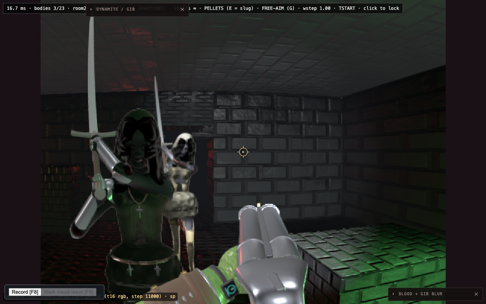 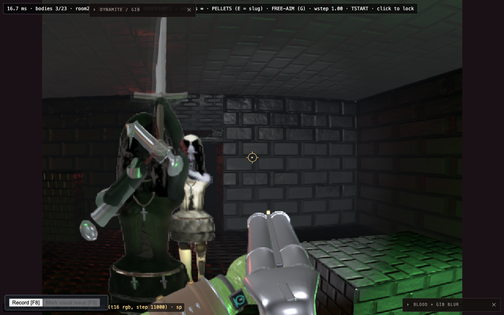 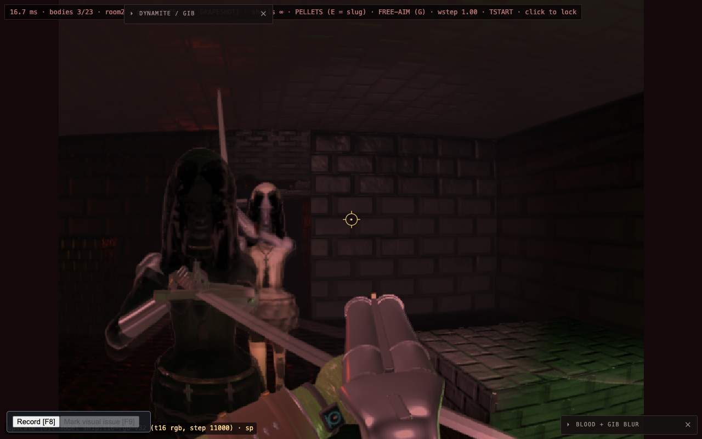

### Honest read

- **Guard:** the sword is in both hands, blade up over her right shoulder, the high guard from the
  lab. The skirt, chain girdle and crosses render uncut. So does the second bride behind her: veil,
  corset, skirt and boots. In the dim green her veil is hard to separate from her hair.
- **Wind-up:** the hands are over the crown and the blade stands straight up, which reads as the
  overhead coming. The renderer's temporal history leaves a faint ghost blade, because the
  frame-stepped capture moves a lot between frames.
- **Strike:** the whole screen goes dark red. Her hands are at her chest and the blade drives
  diagonally out at the camera, past the shotgun, so the hit reads as landing on you. At 1.8 m the
  blade foreshortens hard; the side-view swing strips (Task 9) are clearer about its arc.
- **Weak spots:**
  - At 1.8 m the camera is inside her swing, so the blade's tip mostly leaves frame.
  - She never re-faces while `recover` halts her. A player who sidesteps during her cooldown is
    swung at along the old facing and missed (the contact cone does its job). That is correct for
    a slow knight, but it will read as a whiff.

### Review follow-up: severed arms

- **Without her sword arm she drops the sword.** A `melee` profile no longer holds the carry once
  `armR` is missing (motion.ts `canHold`). game-actor releases the prop once, and the fist seat and
  the fist-tip pin are skipped. She keeps pursuing and still throws her swings, but they come from
  the bare left arm, the zombie's swipe. The sword mind reports no contact and no lunge advance when
  `armR` is missing, so those swings never hit.
- **Without the left arm she fights one-handed.** She keeps the sword and the carry, her right arm
  stays pinned, and her hits still land.
- **Pins skip a missing arm's joints.** The fix needed one more piece. The game fed motion `CALM`
  signals, whose `missing` is all-false, on every frame without damage. So the frame after a cut
  re-pinned the missing arm, which the new test caught. Melee profiles now get the real
  `missingLimbs()` on every sub-step. Every other profile keeps `CALM` exactly.
- Tests: `game-actor-bride.test.ts`, one per arm. Each severs the arm and steps 600 frames. It asserts
  that no step throws and no posePin belongs to the missing arm, then checks the drop, or the
  one-handed fight.
- Minors:
  - The fist-tip list is built once per actor.
  - The gate filters on `brains().name === 'bride'` (the new `profileName()` seam).
  - The gate's 1.2 s lunge window is now sim time. That change is **untested in the browser**.

## Task 12: the jaw gapes on the wind-up (same day) — DONE, inside the time-box

### How it is wired

- **`bone jaw parent=neck dir=up pitch=66 len=0.070`** (bride.blob). It is a CARRIER, not a hinge:
  it runs from the skull's pivot (joint `neck`) to the chin (tail y 1.597, z 0.069) so that its tail
  is a named rig point, `jaw` (gait.ts `GaitJointName`, `GAIT_JOINTS`, `JOINT_AT jaw: { head:
  'neck', tail: 'jaw' }`). It is optional like `hem`. A body without the bone never names it.
- **The hinge** is `jaw.ts` `JAW_HINGE`: skull at 0.30 and 2 cm back (y 1.640, z -0.020), level with
  the upper lip. That is lower than a human jaw joint on purpose. At the anatomical height (0.38,
  under the nose) the 0.55 rad gape swung the lower lip 3.4 cm BACK into the face, where it
  disappeared. Level with the lips, the lip drops ~5 cm and moves back only ~1.4 cm, so the jaw
  falls open, unhinged. Rotating about the bone's own head (the skull pivot) made an underbite.
- **The gape** is `sword-swing.ts` `jawGapeAt(phase, variant)`. It opens on the wind-up's
  smoothstep to a peak at `windupEnd`, holds to mid-strike (0.375), and SNAPS shut by `strikeEnd`,
  so the bite lands with the blade. It is exactly 0 outside (0, 0.5). The peaks are
  **cleave 0.55 rad, lunge 0.42, sweep 0.35**. The cleave is the overhead scream. The sweep is a
  faster side cut and the lunge is a thrust, so both open less.
- **motion.ts** computes the gape. It pins the `jaw` point to the head frame opened by the gape
  (posePins, whenever she stands) and hands the scalar on as `MotionFrame.jawGape` →
  `rig.jawGape` (actor.ts and game-actor.ts). The head frame comes from the head's CURRENT rig
  points, clamped to the same IK cone as the rigid head. The targets don't work: the aim lays the
  head target out along the gaze, tilted ~40° on her upright skull.
- **rig-bind.ts:** `on jaw` prims join the rigid head (`ridesHead`). `headTransform` opens them
  about the hinge by `rig.jawGape`, in the head's rest frame, before the head rotation. Their
  `orient` is the head quat times the gape quat (`jawOrient`). The prims take the SCALAR, never
  an angle read back off the jaw point. That point is one step stale, and at a walk the pivot moves
  ~2.5 cm a step, which is ~0.2 rad of error.
- **Care taken, after the hem:**
  - The jaw bone's Verlet constraint has stiffness 0. Pivot→chin shortens ~4 cm at full gape, and a
    rigid constraint would yank the neck toward the pinned chin.
  - The jaw point is not axial.
  - ONLY `on jaw` prims may bind to it. The upper lip ends 7 cm from it and 10 cm from the pivot,
    and the jaw shares the skull's pivot, so the hem's bone-ring rule would have let every skull
    prim reach it.
  - `impulseAt` and motion's recoil search skip it, so it cannot steal a headshot.
- **The face:**
  - The lower lip and the chin moved `on jaw`, with the same rest points re-expressed off the jaw
    tail (probed identical to 0.1 mm).
  - The FACE MASS capsule is split into two on the same line: the skull keeps 1.676 → 1.650 and
    the jaw gets 1.628 → 1.605. At rest there is a ≤ 5 mm dent at y ~1.63, under the lips.
  - A split at the lip line (1.640) did NOT work: the jaw half's round top cap swung down with the
    jaw and filled the opening with skin. The frame read as a long face with a dropped lip.
  - A dark wet bar `2a0608` on the skull behind the lips (y 1.633 → 1.597, front z ≤ 0.070) sits
    ≥ 6 mm under the rest skin, so it is invisible and paints nothing. When the jaw drops, it is the
    inside of the mouth.
  - The cranium (the sheet's projection anchor) is untouched. The sheet-projection pins pass
    unchanged.

### Numbers (CPU, `bride-blob.test.ts` drive, head frame = un-turned by `headQuatOf`)

| variant | gape | jaw point drop | lip centreline gap |
| --- | --- | --- | --- |
| rest | 0 | — | 1.0 cm |
| cleave (0.25) | 0.55 rad | 4.0 cm | 6.1 cm |
| lunge (0.25) | 0.42 rad | 3.2 cm | 5.0 cm |
| sweep (0.25) | 0.35 rad | 2.8 cm | 4.4 cm |

The jaw is back to its rest point within 0.1 mm by phase 1 (the test allows 5 mm). These numbers
come from the first split (at the lip line). The final split does not move the jaw point or the
lips.

**The test's measure changed from the plan's draft.** The draft took world y against the Verlet
head point. Her upright skull tilts up to ~45° inside the look cone as she turns, so that number
moved 2.2 cm between phase 0 and 1 with the jaw shut. It also ate the gape at the peak: 0.9 cm read
for a 4 cm drop. The pin now measures in the rigid head's own frame. A second pin checks that
exactly the three `on jaw` prims move when `jawGape` is set and every other prim stays put.

**KNOWN_NULL at HEAD (64285c82, run before gait.ts was touched):** the plan's list (mouse, cyclops,
schoolgirl-alt, dragon, gargoyle, bloatmaw, strand-fixture, box-fixture) plus **broodmother**. It
was already null there, so it was added with a comment. Every other registered character still
builds motion joints.

### Frames

Lab, ports 5271/9271, cultist sanity shot first, probe `lightDir (0.35,0.6,0.72)` +
`setSdfScale(1)`, `BLOB_POSE=aim` (+ `BLOB_SWING=cleave:0.25` for the peak), `BLOB_TARGET_Y=1.66
BLOB_DIST=0.30 BLOB_PITCH=-0.2`. **Yaw 315 (her left front 3/4), not the front.** At the cleave
wind-up peak her left forearm crosses in front of her face at yaw 0 and 45, so the front view shows
plate, not a mouth. Crops are 2× of the frame's face region.

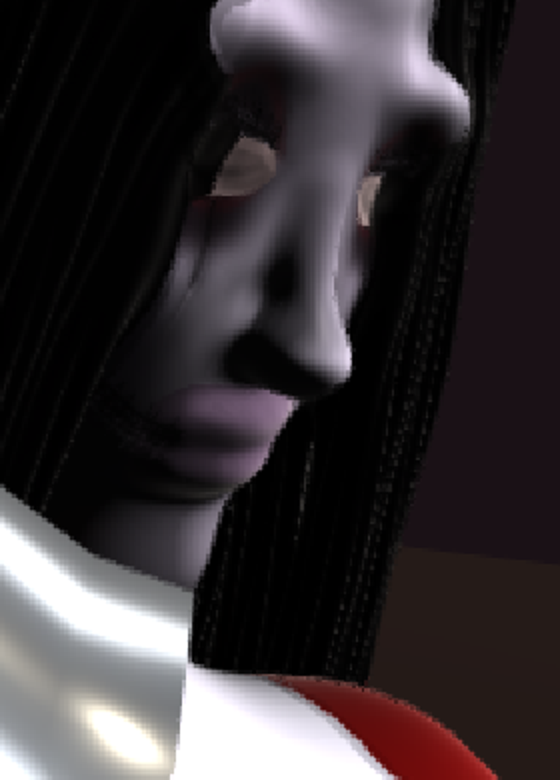 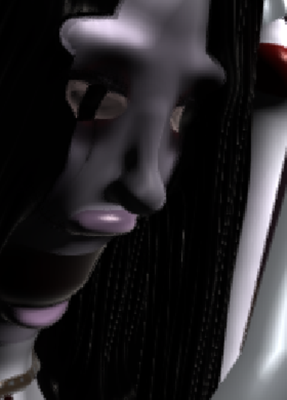

### Honest read

- **It opens.** The lower lip drops from under the upper lip to the chin line, and a dark band
  (mean rgb 34/31/32 against the lips' ~111/93/111) opens between them. It reads as a slack,
  dropped jaw, grotesque and still her face. The nose, eyes, sheet makeup and upper lip are unmoved.
  The rest face shows no seam from the split.
- **It is a DROP, not a split.** The opening is vertical. It does not widen out to the corners, so
  it does not "open past where the sutures begin" in the literal sense: the painted sutures stay
  where they are, and in this shadowed 3/4 view they are barely visible. Tearing the corners would
  mean moving the sheet's paint with the jaw, which the projection cannot do.
- **The inside reads dark, not red.** In this light `2a0608` is near black. That is fine for "a
  mouth", but it is not a wet red throat.
- **Her head is pitched well down in the `aim` pose**, so the mouth faces the floor. The low camera
  (pitch -0.2) is what shows it. From the player's eye height, at game distance, the gape will be a
  small dark gap under the nose. It has not been checked in `sdf-game.html`.
