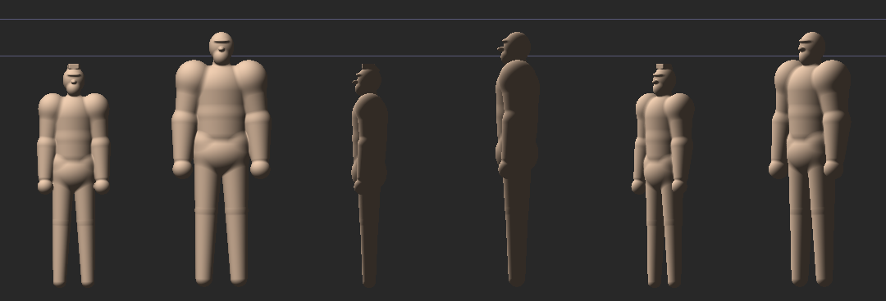
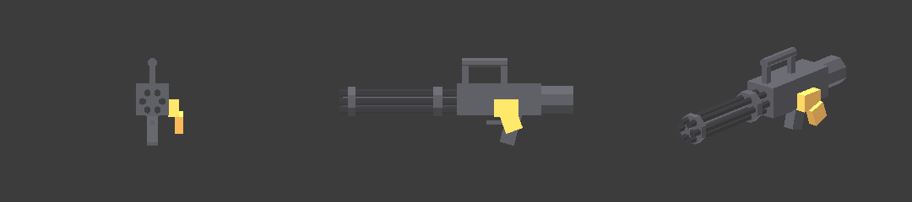

# Juggernaut — Task 2 notes (body + power armour), 2026-09-25

Plan: `docs/superpowers/plans/2026-09-25-juggernaut.md`, Task 2.

## What landed

- **`characters/juggernaut.blob`**: `soldier.blob` scaled by fixed factors, with
  the same skeleton topology and no hair. The header lists every factor:
  - overall size (H) 1.15, so 1.992 m becomes 2.291 m;
  - torso width 1.13x and depth 1.06x on top of H, making the shoulders
    1.3x the soldier's;
  - clavicle 1.13x, arm girth 1.12x, leg girth 1.10x, hip spacing 1.10x,
    neck girth 1.15x.

  The upper-arm tilt of 12° (not 8°) is the only change beyond the scaling.
  Scaled verbatim, his forearm sank 6.4 cm into the widened waist. The
  soldier's own forearm/waist overlap is 4.4 cm, which his kit hides, and
  tilt 12 brings the Juggernaut back to 4.6 cm.
- **`characters/juggernaut-kit.wam`**: classic power armour.
  - Domed pauldrons, about a 1.0 m shoulder span.
  - Upper-arm sleeves, boxy gauntlets and iron gloves.
  - Front thigh plates. Not tubes: the thighs overlap at the crotch.
  - Knee cops, greaves and big boots.
  - A round barrel-chest cuirass with a raised centre plate.
  - An iron waist girdle and gorget.
  - A sealed rounded helmet with a respirator snout and two glowing lenses.
  - A backpack power unit with twin exhaust stacks and a brass ammo drum.

  The skeleton is the `.blob`'s metres / 2.346 to six places.
- **`JUGGERNAUT_PROFILE`**: a soldier-family profile.
  - MARCH only (never runs), cruise 0.9, turn rate 1.8.
  - The soldier's shotgun at 1.38 scale as a placeholder until Task 3.
- **Registry entry `juggernaut`**, with the soldier's baked face and palette.
- **`lens` look** in `kit-overlay.ts`: glass sheen plus a dim red emissive.
- **Tests:**
  - `juggernaut-blob.test.ts`: topology, 1.15x height, 1.25-1.35x shoulder
    span, no hair, fused, the arm hug no worse than the soldier's, legs clear.
  - `juggernaut-kit.test.ts`: containment, the helmet seals the head, the
    pauldron crowns the deltoid, he stands on his boots, rest identity. It
    **skips until the glTF is built**.
  - `character-view.test.ts`: the red-eye rule now covers the soldier family.

## Not done here, and why

- **The kit is not compiled.** WAM lives outside the repo, and this session's
  sandbox refused to run it (external code). Build it on a machine with WAM:

  ```
  scripts/build-wam-kit.sh juggernaut
  npx vitest run src/lab/sdf-zombie/characters/juggernaut-kit.test.ts
  ```

  Until then the lab and game render him undressed; character-view logs the
  404 and carries on. The `.wam` was authored against measured flesh (the
  table in its header), but it has never been through the compiler. Expect a
  round of fixes: WAM lint, and whatever the fit test finds (most likely
  candidates: the pauldron inner-rim tuck bound, TUCK_MAX 0.10, and the
  helmet's clearance at the nose).
- **No GPU frames.** Headless Chromium here has only SwiftShader. The lab
  booted under a texture-view `swizzle` shim, then never finished its first
  frame in 15 minutes. `body-vs-soldier.png` is a scratch CPU sphere-trace
  of `sdBody` instead: flesh only, no kit, no face or palette. The panels are
  front, side and three-quarter views, soldier left and Juggernaut right in
  each pair. The blue guide lines mark 1.992 m and 2.291 m.
- **Gait:** MARCH, slowed by cruise. STOMP (the ogre's) is the alternative
  the plan names; that is the owner's pick once there are frames.



# Task 3 — the chaingun, 2026-09-26

## The prop

`scripts/make-juggernaut-chaingun.ts` writes `juggernaut-chaingun.glb` (336
triangles). It is a small glTF writer, not a Blender script: Blender is not
in the cloud container, and a rotary gun is only boxes and cylinders. Re-run
it with `npx tsx scripts/make-juggernaut-chaingun.ts`. The locators are:

- Grip_Hand and Muzzle: `GUN_GRIP`'s.
- Fore_Hand: the top carry handle (0, 0.11, 0), not the shared fore-end.

Preview (CPU raster of the .glb, rough shading: brass reads too bright):



## The hold: why a new carry, a wrist yaw, and a foreHand override

The rounds fly along the gun's forward axis (game-actor.ts onFire), so the
hip hold must point the muzzle where he faces. A grid search over carry
angles on his rest rig used `armPivot` and `gunPoseFromArm`, as motion.ts
does, and ruled out two things:

- **Forearm straight ahead, gun at the right hip, shared fore-end:** the left
  hand falls short by 4% at best. It has to reach 0.44 m across and 0.6 m
  forward.
- **The same with a wrist yaw:** every solution dragged the right fist across
  to his LEFT side.

What works is the minigun hold: the support hand on a TOP CARRY HANDLE near
the grip (`prop.foreHand`), plus a cocked wrist. The forearm yaws 0.40 in and
`gunYaw` 0.30 back out. Solved values: pitch 0.10, yaw 0.40, fold 1.00,
gunPitch 0.40, gunYaw 0.30, prop scale 1.45. In that pose:

- the fist sits at his right hip (-0.17, 1.37, 0.36);
- the muzzle is 0.5° off his facing and 3° up;
- the left hand reaches the handle at 91% of its arm length;
- the barrel clears his torso by 3.8 cm.

`juggernaut-blob.test.ts` pins it through the real motion pipeline, walking
and standing:

- the grip within 2 cm of the fist;
- the left hand within 3 cm of the handle;
- the muzzle within 7° of his facing.

## Behaviour (CHAINGUN_TUNING, soldier-brain.ts)

He runs on the soldier's brain with four new tuning flags, which the soldier
leaves at his old behaviour:

- `strafe: false`: comfortable means planted, with no drift moves.
- `retreat: false`: he never backs off.
- `sweepFire: true`: follow-up rounds do not wait for his facing, so the
  stream trails a strafing player at his 1.8 rad/s turn.
- `burstMin: 15`: the burst length is 15-24.

The spin-up is the aim telegraph (0.9 s). Barrel spin follows the mind's
state (`barrel-spin.ts`), so the barrels are at speed before the first round.

# Task 4 — plate armour, 2026-09-26

`plate-armor.ts` holds the plates' hit points (plan, Task 4, for the table).
The actor asks the plates before it stamps anything, so an absorbed round
leaves no wound, no injury and no blood: just sparks and a small shove.

- **Kit visual.** In plate mode, `kit-damage.ts` stops counting wounds and
  sheds by the actor's plate state, matched by bone. Everything on a shed
  plate's bones goes with it, lenses and snout included.
- **Dynamite.** Explosions still wound through the armour, and crack every
  plate they reach.
- **Stagger resistance.** Pellets never stagger him; slugs and blasts do.

`webgpu/game-actor-juggernaut.test.ts` found one thing worth knowing for
playtests: in the chaingun hold, the left forearm crosses the chest to the
top handle. Frontal chest fire strips the gauntlet (6 hp) before it reaches
the cuirass. The hips, below the iron girdle, are the one bare target from
the front.
