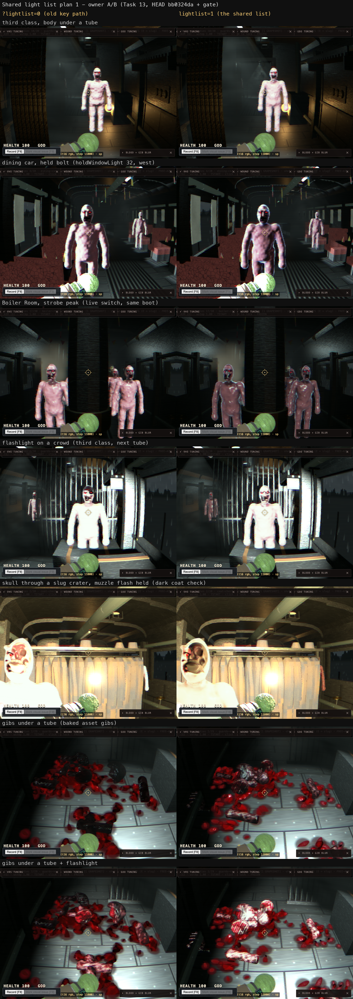
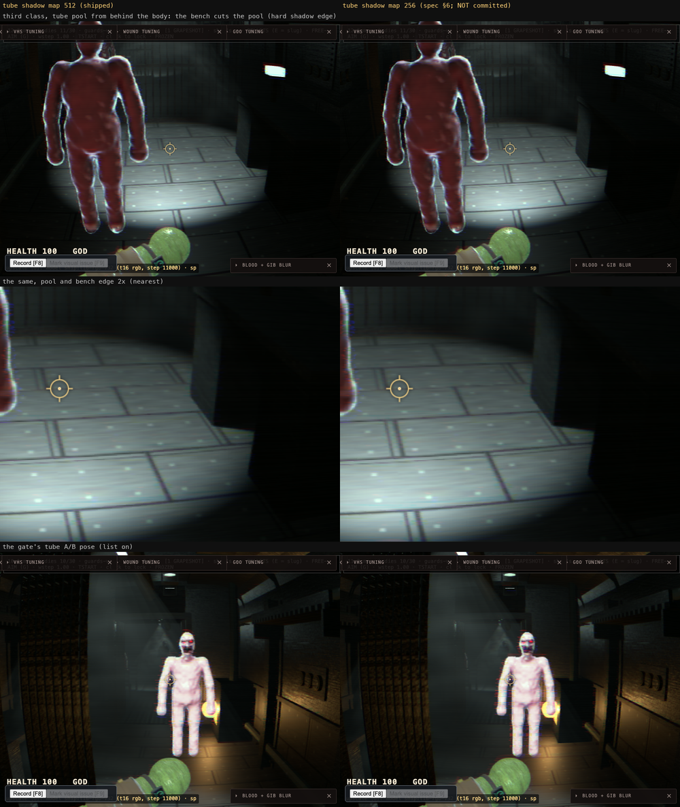
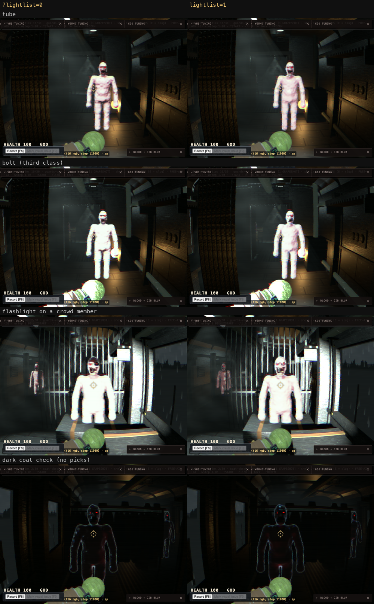
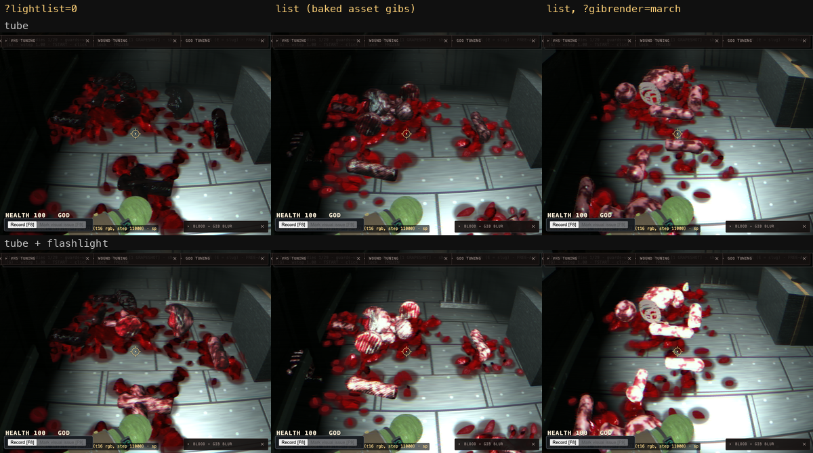
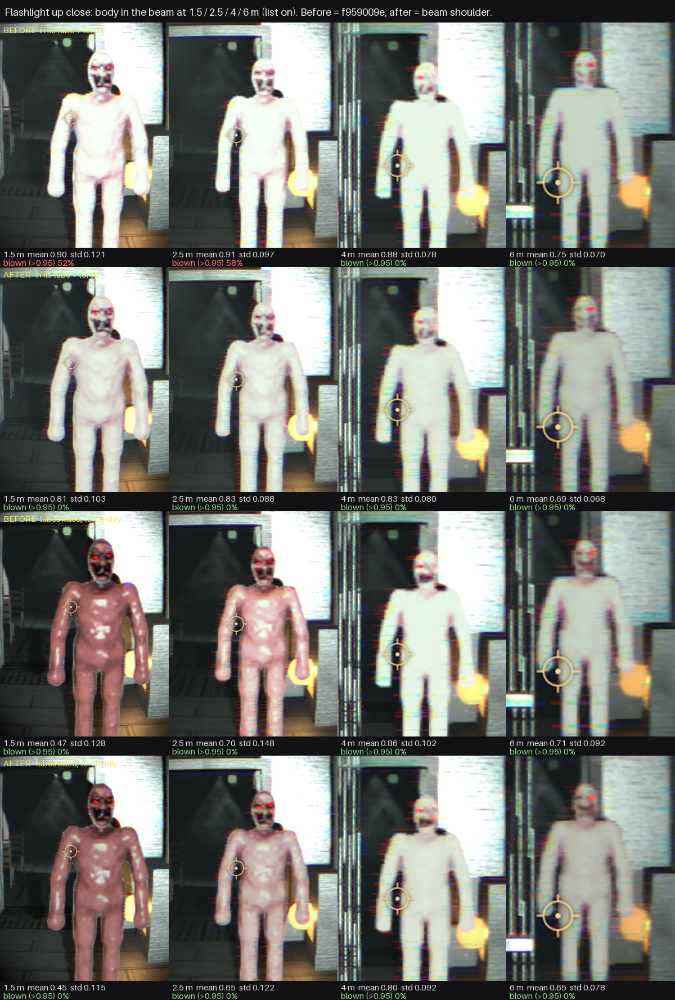
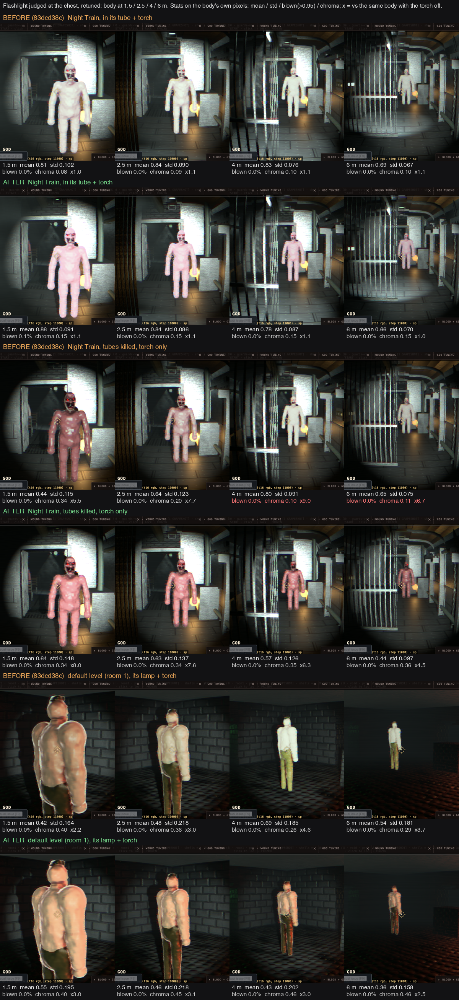

# Shared light list, Part 3 plan 1: dev note of record

Plan 1 of the shared light list ([spec](../../superpowers/specs/2026-09-26-shared-light-list-design.md),
[plan](../../superpowers/plans/2026-09-26-shared-light-list-plan-1.md)), 2026-09-26/27, branch
`claude/wake-level-pipeline-1afb01`. **Status: done, pending the owner's sign-off on the A/B pairs
below.** The old path is still in the code behind `?lightlist=0`; it is deleted after sign-off (plan
Task 13 Step 6), not before.

The first section is the summary of record (Task 13). The sections after it are the per-task records
(Tasks 10-12, the arm-gib fix), kept as they were written.

## What shipped

Every SDF body, crowd member, bone and gib is lit by the **4 lights it picks** from one shared list,
built once a frame, instead of the old single key (`applyWindowKey` / `presentingLamp`).

- **Profiles** (Task 2, `light-profiles.ts`): one presentation profile per light kind (tube, lamp,
  window, flashlight, muzzle, fire). Each profile's GPU `gain` is the old path's conversion.
- **The list** (Task 3, `light-list.ts`): up to 32 lights, 4 vec4 each, one storage buffer. Its rgb is
  physical (colour x three.js intensity x level gain), so plan 2 can feed the same list to level
  materials. `bodyNorm` (v3.z) turns it back into the lamp's live level for bodies.
- **Picks** (Task 4, `light-pick.ts`): each body's 4 lights, ranked on the light it actually delivers
  (presence x luminance x gain x bodyNorm), dominant in slot 0.
- **Level JSON** (Task 5): per-light `gain` and `tint`.
- **One writer** (Task 6): the GPU buffer, filled once a frame from every light source; the window
  light reaches every windowed carriage (room mask).
- **Crowd records** (Task 7): `REC_LIGHTS`, so every crowd member carries its own picks, not its
  type's.
- **`bodyLights`** (Task 8): the 4-light loop in WGSL, with a CPU twin (`shadeBodyLights`).
- **The march reads it** (Task 9), and **the game turns it on** for bodies and crowds (Task 10),
  **bones and bone meshes** (Task 11, 11b: the bone fill follows the owner's room) and **gib chunks**
  (Task 12: every gib picks at its own position).
- **The gate** (`scripts/sdf-game-light-gate.mjs` sections 7-10): the look bands, the bones, the
  gibs, and now the cost (section 10, below).

## The A/B switch

- `?lightlist=0` boots the old key path.
- `__sdfGame.setLightList(on)` flips it live. The list and the old path are one compiled shader
  behind a uniform (`lightListCfg.x`), so the live switch gives the same frame as a second boot,
  without the boot-to-boot noise. The cost gate uses it.

## Owner decisions (2026-09-27, recorded, not open)

- **The self-shadow is rejected** (Task 1): too subtle for +1.3 ms. It ships off; `?selfshadow=1`
  opts in.
- **The pale body baseline is approved.** The list is calibrated to match today's look at a
  front-lit pose; the owner tunes from there.
- **Gibs have no fresnel / edge rim**, on both paths.

## Cost (spec §7: at most +1.5 ms on the worst carriage over `?lightlist=0`)

**Result: the list costs nothing measurable. It is well under budget in both carriages, with refine
off and on.**

**Method** (gate section 10; `LIGHT_GATE_ONLY_COST=1` runs it alone):
- One boot, `level=night-train&frozen&god`. The train is stopped, the window held dark, the
  flashlight off, frame cap 1 and hand steps (the rAF loop is stopped).
- The flicker clock is pinned with the carriage's lamps lit. In the Boiler Room that is a strobe
  peak: the most picks.
- Rounds interleave off and on through `setLightList`, and the order alternates per round.
- Each sample is 9 fenced `timeDraws(1)` frames. That is CPU + GPU, and the list's CPU pick and gather
  are inside it: both run in the draw. The per-pass GPU timestamps are drained per frame.
- GPU ms are charged **exclusively, by completion order** (`attributePassSamples`). On this Apple GPU
  every pass in a frame reports the same start, so a pass's own end - start is queue residency, not
  cost. Summed, residency read 106 ms for a 16 ms frame.
- Poses: third class (0, -12.0, 0, -0.05), 4 bodies in the carriage, all list-lit; the Boiler Room
  (0, -96.0, 0, 0), 6 bodies, all list-lit.
- `?refine=1` puts the game on the per-body path: **the crowd path falls back per body under
  refine**. So the refine rows measure the refine twin's list loop at output resolution, on every
  body.

**Load at measurement:** the 1-minute load average was **2.9-3.5** on the kept runs (polled until it
was under 4). One refine run at load 6.4 is discarded below.

Medians of 12 interleaved rounds per side (frame ms; the per-round deltas show the bench's spread):

| carriage | refine | frame off | frame on | on - off (median) | per-round deltas | GPU span on - off |
|---|---|---|---|---|---|---|
| third class | off | 15.90 | 15.90 | **+0.00** | -0.50..+1.00 | -0.05 |
| third class | off | 16.15 | 15.90 | **-0.25** | -0.50..+0.20 | -0.03 |
| third class | off (load 7.2 at start) | 15.90 | 16.30 | **+0.40** | -1.20..+0.50 | +0.09 |
| Boiler Room | off | 16.80 | 16.80 | **+0.00** | -0.70..+0.70 | +0.10 |
| Boiler Room | off | 16.85 | 17.00 | **+0.15** | -0.30..+1.10 | +0.09 |
| Boiler Room | off (load 7.2 at start) | 17.05 | 17.00 | **-0.05** | -10.6..+1.10 | -0.00 |
| third class | on | 30.85 | 30.75 | **-0.10** | -1.30..+2.40 | -0.05 |
| third class | on | 30.80 | 30.75 | **-0.05** | -0.50..+1.20 | +0.14 |
| third class | on | 30.90 | 31.15 | **+0.25** | -1.80..+1.00 | +0.10 |
| Boiler Room | on | 35.10 | 35.20 | **+0.10** | -1.50..+2.80 | +0.24 |
| Boiler Room | on | 32.60 | 32.70 | **+0.10** | -0.90..+1.10 | -0.11 |
| Boiler Room | on | 33.25 | 33.30 | **+0.05** | -2.60..+2.20 | +0.29 |

Per pass (exclusive GPU ms, median on, on - off): `sdf:march` 5.58 (third class) / 7.8 (Boiler Room),
within ±0.03 ms either way; `sdf:refine` 12.0-12.6 / 15.7-16.5, within ±0.25 ms. No pass moves beyond
its noise. The frame and the GPU span move together, so the CPU pick and gather are not measurable
either.

- **Worst kept median: +0.40 ms (frame) and +0.29 ms (GPU span), against a +1.5 ms budget.**
- **Loaded, the bench is useless.** The discarded refine run (load 6.4-6.6) read -1.65 / -3.25 ms,
  with rounds from -67 to +50 ms. A full-gate run at load 7 read +9.1 ms in third class.
- **Why Task 10 read +1.6-1.9 ms.** Its "march GPU" figures summed each march pass's own end - start
  (residency behind the queue, above), grouped under one pass frame for all 9 `timeDraws` frames, on
  a machine at load 10-95. They were not a cost.

**The gate check is enforcing, with a load guard.** It fails when the median frame on - off is over
1.5 ms in either carriage. The median's run-to-run noise at load < 4 is about ±0.4 ms, well inside
that. When the 1-minute load average is still over 4 after a 2-minute wait, an over-budget result
prints a `WARN ... report-only` line instead of failing: a loaded machine gives a flake, not a
finding. `LIGHT_GATE_COST_REPORT_ONLY=1` forces report-only.

The final full gate run (all sections, 8 cost rounds):

```
     cost third class (4/4 bodies in the carriage list-lit) frame off 16.50 (16.30..17.70) on 16.50 (16.30..17.40) -> median on-off 0.00 ms, per-round deltas -0.60..0.30 | GPU span off 9.91 on 9.97 -> 0.06 ms (rounds -0.18..0.24)
     cost Boiler Room (6/6 bodies in the carriage list-lit) frame off 17.30 (17.10..17.50) on 17.40 (17.00..17.60) -> median on-off 0.10 ms, per-round deltas -0.30..0.20 | GPU span off 12.61 on 12.62 -> 0.02 ms (rounds -0.13..0.43)
ok   cost (enforced, load 2.80, budget +1.5 ms): third class 0.00 ms, Boiler Room 0.10 ms
PASS sdf-game-light-gate (wall 88 s)
```

## Owner A/B pairs (`?lightlist=0` left, the list right)



[owner-ab-off-on.png](owner-ab-off-on.png): the pairs the plan asks for, all from one full gate run
(`LIGHT_GATE_SHOT`, HEAD bb0324da plus the gate changes), clocks pinned, the train stopped. The
Boiler Room row is the cost section's frame (the live switch, same boot); the others are two boots.
Also regenerated from the same run:
- [contact-sheet-off-on.png](contact-sheet-off-on.png): the Task 10 rows (tube, bolt, flashlight,
  dark coat check).
- [gibs-off-on.png](gibs-off-on.png): gibs, with the `?gibrender=march` column.
- [skull-off-on.png](skull-off-on.png): the skull, with and without the muzzle flash.

Body-box numbers from that run (gate section 7; the frame's centre box):

| scene | on mean / near-black | off mean / near-black | on/off |
|---|---|---|---|
| third class, under a tube | 0.347 / 0.8% | 0.335 / 0.8% | 1.04x |
| third class, held bolt | 0.374 / 0.0% | 0.381 / 0.0% | 0.98x |
| flashlight on a crowd member | 0.594 / 1.9% | 0.595 / 1.8% | 1.00x |
| dining car, held bolt (new, look row only) | 0.307 / 1.1% | 0.338 / 1.0% | 0.91x |
| dark coat check (no picks) | 0.050 / 60.6% | 0.054 / 58.0% | 0.93x |

Skull (dark coat check, a slug crater): crater crop 0.115 -> 0.547 with the flash (list) against
0.150 -> 0.683 (`?lightlist=0`); skull / surrounding flesh with no flash 1.27x (bound 1.5x) against
1.53x. Gibs under the tube: 0.205 against 0.064 (3.2x), dark 0.5% against 28.8%; with the torch
0.514 (6.1% blown) against 0.234.

**By eye:**

- **Third class, under a tube.** Essentially the same pale body. The list is a touch smoother.
- **Dining car, held bolt.** The list is a little pinker and more modelled, with a cold edge on the
  window side. Today's is flatter and paler. The body box reads 0.91x.
- **Boiler Room, strobe peak.** **The clearest difference.** Today's bodies are pale pink and evenly
  front-lit. The list's are darker, redder and wet-modelled: they are lit from where the strobe lamps
  are, not presented to the camera. Measured on the bodies: 0.293 against 0.428 (0.68x) for the
  left body, and 0.202 against 0.365 (0.55x) for the right. The body at the third-class cost pose
  (standing right of the camera, not front-lit) reads 0.75x. The calibration matches today only at
  a front-lit pose; elsewhere the list is darker than today's presented key. **This is the owner's
  call**, below.
- **Flashlight on a crowd.** The front body is the same very pale white. The crowd member behind is
  redder on the list: it has its own picks.
- **Skull, muzzle flash.** The list skull is modelled by the flash (the sockets are shaded) and a
  little darker than the blown-out flesh. Today's is flatter and paler.
- **Gibs.** Today's pieces are near-black silhouettes under a lit tube. The list's read as maroon
  flesh with no pale outline. In the beam they go pink-white with wet highlights and bone stripes,
  and a few face-up pieces come close to white (6.1% blown). The marched views (`?gibrender=march`)
  blow out more in the beam (16.7% this run): a known gap.
- **No NaN speckles, no flat white, and no black bodies** in any frame.

## Tube shadow maps at 256² (spec §6): not committed, owner question

`TUBE.shadowSize` in `game-dynamic-light-leaves.ts` was set to 256, measured, shot, and **put back to
512**.



[tube-shadow-512-vs-256.png](tube-shadow-512-vs-256.png): the tube's pool from behind a body, where
the bench cuts the pool (the tube's hard shadow edge), then the same crop at 2x, then the gate's tube
pose.

- **Look.** Indistinguishable. The largest pixel difference is 16/255, and 0.00% of pixels differ by
  more than 24/255 in the pool shot (0.02% at the tube pose). Penumbra and PCF soften the edge more
  than the map's resolution does.
- **Cost.** Below the bench's noise. The tube shadows re-render on every other hand step in the
  player's carriage, inside the `sdf:polys` pass. That pass's mean exclusive GPU time read 1.03 /
  0.73 / 0.82 ms at 512 and 0.76 / 0.70 / 0.77 ms at 256. The step-frame medians (17-27 ms per
  round) were dominated by the GPU's clock state, not by the map size.
- **Question for the owner:** 256 saves memory and maybe ~0.1 ms, and looks the same. Take it or
  keep 512?

## Deviations from the plan

- **Profiles are 3 vec4, not 2** (`PROFILE_VEC4S`): ten parameters per profile did not fit in two.
- **Gibs pick per object, not per material.** The first cut of Task 12 picked per chunk material at
  the pieces' centroid. Review I1 removed that: every drawn gib mesh picks at its own position, spec
  §4 as written. What remains: the list is on for every drawn gib whatever it picks (no picks = fill
  only), not "x = 0 without picks".
- **`applyRoomFill` and `applyStormBodyKey` are kept in list mode** (Task 10): the room fill is the
  floor where no light picks a body, and the storm key sets the fill colour.
- **Chunk bones and ejected eyes** have no owner and keep the old key in list mode (Task 11).
- **The cost gate uses the live switch** in one boot, not two boots (the task text): the same shader
  behind a uniform, without the boot-to-boot noise. It is enforcing with a load guard (above).
- **The dev note is this file** (`notes.md` in this folder), not a new
  `2026-09-27-shared-light-list.md`.

## Known gaps (consolidated)

Looks, for the owner:
- **Away from a front-lit pose the list is darker than today** (Boiler Room 0.55-0.68x, a body
  standing to the side 0.75x). Today's key is presented to the camera; the list lights from where
  the lamps are.
- **Shine and fresnel on a dim dominant.** keyC is normalised to peak 1, so the wet shine and the
  fresnel do not dim with the key.
- **Non-storm levels keep the preset's warm keyColor as the fill** in list mode. This needs a look
  on a non-storm level.
- **Marched gib views blow out in the beam** (15-32% of gib pixels over 0.95): they take the list at
  the march's full level, with no chunk trim. The gate fences it at 40%.
- **Cover at the chunk's own height.** A piece on the bench top at the pool's edge picks the tube at
  about 0.1 while the bench top around it is visibly lit: the list's cone is narrower than the
  level's lit pool there.

Numbers not measured:
- **Muzzle and fire gains are derived, never measured.** The old and new flash curves cross at 1.5 m;
  the list is about 3x brighter at 3 m and dimmer inside 1 m.
- **The lamp's 1.1 presentation gain** (`LAMP_PRESENT_GAIN`) was chosen, not measured. A warm bulb
  keys about 15% under the old path's 1.3.

Behaviour:
- **The live tuning seams stop reaching bodies in list mode.** `setBodyFlash` / `bodyFlashGain` and
  `beamTuning` no longer affect list-lit bodies; the profile gains bake in their defaults.
- **BODY_DARK_FLOOR** leaves about 60% of a body with no picks near-black (60.6% against 58.0%
  today), the same as today.
- **No level-to-body shadows until plan 2.** A body inside a seat's shadow stays lit.
- **A chunk view's bones** reach the tube instancer with no owner, so they keep the old key (and
  their fresnel) in list mode.
- **The storm window's side rim** on chunk views (old path only, during a bolt) is untouched.
- **Dead data:** the bake still writes the per-vertex `bakeFresnel` attribute; nothing reads it.

## After sign-off

1. One commit deletes the old path (plan Task 13 Step 6): `applyWindowKey`, `presentingLamp`,
   `strongestLamp`, the `spotCfg2.w` rim block in `compose.wgsl.ts` and the `?lightlist=0` switch,
   then updates the golden and the gates. The plan's list also names `applyRoomFill` and
   `applyStormBodyKey`, but list mode still calls both (deviation above), so they stay unless the
   owner decides otherwise. With no old path to compare against, the cost section goes too, or is
   re-pointed at plan 2's level-material cost.
2. Plan 2: level materials move onto the list (4 strongest per carriage), with one 1024² shadow atlas
   read by the level and the bodies. The tube cones (shadowed spots, about 4-9 ms per carriage in
   the optimisation pass) are where that wins its time back.

---

# Per-task records

## Task 10: bodies and crowds lit by their own 4 lights

Plan 1, Task 10 (2026-09-27). With `lightlist` on by default, every SDF body and crowd member is lit
by the 4 lights it picks from the shared list. `?lightlist=0` gives the old key path
(`applyWindowKey` / `presentingLamp`).



(Regenerated in Task 13 from the final run, with the same four rows.)

The contact sheet has one row per scene: a body under a third-class tube, a held bolt
(`holdWindowLight(32, -1)`), the flashlight on a crowd member under the next tube, and the dark coat
check (lamps killed, no picks). The left column is `?lightlist=0` and the right is the list. Each
column is a fresh boot with the clocks pinned and the train stopped. `scripts/sdf-game-light-gate.mjs` section 7 renders
it. Set `LIGHT_GATE_SHOT=<dir>` to keep the frames, or `LIGHT_GATE_ONLY_LIST=1` to run that section
alone.

## The first cut blew the bodies out; the calibration fixed it

The list's rgb is physical: colour × three.js intensity × level gain. That is tube spot 16-17.6,
window 32 while held, flashlight 90. The first cut multiplied that by the pick weight and the old
presentation gain (1.3), so keyI came out near 19 under a tube. The old key was about 2. The result
was flat white bodies under a tube, a bolt and the flashlight.

The rgb stays physical because plan 2 feeds the same list to level materials. Two things convert
it to the body key the old path gave:

- **`bodyNorm`**, packed in light v3.z, is 1 / the light's reference intensity (`refIntensity`):
  - For a tube, base × `TUBE_SPOT_GAIN` 7.
  - For a point lamp, its base.
  - For the flashlight, its base of 90.
  - For everything else, 1.

  Per light, `intensity × bodyNorm` is the lamp's live level. That is the old key's level term, so
  flicker and blackouts still ride it. A single per-kind constant could not do this, because lamp
  bases differ (a 4.9 tube in the tender).
- **Each profile's GPU `gain`** (lane a.x) is the old path's conversion. Its derivation is written
  next to the number in `light-profiles.ts`, and the old constants are pinned equal to their homes
  by `game-light-list-leaves.test.ts`.

`bodyLights` (WGSL) and `shadeBodyLights` (CPU twin) compute `c = rgb × weight × gain × bodyNorm`.
The WGSL change is one line; the march golden moved on purpose, and only `__HELPERS_joined`
changed.

| profile | gain | derivation |
|---|---|---|
| tube | 3.276 | lightCfg.x 2.4 × BODY_LAMP_GAIN 1.5 × PRESENT.gain 1.3 × LAMP_LIST_TRIM 0.7, bodyNorm 1/(base × 7) |
| lamp | 2.772 | 2.4 × 1.5 × 1.1 (the lamp's own presentation gain) × 0.7 (tube-measured trim; no warm lamp measured), bodyNorm 1/base |
| window | 0.1092 | 2.4 × BODY_WINDOW_GAIN 0.035 × WINDOW_LIST_TRIM 1.3, on the raw intensity (bodyNorm 1) |
| flashlight | 11.2 | beam gain (spotCfg2.x) 4 × FLASHLIGHT_LIST_TRIM 2.8, bodyNorm 1/90 |
| muzzle | 0.0387 | bodyFlashGain 0.06: old I·0.06/d², list I·g/(1+0.2d²), equal at 1.5 m (not measured) |
| fire | 0.0327 | the same, with fire's distFall 0.1 (not measured) |

**The trims are measured, not derived.** The old key was one lamp. The list adds up to three more
lights, each light's backRim, the wrap floor and the highlight shoulder. The shoulder compresses, so
the mean moves slowly with gain. Body-box mean against today's at the gate pose, by trim:

- **Tube:**
  - 0.45 gives 0.90×.
  - 0.6 gives 0.99×, with the std 4% under today's.
  - 0.7 gives 1.01-1.04×, with the std at or above today's.
- **Flashlight** (the old beam replaced the key direction with a frontal lambert; the list's
  flashlight is one wrapped light of four):
  - 2.4 gives 0.99×.
  - 2.8 gives 1.00×.
- **Window** (held bolt):
  - 1.0 gives 0.96×.
  - 1.3 gives 0.99×.

This is a baseline that reproduces today's brightness. The owner tunes the look from here.

## A/B, body box (0.38-0.62 × 0.2-0.8 of the frame), final constants, full gate run

| scene | on mean / std / near-black | off mean / std / near-black | on/off mean |
|---|---|---|---|
| tube | 0.350 / 0.306 / 0.8% | 0.337 / 0.296 / 0.8% | 1.04× |
| bolt | 0.376 / 0.335 / 0.0% | 0.381 / 0.345 / 0.0% | 0.99× |
| flashlight | 0.595 / 0.356 / 1.8% | 0.596 / 0.366 / 2.0% | 1.00× |
| dark coat check (no picks) | 0.051 / 0.052 / 60.0% | 0.053 / 0.057 / 58.6% | — |

The std is at or above today's under a tube. It is 2.6-2.9% under today's for the bolt and the
flashlight, which is within run-to-run noise (about 0.01).

**The gate** requires the tube, bolt and flashlight means to be within 0.9×..1.2× of
`?lightlist=0`. It also requires the near-black share to be ≤ 15% in those three scenes, and the
dark scene to stay within today's value + 5 points.

**Determinism.** Each boot pins the scene before the A/B:

- The train is stopped (`setTrainSpeed(0)`), so the tubes hang still. The old key's direction
  follows the tube's swing: frozen mid-swing with the tube behind the body, today's tube mean fell
  to 0.16 against 0.34 at rest. The list stayed at about 0.24-0.35 there, which is the point of
  the list.
- The A/B body stands 0.6 m past its tube as the camera sees it, so the pool presents its front.
- The coat check's `die` script is stepped to its end, so the dark scene has no picks. The gate
  checks this.
- The flicker clock is pinned only when the third-class tubes are at full level.
- The clock is re-pinned after the torch ramps on.

## How the list looks against today (by eye)

At this pose today's path is itself a bright, pale body, and the list now matches it.

- **Tube.** Close to today. The list is a little smoother, with a soft sheen on the shoulders and
  chest. The limbs, chest and head still read as modelled. It is not flat and not black.
- **Bolt.** Close to today. The list is slightly softer, and the cold rim reads on the edges.
- **Flashlight.** Both are very pale on the torso. The list keeps a little more pink relief there
  and lights the face, where today leaves the face and scalp darker. The crowd member behind is lit
  differently from the one in front: each has its own picks.
- **Dark coat check.** Essentially identical: a dark body carried by the blue fresnel rim and the
  red eyes. There is no flat black. There is no visible (0,1,0) highlight from the empty slot 0.
- **No NaN speckles** in any frame.

**For the owner.** "Match today" means matching today's pale look at a front-lit pose. The first
uncalibrated cut was flat white, and that is gone.

**Owner, 2026-09-27: the pale baseline for bodies is approved.** The list keeps matching today's
look on bodies; the owner tunes from here.

## Deviations from the task text (approved by the coordinator)

- **`applyRoomFill` is kept in list mode.** It is the fill, not the key. It makes blackouts go
  dark, and BODY_DARK_FLOOR is the floor for bodies no light picks.
- **`applyStormBodyKey` is kept at spawn.** It sets keyColor to COLD_FILL on storm levels, and the
  watch items say to keep keyColor as the fill colour. `releaseWindowKey` hands back a key that the
  old path steered, for the live `setLightList` switch.

## Watch items (Task 9 review)

- **keyColor stays the fill colour.** It is COLD_FILL on Night Train and is never steered in list
  mode.
- **`lightListCfg.x = 1`** is set on every crowd type's uniforms and on single views. It is not set
  on chunks or hands (Task 12).
- **`spotCfg2.w` and `bodyFlash.w` are 0** in list mode. `spotCfg` and `levelShadowCfg` are left
  alone (shader-gated).
- **Never black in a dark corridor.** The body box is 60.5% near-black with no picks, against
  57.3% today. The rim and the room fill (BODY_DARK_FLOOR) carry it, the same as today.
- **Flat-lit face against the body in a dark carriage.** The face is no brighter or flatter than the
  body there. Lit, the face reads better than today under the flashlight.
- **Shine and fresnel on a dim dominant.** keyC is normalised to peak 1, so the wet shine and the
  fresnel do not dim with the key. This is the likely source of the smoother sheen under a tube. It
  is a look item for the owner.

## Cost (indicative only: the machine was loaded, load average 10-70). SUPERSEDED by Task 13

**Superseded.** These "march GPU" figures were pass residency, not cost (see the Cost section at
the top). The clean Task 13 measurement is +0.0..0.4 ms.

Rounds interleave on and off via `__sdfGame.setLightList`, with 8 rounds of `timeDraws(9)` and the
`passTimings` march passes. There were two runs, minutes apart:

| scene | run 1 frame off→on | run 1 march GPU off→on | run 2 frame | run 2 march GPU |
|---|---|---|---|---|
| third class, refine off | 31.8 → 34.0 | 7.30 → 10.70 | 32.0 → 31.7 | 6.06 → 6.65 |
| Boiler Room, refine off | 34.2 → 35.3 | 14.81 → 12.60 (inverted) | 27.0 → 28.0 | 10.57 → 12.18 |
| third class, `?refine=1` | 63.0 → 64.1 | 8.69 → 8.86 | 50.4 → 50.6 | 7.65 → 8.20 |
| Boiler Room, `?refine=1` | 67.2 → 68.9 | 14.72 → 12.24 (inverted) | 55.6 → 55.3 | 11.11 → 12.97 |

Run 1 disagrees with itself: +3.4 ms in third class, and inverted in the Boiler Room. Run 2 is
steadier: march GPU +0.6 ms in third class and **+1.6 / +1.9 ms in the Boiler Room**. That is over
the 1.5 ms flag, but the Boiler Room strobes and the machine was busy. Task 13 needs the real
measurement on a quiet machine.

`?refine=1` puts the game on the per-body path (the crowd path falls back), so its rows measure the
refine twin's list loop at output resolution.

## Task 10 review fixes

**Ranking is on delivered light.** `lightRank` (and the pick) now rank on presence × lum(rgb) ×
profile gain × bodyNorm, the same scalar the shader multiplies rgb by. Before this, rgb was
physical, and gain × bodyNorm varies about 6× by kind (lit tube ≈0.19, flashlight 0.124, window
0.109, muzzle 0.039, fire 0.033). So a 35-intensity muzzle flash 1.5 m from a body under a lit tube
outranked the tube and took slot 0 (the dominant: scatter, the wound shadow, the shine). A
light-pick test pins this case. The packed weight is still absolute presence. `RANK_FLOOR` (1e-4)
now applies to the delivered scale.

**Fire-mood lamps are not normalised twice.** The fire profile's gain converts raw intensity
(bodyNorm 1), and burning-body flashes use it the same way. `collectLightSources` and the reader
no longer set a reference intensity for fire-mood lamps.

**Pinned mirrors.** `OLD_BEAM_GAIN` and `OLD_BODY_FLASH_GAIN` are test-pinned to
`makeVfxState().beamTuning.gain` and `makeLightingState().bodyFlashGain`. The lamp's 1.1 is now
`LAMP_PRESENT_GAIN`. The plan chose it and nobody has measured it; a warm bulb keys about 15% under
the old path's 1.3.

**Allocation-free pick path.** `pickBodyFor` takes an `out`, and the actor loop reuses one scratch
body. `pickLights` keeps its rank and presence scratch at module level, and it packs the presence
from the ranking pass instead of recomputing it. A spot's cover-zero cosine is computed once per
light in `buildLightList` (`ListLight.coverZero`, CPU-only). List mode skips the bodyFlash
best-flash scan, since that slot is zeroed anyway. Everything else behaves the same.

**`a.room` keeps `||`.** In `game-actor.ts`, `roomAt(pos) || opts.room` stays as it is. Room id 0
is never valid: `level-json.ts` rejects ids below 1, and the three levels use 1..8. Navigation's
`roomAt` returns 0 to mean "in no room or tunnel". `||` falls back to the spawn room there. `??`
would keep 0, and a room-0 body would then match no room-masked light.

**The gate's dark scene is checked.** The framed actor must be in room 6 and within 2 m of the
target (both boots).

### Gate after the fixes (loaded machine, load average 27-95)

```
shared list: 15 lights in third class; crowd actors 27/28 (room 1, 8.2 m apart) dominants 0 (w 0.901) / 1 (w 0.497); 26/30 bodies picked
tube       on  mean 0.349 std 0.306 dark 0.9% | off mean 0.331 std 0.290 dark 0.9%
bolt       on  mean 0.375 std 0.335 dark 0.0% | off mean 0.373 std 0.336 dark 0.0%
flashlight on  mean 0.595 std 0.357 dark 1.8% | off mean 0.593 std 0.364 dark 2.0%
dark       on  mean 0.051 std 0.053 dark 60.3% | off mean 0.054 std 0.056 dark 57.9%
shared list look: on/off mean tube 1.05x bolt 1.00x flashlight 1.00x
PASS sdf-game-light-gate (wall 404 s)
```

The ratios are unchanged within noise (they were 1.04 / 0.99 / 1.00). The first run failed in section
4 ("the glass did not flash: 0.2719 -> 0.3839"). That section comes before any list code, and the
bolt flickers. The rerun passed.

### Known gaps (for the owner)

- **Muzzle and fire gains are derived only, never measured.** The old flash curve (I × 0.06 / d²)
  and the list's (I × gain / (1 + distFall d²)) cross at 1.5 m. The list is about 3× brighter than
  the old flash at 3 m and dimmer inside 1 m.
- **The live tuning seams stop reaching bodies in list mode.** `setBodyFlash` / `bodyFlashGain` and
  `beamTuning` no longer affect list-lit bodies. The profile gains bake in their defaults.
- **BODY_DARK_FLOOR** still leaves about 60% of a body with no picks near-black (the dark coat
  check: 60.3% against 57.9% today), the same as today.
- **Non-storm levels keep the preset's warm keyColor as fill in list mode.** Only storm levels set
  it to COLD_FILL at spawn. This needs a look on a non-storm level.
- **Boiler Room cost.** +1.6 to 1.9 ms march GPU, measured on a loaded machine (see Cost). Deferred
  to Task 13.

### Cold boot, bodyLights WGSL (scripts/boot-time.mjs, fresh profile each run)

The runs alternate head and base. Head is this commit (bodyLights WGSL from 6540bd05). Base is
17b7ffe4 (before it), in a temporary worktree. The machine was loaded.

```
HEAD run 1: {"drawOnce":3364.5,"warmMs":4825}
BASE run 1: {"drawOnce":3992.3,"warmMs":68570}
HEAD run 2: {"drawOnce":3710.5,"warmMs":5471}
BASE run 2: {"drawOnce":3727.3,"warmMs":5451}
```

drawOnce is within run-to-run noise: head 3.36 / 3.71 s against base 3.99 / 3.73 s. No cold-boot
regression shows. Base run 1's 68.6 s warmMs is an outlier from the fresh worktree's first Vite
dependency pre-bundle. Its second run is 5.45 s, level with head.

## Task 11: bones read the same lights

- **How owner picks reach an instance.** Tubes: each `update` source carries `lights` (the owner
  view's `bodyLights` Vector4, by reference); rows remember it, and `syncLights()` copies it into
  the row's iLights (floats 18..21, `INSTANCE_FLOATS` 22). Bone meshes: `push` records the owner
  per batch instance; `syncLights(ownerBodyLights)` copies each owner's `bodyLights` into the
  batch geometry's iLights `InstancedBufferAttribute` (grown with the batch). The copy runs in
  game-main after the actor light loop, because both renderers' `update` runs earlier in the
  frame (a direct write there would lag the flash by one frame).
- **No owner = -2.** Chunk bones and ejected eyes (their own geometry) pack -2 and keep the old
  key even in list mode, so the old key is still steered (`applyWindowKey`) on both uniform sets.
  `?lightlist=0` sets `lightListCfg.x = 0`: exactly the old path.
- **Compose.** Only the key changes: `albedo * (ambient + bl.diffuse) * ao + wetTint * (bl.spec *
  look.z * mix(1.3, 0.7, expo) + rimC * fres * (0.5 + 0.5 * peak)) + bl.rim`, `rimC` the dominant's
  colour (the key colour when nothing is picked), as the march's fresnel does. The plan's
  `diffuse * deepColor` read as albedo, the march's compose.
- **Gate.** Coat check (no picks), `hitMeshSkull` crater, `muzzleFlash()` held at dt 0: all 18
  bone-mesh instances pick the muzzle light; crater crop 0.091 -> 0.550 (list) against 0.092 ->
  0.683 (`?lightlist=0`). The list skull is modelled by the muzzle (sockets shaded) and a little
  darker than its blown-out flesh; the old one is flatter and pinker. With no flash both paths show
  the same pale skull in a near-black body (bone ambient is seeded once from the spawn fill).
- **Draws.** Unchanged by construction: an attribute on existing meshes, no new mesh or material.
- **Cold boot** (loaded machine, alternating): head drawOnce 1608 / 1903 / 3539 / 2239 / 3028 ms,
  base 1400 / 1655 / 2147 / 2432 / 3973 ms; medians 2239 vs 2147, inside the noise.

## Task 11b: bone fill follows the owner's room

- **The bug (review I1).** Bone `ambient` is a uniform seeded once at spawn, while the body's fill
  is rescaled every frame by `applyRoomFill`. In a dead carriage the skull glowed pale inside a
  near-black body.
- **Fix, list mode only.** `roomFillFactor(ctx, x, z)` returns the factor `applyRoomFill` uses:
  `fillFactorOf(roomLight)`, which is `BODY_DARK_FLOOR + (1 - floor) * lit` (pure, unit-tested).
  `applyRoomFill` now calls it, so its behaviour is unchanged. game-main writes each actor's factor,
  taken at its root, into a WeakMap during the actor light loop. `syncLights(..., ownerFill)`
  copies it into iFill. For tubes that is float 22 (`INSTANCE_FLOATS` 23; the `probe-dynamic`
  mirror follows, and the test now uses the imported constant). For bone meshes it is a 1-float
  `InstancedBufferAttribute` per batch, eyes included, grown alongside iLights. Instances with no
  owner get 1. `boneShade`'s list branch uses `ambient * fill`, and the old branch is untouched,
  so `?lightlist=0` is exact.
- **Minors.** `ownerBodyLights` reads `?.view?.` (M1). M3: in r186, three uploads a
  `DynamicDrawUsage` attribute every frame, and without update ranges it uploads the whole buffer.
  The WebGPU backend honours `updateRanges` on both `InstancedBufferAttribute` and
  `InstancedInterleavedBuffer` (element units, cleared after each write). The tube buffer and the
  mesh iLights/iFill now set `[0, live * itemSize)`.
- **Gate.** Coat check, no flash, list on. Every bone instance carries fill 0.250. The regions are
  centred on the projected head bound, because the crater box sits off the skull's centre: a skull
  disc (0.7 x the projected half-width) and a hood ring (1.25..1.6). Skull/flesh reads 0.070 /
  0.059 = 1.18x; the bound is 1.5x. With the fill forced to 1 (the pre-fix look) it read 0.118 /
  0.069 = 1.73x. `?lightlist=0` reads 0.116 / 0.064 = 1.81x (the old path, left alone on purpose).
  The flash check still passes: crater 0.062 -> 0.539 (8.7x; it was 0.091 -> 0.550, and the
  darker start is the fix).

## Task 12: gib chunks pick their lights



Left `?lightlist=0`, middle the list (the default asset gibs, baked-chunk materials), right the
list with `?gibrender=march&chunkbake=0` (live marched chunk views). Each a fresh boot, clocks
pinned, the train stopped, a zombie blown up (`__sdfGame.detonate`, gibs and all) under the z -4
third-class tube. The piles differ boot to boot, so the gate judges the gib pixels only (the ones
that change when `setChunksVisible(false)` hides the pieces in the same frame). Red splats on the
floor are blood decals, not gibs.

**Owner, 2026-09-27: no fresnel / edge rim on gibs** ("for gibs i want to remove the fresnel effect
that creates the pale outline around them as it shimmers and looks distracting"). Applied to every
gib, on both paths (a look change on `?lightlist=0` too, by owner decision):
- baked chunks (`chunkShade`, plain and face variants; settled bakes, corpses, carved/asset sprite
  pieces, the showcase): the old fresnel (`look.w` or the per-vertex `bakeFresnel`) and the list's
  per-light back rim `bl.rim` are gone; the `fresnelGain` argument is removed. Wet specular,
  diffuse and ambient stay. `look.w` is no longer read.
- marched chunk views: `surfCfg.z` (the march's fresnel strength, light.wgsl.ts `fres`) is set to
  `CHUNK_FRESNEL` 0 after every template copy (zombie-gpu copyTemplateLook), and
  `lightListCfg.y = 1` marks a view as a gib: LIGHT_LIST_BLOCK then drops `listRim`
  (`select(bl.rim, 0, lightListCfg.y > 0.5)`). Bodies, crowds and bones keep their fresnel and
  back rims (their `lightListCfg.y` is 0). The march golden snapshot moved (MARCH_BODY,
  MARCH_BODY_LIGHT, REFINE_BODY) for that one line.
- Not touched: the storm window's lightning side rim (`spotCfg2.w`, only during a bolt, only on the
  old path for views) and the bone tubes/meshes of chunks (bones keep their rim).

### Per object (Task 12 review, I1)

The first cut picked once per MATERIAL at the centroid of its pieces. `ctx.bake.mat` is shared by
every settled bake level-wide and by every soldier corpse, so piles in two rooms picked at a point
between them (possibly in no room, which matches every light). Now every gib picks at its **own
position**, spec §4 as written; the per-material deviation is **removed**.

- **Binding.** `chunkShade`'s `picks`, `listOn`, `listGain` and `ambient` are PER-OBJECT nodes
  (`chunkObjectLightNodes`, baked-chunks.ts), the shared chunk march material's pattern
  (zombie-gpu `bindObjectValue`: `onObjectUpdate` sets the node from the mesh about to draw). Each
  drawn mesh carries a `ChunkObjectLight` record in `userData` (picks, cfg = (on, gain, own
  ambient), ambient), allocated once per mesh and reused. The node reads the record only while the
  material's switch (`lightListCfg.x`) is on and the record says on; otherwise the old path (so a
  stale record after `setLightListOn(false)` is ignored). A drawn mesh without a record shades by
  the old key.
- **Granularity: one mesh is one piece for every source** (`forEachDrawnChunkMesh`,
  game-bake-leaves): a settled bake = one mesh per chunk, at its bake `centre`; a soldier corpse =
  one mesh per corpse (the whole corpse), at its geometry's bounding-sphere centre; a sprite-set
  piece drawn as a mesh (carved, asset, asset head) = one mesh per piece, at `state.pos`; the gore
  showcase = one mesh per part, at its world position. Billboards use their own unlit materials.
  No source draws several chunks in one mesh, so there is no (material, room) fallback.
- **Per piece, per frame** (`pickChunkObjects`): room at the piece (`roomIdAt`, -1 in a tunnel
  matches every light), `pickLights` into a scratch body and pick (facing [0, 0]), the list-mode
  ambient (body 0's fill re-based on the piece's room: `fill / f(body 0) x f(piece)` + bounce,
  scalar `chunkListAmbient`). The room fill inputs are derived once per frame. Cost: one pick
  (<= 32 lights) per drawn gib mesh; bakes are capped at `maxChunks` (96), sprite pieces by their
  live/rest caps, so a few hundred picks per frame at most, allocation-free after a mesh's first
  frame. The gate's pile: 14 meshes, 13-14 distinct picks (weights 0.07-0.53 across the pool).
- **Facing [0, 0] (I2).** A tumbling chunk has no front. facingDot 0 gives every light the side-on
  value (`backKey + (1 - backKey) x 0.5`), whatever its direction; before, `[0, 1]` was a fixed
  world +z bias (a light on the -z side took the backKey falloff). Chunk views use the same
  `chunkPickBody`. Unit test: mirror-image tubes at -z/+z weigh the same.

### Chunk views (M5, M7)

Views pick at their own position (`applyBodyLights`), `bodyFlash.w = 0`, no `applyWindowKey`, and
`syncRecord()` runs **only in the list branch** (`?lightlist=0` is literally the old loop body).
Their **fill follows the room** like an actor's: `applyRoomFill(ctx, u, x, z, template)`. A view
copies its origin body's `lightCfg.y` at spawn, which `applyRoomFill` had already scaled by that
body's room, so the new `seedFrom` argument (re)bases the view's fill on the TEMPLATE's unscaled
base (the fillBase WeakMap entry), not on the copied value: no double scaling. A recycled view
(`reset()` copies a new template value) re-bases the same way.

### Shader (M6)

`chunkShade`: the old key (key direction, beam cone, lambert, `pow` shine, old spec) is the `else`
of the list branch; the wet tint is shared above it. A list-lit gib pixel runs no old-key ALU. The
off path is the old arithmetic minus the fresnel (owner). First-detonation frames (wall time of each
of the first 6 hand steps after the blast; the first gib draws compile the chunk shader), three
runs on a loaded machine (load average 30-70): list `87 140 36 31 29 25`, `92 117 59 63 96 106`,
`54 42 114 132 44 32` ms; `?lightlist=0` `83 50 61 51 41 41`, `63 68 32 91 33 71`,
`205 31 30 26 43 33`; march `48 38 42 55 40 36`, `49 31 37 31 32 26`, `167 121 165 117 66 60`.
No first-frame spike beyond the noise on either path. Not a benchmark: both paths compile the same
shader (the switch is a uniform).

### CHUNK_LIST_GAIN 0.4 -> 0.6

The 0.4 calibration was taken with per-material picks and the fresnel/back-rim terms, on a pile
that half-landed on the bench top at the pool's edge. With per-piece picks, facing [0, 0] and no
rim, and the gate's pile now thrown into the pool (below), the baked pile at 0.4 read 0.167-0.190
under the tube, 9.2% dark, against the marched views' 0.327-0.368 in the same pool. Sweep (tube /
torch mean, torch blown): 0.4 0.167 / 0.395 (2.5%), 0.5 0.194 / 0.433 (4.1%), 0.6 0.220 / 0.462
(5.9%), 0.7 0.243 / 0.487 (7.4%), 0.8 0.264 / 0.507 (8.8%). The marched views themselves blow out in
the beam (0.63-0.71, 16-32% over 0.95), so the torch anchor is no target now. 0.6 takes back part
of what the rim removal and the per-piece picks cost under the tube, and keeps the beam <= 6% blown.

### Gate section 9 (M1-M3)

- **Blast point.** The detonation sits 0.6 m on the bench side (+x) of the actor, so the pieces fly
  into the aisle and settle on the floor in the tube's pool. Straight up, half the pile landed on
  the bench top at the pool's edge (pick weights ~0.1) and the mean measured where it landed.
- **Absolute bounds (M2).** Tube mean in [0.18, 0.40] (measured 0.211-0.236 over four runs at
  gain 0.6; the marched anchor in the same pool 0.268-0.342); torch mean <= 0.65 (measured
  0.488-0.596; the marched views 0.548-0.685). Still: list >= the old global key (2.0-2.9x),
  <= 10% dark, <= 2% blown (tube). Torch blown <= 15% (was 10%): a face-up pile in the beam read
  4-13% over four runs at 0.6 (one run 12.9%), depending on where it lands.
- **Dark mask.** A gib pixel counts as dark when it is < 0.04 in the shot AND the bare (hidden)
  frame reads >= 0.07 there: a gib that blacked out the lit floor it lies on. On a pile in the pool:
  0.2-5% (list), 5-25% (`?lightlist=0`).
- **Per-object checks.** List boot: every registered material switched on; every drawn gib mesh
  near the blast list-lit by its own record, with a third-class tube among its picks.
  `?lightlist=0`: no material, mesh or view switch on.
- **March sub-pass (M3), on by default.** A third boot, `?gibrender=march&chunkbake=0` (the views
  stay live): every view near the blast list-lit, fresnel 0 and rim-free, the tube picked in its
  pool; tube dark <= 10% and blown <= 2%, torch dark <= 10%; torch blown <= 40% is a regression
  fence around the recorded 15-32% (known gap below), not a look target. About 35 s.
- **Retry.** One re-measure when the pile covers < 1% of the frame: one full run read 29 gib pixels
  for the march pass (a capture landing before the pieces drew; the same tree's gibs-only run read
  3.2%).

Final full run of Task 12 (`LIGHT_GATE_SHOT` kept the frames of the first gibs-off-on.png; Task 13
regenerated that image from its own run, same layout):

```
     gibs       on  mean 0.211 (3.7% of frame, 14 sprite pieces) dark 0.1% blown 0.0% | off mean 0.074 (5.7% of frame, 14 sprite pieces) dark 29.3% blown 0.0%
     gibs+torch on  mean 0.509 dark 0.0% blown 7.8% | off mean 0.257 dark 5.4% blown 0.1%
     gibs march on  mean 0.318 (5.1% of frame, 14 march pieces) dark 0.1% blown 0.0% | torch mean 0.654 dark 0.0% blown 23.2%
ok   gibs lit by the tube: on/off gib mean tube 2.86x torch 1.98x; tube 0.211 in 0.18,0.4, torch 0.509 <= 0.65; 14 gib mesh(es) (sprite) each list-lit by its own picks (13 distinct), e.g. [[0.497,-1,-1,-1],[0.139,-1,-1,-1],[0.07,-1,-1,-1],[0.465,-1,-1,-1]]
ok   marched gib views: 14 live view(s) near the blast, list-lit, rim-free, tube picked in its pool; tube mean 0.318 (baked 0.211), torch 0.654 (baked 0.509)
ok   shared list look: on/off mean tube 1.05x bolt 1.01x flashlight 1.00x; near-black tube 1.0% bolt 0.0% flashlight 1.8% dark-corridor 60.6%
PASS sdf-game-light-gate (wall 217 s)
```

`LIGHT_GATE_ONLY_GIBS=1` runs section 9 alone (about 100 s, three boots).

### Cold boot (Task 12 first cut; scripts/boot-time.mjs, fresh profile, alternating)

```
HEAD run 1: {"drawOnce":1505.1,"warmMs":2090}
BASE run 1: {"drawOnce":1698.6,"warmMs":2456}
HEAD run 2: {"drawOnce":1710.4,"warmMs":2327}
BASE run 2: {"drawOnce":1641.7,"warmMs":2302}
```

Within noise. The boot warms the marched chunk view (same WGSL; only the bound list node changed);
the baked-chunk shader compiles on the first gib, which this number does not cover.

### By eye (gibs-off-on.png)

Off: under the tube the pieces are near-black silhouettes; the beam lifts a few to dull pink.
List (baked): the pieces read as flesh (maroon-pink with the mottle and the ribcage's bone) in the
tube's pool, with no pale outline; in the beam they go pink-white with wet highlights, not flat
white. March: paler pink pieces under the tube, rim-free; in the beam the face-up pieces blow to
white (the known gap below).

### Deviations and gaps

- Removed: the per-material centroid pick (spec §4 is now followed), facing [0, 1].
- Remaining deviation: the list is on for every drawn gib whatever it picks (like actors: no
  picks = fill only), not "x = 0 without picks".
- **Marched views blow out in the beam** (15-32% of gib pixels over 0.95): they take the list at the
  march's full level, like a body, with no chunk trim. The gate fences it at 40%.
- **Cover at the chunk's own height.** A piece on the bench top at the pool's edge picks the tube
  at ~0.1 (spot cover judged at y 0.9, where the cone is narrow) while the bench top around it is
  visibly lit by the level's tube: the list's cone is narrower than the level's lit pool there.
- A chunk view's BONES reach the tube instancer with no owner (`posedBones()` sources carry no
  `lights`: -2), so they keep the old key in list mode (and their fresnel: bones are not gibs).
- The storm window's side rim on chunk views (old path only, during a bolt) is untouched.
- The bake still writes the per-vertex `bakeFresnel` attribute (from the view's surfCfg.z, now 0
  for gibs); nothing reads it. Dead data, left for a cleanup.

## Arm gib bone through blur — pre-existing, fixed

Owner report: an arm shot off shows its full white bone through the flesh while it flies, and
looks fine once it lands. Not a light-list regression; it predates this branch.

- **Cause.** Gib motion blur (`gibBlurSubjects` → `shutter.select`, end of `tick`) lifts only the
  chunk's marched proxy (`c.view.object`) onto `GIB_BLUR_LAYER`, so the flesh and its depth leave
  the ordinary pass and come back only as the smeared, semi-transparent composite. The same chunk's
  bones were still fed to the shared bone-tube instancer (`gibBoneMesh`, default on) on layer 0,
  drawn sharp with nothing occluding them. Ordering checked: `lab-renderer` runs the tick callback
  (which ends with `select`) before `drawFn` (which feeds the instancer), and the layer holds until
  the next `select`, so the draw sees this frame's selection.
- **Fix.** `chunkBoneTubesNeeded(packsBones, onBlurLayer)` (gib-motion-blur.ts, unit-tested) drops a
  chunk's tubes only when it is on the blur layer AND its own field packs its bone rows (new
  `ChunkGpuView.packsBones()`), so the blur smears the bone with the flesh. Limb chunks pack their
  bones by default (`setPackBones(!render.boneMesh)`), so nothing is lost.
- **Bone-only chunks keep their tubes.** In tube mode they are spawned with packing OFF
  (`boneOnly ? !gibs.boneMesh : ...`) and with their proxy hidden (empty field), so they are never
  blur subjects (`gibBlurSubjects` skips invisible views) and `packsBones()` is false anyway: the
  tubes stay their only bones. With `?gibbonemesh=0` no chunk feeds tubes and bone-only pieces
  march (and blur) their packed bones. Under the dev `boneMesh` switch limb chunks stop packing and
  keep tubes. Not exercised headless (a dynamite blast on the test zombie wounded but did not gib).
- **Evidence** (`armgib` A/B rig: sever zombie 27's arm, per frame compare tubes shown vs
  `material.visible = false`, blur on; pixels with |Δluma| > 24): before 173 / 657 / 416 / 339 /
  957 / 2086 / 2563 px at F4-F40 in flight; after 0 / 0 / 1 / 0 / 1 / 5 / 13. Landed (F80, F140)
  0 in both; tubes also contribute ~0 px with blur off (the packed bone is inside the flesh).
  The two runs' arms take different paths (launch is not deterministic across loads).
  Strip: [arm-gib-bone-fix.png](arm-gib-bone-fix.png) — BEFORE blur+tubes shows sharp white bone
  lines through the smeared arm (F28-F40); AFTER blur+tubes is identical to AFTER tubes hidden.

## Flashlight up close (owner 2026-09-27): the beam shoulder

Owner report, playing Night Train: "Direct flashlight beam at close/mediumish ranges causes
enemies to blow out a bit too much." Screenshots showed near-white zombies.



(Rows: before / after in the body's own tube with the torch on; then before / after with the
tubes killed. Columns: 1.5, 2.5, 4, 6 m.)

### What was measured

- **Rig.** Scratch sweep on the gate's plumbing: the section 7 boot (clocks pinned, train
  stopped, window held dark). The UNDER_A crowd body is framed from 1.5, 2, 2.5, 4 and 6 m with
  the torch on and the view-model hidden.
- **The body is the pixels the march debug heatmap changes** (`setMarchDebugMode(1)`, same
  frame), eroded once. The gate's fixed body box is not used here: at 2 m it is half wall, and
  the wall in the beam is blown on both paths.
- **The metrics.** Mean, std and "blown" (share of body pixels with luminance > 0.95), in the
  list boot and a `?lightlist=0` boot. The tubes are on (the owner's case) or killed
  (`lightCommand("die", 1)`).

Before (f959009e), body pixels:

| m | list, tube + torch: mean / std / blown | `?lightlist=0`, tube + torch | list, tube only (torch off) | list, tubes killed |
|---|---|---|---|---|
| 1.5 | 0.902 / 0.121 / 51.7% | 0.926 / 0.125 / 72.0% | 0.817 / 0.147 / 3.0% | 0.466 / 0.128 / 0.0% |
| 2 | 0.888 / 0.125 / 41.5% | 0.915 / 0.131 / 66.8% | — | 0.443 / 0.117 / 0.0% |
| 2.5 | 0.915 / 0.097 / 57.9% | 0.913 / 0.114 / 64.0% | 0.808 / 0.134 / 1.3% | 0.696 / 0.148 / 0.4% |
| 4 | 0.884 / 0.078 / 0.5% | 0.294 / 0.173 / 0.0% | 0.750 / 0.125 / 0.0% | 0.862 / 0.102 / 0.2% |
| 6 | 0.746 / 0.070 / 0.0% | 0.436 / 0.213 / 0.0% | 0.643 / 0.098 / 0.0% | 0.711 / 0.092 / 0.0% |

**Why it blew.** The tube alone already puts this pale body at the highlight shoulder's knee
(1.5 m: mean 0.82, 57% of pixels over 0.85). The torch adds its light on top, and the
exponential shoulder (knee 0.65) is spent quickly: it reaches 0.95 at 2x its headroom past the
knee. So half the body clipped to white, even with a small torch share.

**The pick undercounts the torch up close.** The flashlight's pick weight is only 0.09 at 1.5 m
and 0.17 at 2.5 m, because the pick judges spot coverage at the FEET. The torch is at the hand
(0.65 m right, 1.48 m up), so up close the feet are outside its cone. At 4 m the weight is 0.59;
at 6 m, 0.40.

So the list's torch delivers about 1.0 at 1.5 m and 6.6 at 4 m (rgb × weight × gain 11.2 /
90), against the tube's 2.8.

### The fix: one knob, the shoulder

- **`bodyLights` (WGSL and the CPU twin) sums `beamShoulder × luminance(c)`** over the body's
  picks. `beamShoulder` is a new profile field in the spare lane b.z: flashlight 2, every other
  kind 0.
- **`compose` uses that sum as a weight** (clamped to 1, so it is full from 0.5 delivered). It
  mixes the exponential shoulder toward a Reinhard tail from a knee 0.1 lower (0.55).
  - Like the exponential shoulder, the Reinhard tail is monotonic and C1 at its knee. It reaches
    0.95 at 8x its headroom instead of 2x, so the highlights compress instead of clipping.
  - The lower knee keeps a beam-lit body about as bright as the same body in its tube alone.
- **With no flashlight pick the output is bit-identical to before**, for every other light and
  with `?lightlist=0`.
- **Not changed:** the flashlight gain and trim (`FLASHLIGHT_LIST_TRIM` 2.8), `distFall` (0.04)
  and the shipped shoulder (`beamTuning.shoulder` 0.35).

Tried and rejected (same rig):
- **Trim 1.4 alone.** Still 23-40% blown at 1.5-2.5 m under the tube. The tubes-killed body at
  1.5 m fell to 0.28.
- **Trim 2.0 plus the Reinhard tail.** The weaker torch made the weight smaller, so 1.5 m blew
  again (4%). The dark-room body fell to 0.36.
- **An "exposure" pre-scale in the beam.** It made a body in the beam darker than the same body
  with the torch off (0.77 against 0.82), and the tubes-killed body fell to 0.36.
- **The Reinhard tail from the same knee (0.65).** Blown 0.1-0.5%, but still visibly white.

After (the committed code), body pixels:

| m | list, tube + torch: mean / std / blown | vs before (mean) | list, tubes killed | vs before (mean) |
|---|---|---|---|---|
| 1.5 | 0.809 / 0.103 / 0.0% | 0.90× | 0.453 / 0.115 / 0.0% | 0.97× |
| 2 | 0.794 / 0.105 / 0.0% | 0.89× | 0.433 / 0.108 / 0.0% | 0.98× |
| 2.5 | 0.833 / 0.088 / 0.0% | 0.91× | 0.647 / 0.122 / 0.0% | 0.93× |
| 4 | 0.828 / 0.080 / 0.0% | 0.94× | 0.800 / 0.092 / 0.0% | 0.93× |
| 6 | 0.691 / 0.068 / 0.0% | 0.93× | 0.649 / 0.078 / 0.0% | 0.91× |

- **Blown** is 0% at every distance (was 42-58% at 1.5-2.5 m).
- **The std** is 15% lower up close (0.121 → 0.103 at 1.5 m), because compressing the top narrows
  the range. It is unchanged at 4-6 m.
- **1.5 m in the beam now matches the tube alone** (0.81 against 0.82), not brighter.

### Gate

- **Section 7's flashlight row** (the calibration pose, UNDER_B from 2.4 m, the fixed box) moved
  from 1.00x to **0.93x** of `?lightlist=0` (mean 0.554 against 0.596). That is inside the
  0.9-1.2 band, so the bounds are unchanged.
- **Tube and bolt** are unchanged (1.03x, 0.98x): no flashlight pick, so the same arithmetic.
- **New section 7b, `flashNear`:** in both boots, the tube-lit UNDER_A body from 2 m in the beam,
  measured on its own pixels (the heatmap mask).
  - Bounds, list on: blown ≤ 5% and mean ≥ 0.6, so a fix that only darkens the body fails.
  - Run: list 0.0% blown, mean 0.796, std 0.105; `?lightlist=0` 66.6% blown, reported, not bounded.
- `LIGHT_GATE_ONLY_LIST=1` run: PASS (224 s). Gibs in the torch: baked 4.7% blown, marched 1.9%
  (marched chunk views take the compose shoulder too).

### By eye (honest)

- **1.5-2.5 m, in the tube and the beam.** Paper white before; pale grey-pink after, with the
  chest and belly forms faintly back. It reads as a pale lit body rather than a cut-out. It is
  still pale, the approved tube baseline plus a little.
- **4-6 m.** About the same as before: a flat, pale grey-white body.
  - Nothing clips there (0% blown before as well), but 57-80% of the body sits over 0.85, and the
    relief is weak.
  - The list's torch is at its STRONGEST there (weight 0.4-0.6, so delivered 4.5-6.6), because
    of the feet-coverage pick above. The brief kept this range near today (0.93-0.94x).
- **Tubes killed, up close.** Unchanged: pink with relief and wet specular glints, the look the
  owner asked for. The torch barely counts in the pick there.

### Owner questions / follow-ups (not done here)

- **The mid-range flat look (4-6 m) is a gain question.** Lowering `FLASHLIGHT_LIST_TRIM` (2.8)
  is the knob. It moves the section 7 calibration row, which was calibrated to match the old
  beam at 2.4 m; the old beam is itself 64-67% blown on the body at 2-2.5 m.
- **Judge the flashlight's pick coverage at the chest, not the feet.** Up close the list gives a
  hand-held torch a weight of 0.09 while its beam is visibly on the chest. That is why the torch
  is weak at 1.5-2 m and strongest at 4-6 m. It needs a light-pick change (a per-profile cover
  height) and a re-calibration.

## Flashlight judged at the chest, retuned (owner 2026-09-27)

Owner report, in the default level and Night Train: "up close it's not so blown out, but at ~2 m
it's blown out." Then: "it must feel like a flashlight in terms of the difference in illumination
vs ambient, but at the same time not completely blown out."



(Rows, before (83dcd38c) and after in pairs: Night Train in the body's tube with the torch on;
Night Train with the tubes killed, torch only; the default level (`sdf-game.html`, no level
param, room 1, actor 1 seen from the player's start direction) in its lamp with the torch on.
Columns: 1.5, 2.5, 4, 6 m. Captions: body-pixel mean / std / blown (> 0.95) / chroma, and x = the
same body with the torch off at the same pose.)

### Why it was white at 2-4 m

- **The pick judged the torch's cone at the feet.** Right for ceiling tubes (the visible pool),
  wrong for a hand-held beam: up close the feet are below the cone, so the list's torch weight
  was 0.09 at 1.5 m, 0.17 at 2.5 m, 0.59 at 4 m and 0.40 at 6 m. The torch was weakest up close
  and full strength at 2-4 m.
- **`FLASHLIGHT_LIST_TRIM` 2.8 matched the old beam**, which is itself 60-67% blown on the body at
  2-2.5 m (`?lightlist=0`, gate 7b).
- **The shoulder is per channel.** As a pink body brightens, green and blue climb the exponential
  shoulder after red has flattened, so the three converge and the pink drains to white before
  anything clips. Blown (> 0.95) was 0% at 4 m, but the body's chroma, mean (max - min) / max,
  was 0.10 (0.34 for the same body at midtones under the same torch).

### The fix

- **`coverAt` (new CPU-only profile field, `light-profiles.ts`).** `'feet'` for the tube, lamp,
  window, muzzle, fire and beacon (unchanged); `'chest'` for the flashlight. `lightPresence`
  judges the cone at `b.pos` (the pick body's centre, root + 1.2 m) for a chest profile.
  Chunk bodies have pos = feet, so gibs are unchanged by it. The torch's weight is now its
  distance fall alone inside the cone at every distance from 1.5 m (0.98 at 1.5 m).
- **Retuned on bodies** (by look, on body pixels, not against the old path):
  - `FLASHLIGHT_LIST_TRIM` 2.8 → **0.43** (profile gain 11.2 → 1.72).
  - flashlight `distFall` 0.04 → **0.01**: the torch falls about 25% from 1.5 to 6 m. "A
    flashlight" comes from the beam against the ambient (4.5-8x the torch-off body), not from a
    steep fall-off; with 0.03 the 6 m body went dim (0.38) and the default level's to 0.23.
- **The beam shoulder is hue-preserving** (`compose.wgsl.ts`, CPU reference `light-shade.ts`
  `beamTail`). Where the flashlight lights the body (`listBeam`, unchanged), the tail is a
  Reinhard on LUMINANCE from the shoulder's own knee (0.65; the 83dcd38c knee - 0.1 is gone) with
  rgb scaled by lumOut / lumIn, then a per-channel exponential shoulder from 0.9 that rounds off a
  saturated channel that passed 1. A white specular glint stays near-white. No flashlight pick
  (every other light) and `?lightlist=0` are bit-identical. March golden re-pinned (`-u`): the
  compose block only.

Tried and rejected (same rig):
- **Trim 0.8, 1.2** (distFall 0.04): 1.2 read 0.79 at 1.5 m in Night Train torch-only, salmon and
  flat; 0.8 had a small bump (0.46 → 0.48 at 1.5 → 2.5 m, default level).
- **Trim 0.55, distFall 0.03**: monotonic, but 0.70 at 1.5 m (brighter than the owner's "good"
  torch-only look, 0.45) and 0.38 at 6 m.
- **The hue tail from knee - 0.1 (0.55)**: tube + torch std 0.077 (flat).
- **A softer tail (slope ((1 - y) / head)^1.5, between exponential and Reinhard)**: tube + torch
  std 0.091 → 0.097 only, with 1.6% blown at 1.5 m. Not worth the extra curve.

### Measured (body pixels; the rig is the 83dcd38c one: clocks pinned, train stopped, view-model hidden, `setMarchDebugMode(1)` mask)

Night Train third class, the UNDER_A body. x = against the same body with the torch off (tube
alone, or the tubes-killed fill).

| m | tube + torch, before: mean / std / blown / chroma, x | after | torch only, before | after |
|---|---|---|---|---|
| 1.5 | 0.813 / 0.102 / 0.0% / 0.08, 1.01x | 0.857 / 0.091 / 0.1% / 0.15, 1.06x | 0.440 / 0.115 / 0.0% / 0.34, 5.5x | 0.644 / 0.148 / 0.0% / 0.34, 8.0x |
| 2.5 | 0.836 / 0.090 / 0.0% / 0.09, 1.06x | 0.842 / 0.086 / 0.0% / 0.15, 1.06x | 0.640 / 0.123 / 0.0% / 0.20, 7.7x | 0.631 / 0.137 / 0.0% / 0.34, 7.6x |
| 4 | 0.832 / 0.076 / 0.0% / 0.10, 1.13x | 0.783 / 0.087 / 0.0% / 0.15, 1.06x | 0.799 / 0.091 / 0.0% / 0.10, 9.0x | 0.568 / 0.126 / 0.0% / 0.35, 6.3x |
| 6 | 0.694 / 0.067 / 0.0% / 0.10, 1.10x | 0.664 / 0.070 / 0.0% / 0.15, 1.05x | 0.648 / 0.075 / 0.0% / 0.11, 6.7x | 0.440 / 0.097 / 0.0% / 0.36, 4.5x |

The default level, room 1, actor 1 (its warm wall lamp, which tints the torch-off body red: chroma
0.7):

| m | lamp + torch, before | after | torch only (lamp killed), before | after |
|---|---|---|---|---|
| 1.5 | 0.425 / 0.164 / 0.0% / 0.40, 2.2x | 0.551 / 0.195 / 0.0% / 0.40, 3.0x | 0.317 / 0.130 / 0.0% / 0.30, 3.5x | 0.462 / 0.182 / 0.0% / 0.31, 5.1x |
| 2.5 | 0.477 / 0.218 / 0.0% / 0.36, 3.0x | 0.463 / 0.218 / 0.0% / 0.45, 3.1x | 0.410 / 0.208 / 0.0% / 0.31, 6.0x | 0.374 / 0.197 / 0.0% / 0.34, 5.4x |
| 4 | 0.694 / 0.185 / 0.0% / 0.26, 4.6x | 0.426 / 0.202 / 0.0% / 0.46, 3.0x | 0.674 / 0.199 / 0.0% / 0.25, 9.9x | 0.331 / 0.180 / 0.0% / 0.33, 4.9x |
| 6 | 0.541 / 0.181 / 0.0% / 0.29, 3.7x | 0.355 / 0.158 / 0.0% / 0.46, 2.5x | 0.515 / 0.196 / 0.0% / 0.26, 6.5x | 0.262 / 0.129 / 0.0% / 0.29, 3.3x |

- **The bump is gone.** Every column falls with distance (before: torch only 0.44 → 0.80 from
  1.5 to 4 m in Night Train, 0.32 → 0.67 in the default level).
- **Never blown** (≤ 0.1%), and the torch-lit body keeps its colour: chroma 0.34-0.36 at every
  distance torch only (before 0.10 at 4-6 m), 0.40-0.46 in the default level.
- **Contrast vs outside the beam:** torch only 4.5-8x (Night Train), 3.3-5.4x (default level);
  default level lamp + torch 2.5-3.1x.

### Targets not met (honest)

- **In its tube, the torch adds almost nothing: 1.05-1.07x.** The tube alone already puts this
  body at 0.80 (the shoulder's knee region, 2-3% blown at 1.5 m on its own), so there is no room
  for 2x. What the torch changes there is the colour (chroma 0.13 → 0.15, visibly pinker) and
  it no longer whitens it. Getting a flashlight contrast under a tube needs the tube's body
  level down (`LAMP_LIST_TRIM` 0.7, Task 10 calibration), which moves the tube calibration row:
  an owner call, not done here.
- **Tube + torch std 0.070-0.091** (< 0.1). Partly the Reinhard's compression at 0.8+, partly
  physics: a light from the eye fills the relief the overhead tube carved (the tube alone reads
  0.147). Torch only, std is 0.148 at 1.5 m.
- **The default level reads darker than Night Train** at the same torch (its zombie's albedo and
  room): torch only 0.46 → 0.26, lamp + torch 0.55 → 0.36, under the 0.45 floor from 4 m. The
  trim is set by Night Train's torch-only look (0.64 at 1.5 m; the owner's "good" close shot was
  0.45 there); raising it for the default level brightens Night Train's close body toward salmon
  (0.70 at 0.55).

### Gate

- **Section 7's flashlight row** (list on/off at the calibration pose, the fixed box) is
  reported, no longer bounded 0.9-1.2x: the old path it matched is the thing that was too white.
  It read 0.93x. Tube and bolt keep their bounds (1.05x, 1.00x).
- **7b is now a sweep**, list on, at 1.5 / 2.5 / 4 / 6 m on the body's pixels: in the tube + torch
  (after section 7) and torch only against the torch-off body (after section 9: it kills the
  third-class tubes, last in the list boot). Bounds: blown ≤ 3%; the mean never rises with
  distance by more than 0.02; torch only mean 0.40-0.75, std ≥ 0.08, chroma ≥ 0.25, ≥ 2x the
  torch-off body (1.5x at 6 m); tube + torch mean 0.45-0.90. `?lightlist=0` at 2 m is reported
  (60% blown).
- Gibs in the beam (section 9) are still inside their bounds (baked torch mean 0.368, marched
  0.531).
