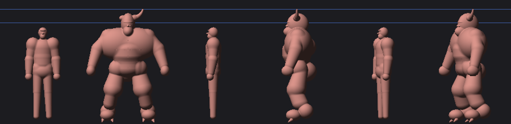
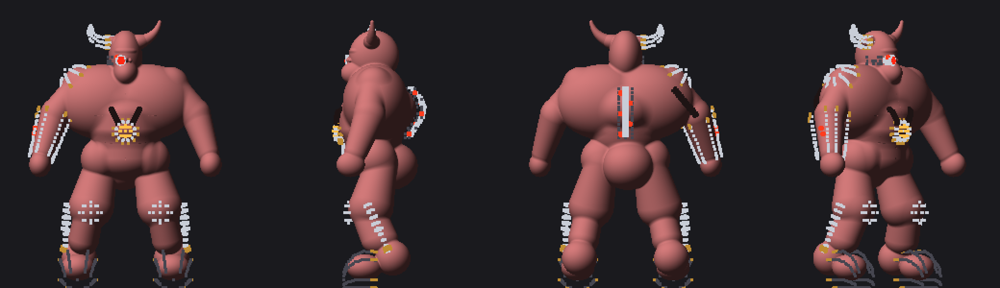

# Warbull — Task 1 notes (body), 2026-09-27

Plan: `docs/superpowers/plans/2026-09-27-warbull.md`, Task 1.

## What landed

- **`characters/warbull.blob`** is `minotaur.blob` ×1.28 on every length, with
  angles and bone fractions unchanged. That takes 1.90 m to 2.432 m, with the
  horn tip at 2.605 m (field-marched). Beyond the scale:
  - **Dropped** the painted right-leg prosthetic (five metal `box` plates, a cable
    and two seam grooves) and the painted shoulder cables. Both legs are the
    minotaur's left-leg flesh, mirrored.
  - **Left-only** horn sweep and glowing eye bead. The right side is kit (steel
    horn, optic). Both horn-root bosses stay, as the steel horn's socket.
  - **A hump** behind the neck (one torso blob). The back surface at y 1.65–1.85
    moves from z ≈ −0.29 to about −0.39: about 10 cm of profile, where the
    minotaur has only the gap behind its traps.
- **`warbull-face.png`** was baked from the minotaur reference mesh
  (`blob:face-bake -- minotaur --head-frac 0.165`), then soft-cropped to the face
  band. The minotaur's own PNG was never committed; the registry has been 404ing
  it. Mean 0.3204, measured off the opaque texels.
- **Registry entry** `warbull`, shown as `?character=warbull` in the lab. He
  walks the zombie shamble for now; his profile is Task 4.
- **Tests:** `warbull-blob.test.ts`, 13 pins (plan, Task 1).

## Frames

There are no GPU frames: the cloud container has only SwiftShader, as for the
Juggernaut. The image below is a CPU sphere-trace of `sdBody`: flesh only, with
no face decal, no palette and no kit. Views are front, side and three-quarter,
with the Juggernaut's flesh left and the Warbull right in each pair. The blue
lines mark 2.60 m and 2.291 m.



## For the owner to judge in the lab

- The bull head and horns at scale, and whether the hump reads from the side.
- **Palette:** kept at the minotaur's pink (henenlotter-latex). A darker,
  redder hide may contrast the chrome better; judge that once the kit is on.
- **Gait:** the zombie shamble for now. STOMP (the ogre's) is the candidate.

# Task 2 — the kit, 2026-09-27

`characters/warbull-kit.wam` is the machinery, authored under one rule:
**embedded, not worn**. Every part is small against the body, and meets the
flesh at a collar or an insertion. The .wam header lists how far each part is
sunk.

- **Legs (both):**
  - steel-shod **hooves** over the paws, with a brass rim where the fetlock
    flesh enters;
  - a chrome **knee cop**;
  - a **hock piston**: a housing on the outer shin, and a rod diving into the
    ankle through a brass collar.
- **Centreline:**
  - a **spine rack** of five iron vertebral plates down the hump, each with an
    LED, and a chrome conduit over them;
  - a **reactor** sunk into the upper abdomen, with a brass collar, an amber
    core, and two cables that run up the chest and dive into the pecs.
- **Right side (the machine's):**
  - a **steel horn** with brass bands, collared into the flesh horn-root boss;
  - an **optic** (a chrome barrel sunk in the right eye socket, a red lens and
    an LED);
  - an iron **cheek plate**;
  - a chrome **shoulder cap** over the deltoid, with a brass collar;
  - a cable down the back of the upper arm;
  - a brass **elbow collar** and a chrome **gun-arm sleeve** down to the fist
    (the launcher prop, Task 4, swallows the fist), with two LEDs.
- **Materials:** chrome, iron, brass, cable, lens, led and core. The runtime
  looks for chrome, cable, led and core are Task 3; until then they take
  `LOOK_DEFAULT`.
- **Skinning chosen for the plates** (Task 5):
  - skull: horn, optic, cheek;
  - chest: reactor;
  - neck and spine2: rack;
  - forearm.r: sleeve and collar, which go with the launcher.
- **`warbull.blob`:** the paw's claw prims were dropped; the hoof encloses the
  paw.

## The skeleton transcription needed a fix the soldier kits never did

The .blob applies a down bone's **pitch then tilt** (`blob-compile.ts`
`dirVector`); WAM applies **tilt then pitch** (`skeleton.py` `resolve_dir`,
rotY·rotX·rotZ). The soldier-family kits negate pitch and copy tilt, which
is right to under a millimetre at their 2–12° angles. At the minotaur's 40°
arm tilt it is centimetres. The .wam solves each (pitch, tilt) pair to give
the .blob's exact direction (formula in its skeleton comment). All 20 bones
land within 0.004 mm.

## Pre-flight without WAM: `scripts/wam-shadow.ts` + `scripts/wam-preflight.ts`

WAM still cannot run in this container, so I transcribed its skeleton, loft,
attach and sweep maths into TypeScript. I read the source in a local WAM
checkout; I did not run it.

**Checked against the compiled `juggernaut-kit.gltf`:** every ring vertex
within 1 mm, and identical per-material bounds. Sweeps are transcribed but not
yet checked against a compiled kit.

```
npx tsx scripts/wam-preflight.ts warbull [part-prefix]
```

It prints bone agreement and, per part, the deepest sunk vertex and the
nearest and farthest distance to the flesh. The kit was sized with it:

- the deepest vertex is the shoulder cap's rim in the trap shelf, −57 mm;
- nothing floats except the rack LEDs and conduit, which sit on the plates;
- the soles are at y 0.004;
- the steel horn's tip lands within ~3 cm of the mirrored flesh horn.

`warbull-kit.test.ts` (13 pins) **passed against a shadow-built glTF**
(written temporarily, then deleted). It skips until the real build exists:

```
scripts/build-wam-kit.sh warbull
npx vitest run src/lab/sdf-zombie/characters/warbull-kit.test.ts
```

Preview: the CPU flesh raster with the shadow's kit vertices drawn as
depth-tested dots, coloured by material. Placement only; it shows no shading
of the kit.



## Expect from the real build

- WAM lint on the `hips`/`hand`/`foot` bones having little geometry (normal).
- Possibly an `on=`-less "floating part" lint on the rack LEDs, which sit on
  the plates, not on the flesh.
- If the real mesh disagrees with the pre-flight, the sweeps (steel horn,
  reactor cables) are the least-checked parts.

# Task 3 — looks and blinking lights, 2026-09-27

- **`status-lights.ts` (pure, 9 tests).** It maps mind state, sim time, plate
  damage and rage to LED and core levels:

  | Mode | LEDs | Core |
  | --- | --- | --- |
  | idle | double-thump heartbeat, 1.2 s | breathes |
  | alert | heartbeat, 0.7 s | breathes |
  | aim (the rocket telegraph) | 8 Hz strobe | flares |
  | fire | bright and ragged | flares |
  | stunned | stutter | stutter |
  | dead | dark | dark |

  Plate damage drops LEDs out deterministically (up to 55% of the time at full
  damage). When he is enraged the core turns from amber to red. Each body gets
  its own phase, so a crowd doesn't blink in unison.
- **New looks in `kit-overlay.ts` LOOK:**
  - `chrome`: metalness 0.88, roughness 0.10, env 1.7. It is the one material
    that must read as polished metal against wet flesh.
  - `cable`: soft rubber sheen.
  - `led`: red emissive, 1.4.
  - `core`: amber emissive, 1.6.

  `KitOverlay.glow()` scales the pulsed materials (`led`, `core`) from those
  authored intensities. The juggernaut's `lens` is deliberately not pulsed.
- **Wiring:**
  - `GameActor.statusLights()` reports the actor's mind state and its plate
    damage fraction.
  - game-main passes it to `character-view.pose`.
  - With no lights passed, as in the lab turntable, the view runs an idle
    heartbeat on its own clock, so `?character=warbull` blinks in the lab.
- Unverified on a GPU here: the actual brightness of the emissives against the
  lab key. It is the owner's call once the kit is built.
