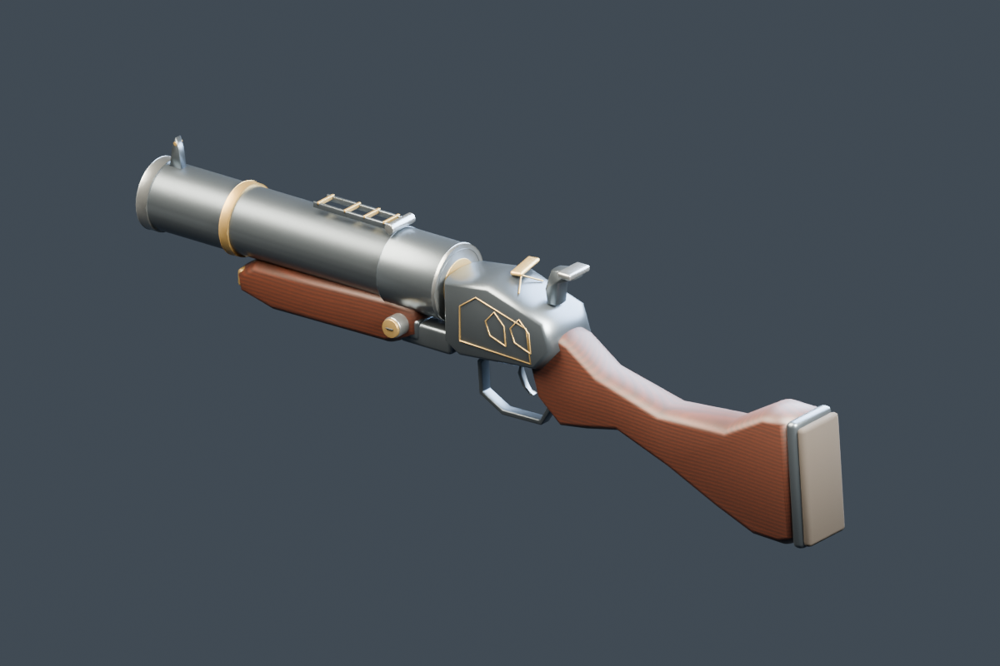

# Grenade launcher — FPV art and motion pass

2026-09-29. Local changes, owner look/feel review pending. [Spec](../../superpowers/specs/2026-09-29-grenade-launcher-design.md) · [Plan](../../superpowers/plans/2026-09-29-grenade-launcher.md).

## Try it

Run the normal Vite server, then open `/sdf-game.html?launcher=1` (append `&level=night-train&god` for the train without damage). The query enables the prototype and starts with it selected. `4` selects it again, `1` returns to the shotgun, left click fires, `R` demonstrates a manual reload, and `T` cycles slow inspection speeds. The usual first click locks the pointer. `H` hides tuning panels.

The launcher has an unlimited reserve but always cycles its one-round chamber: 0.34 s fire/recoil, then 1.85 s reload. The shotgun's default unlimited-ammo behavior is unchanged. This pass has no grenade projectile, blast/damage, or launcher audio. Launcher fire edges are not yet part of demo recording/replay. The ordinary forward renderer is the verified path; the existing deferred mesh routing is wired but not separately verified here.

## Assets and code

- Editable source: `assets-source/weapons/grenade-launcher.blend` (studio cameras/lights included).
- Rebuild: `/Applications/Blender.app/Contents/MacOS/Blender --background --python scripts/model_grenade_launcher.py`.
- Export: `public/assets/lab/grenade-launcher.glb`, original geometry/texture; **17,192 triangles, 463,148 bytes**. No reference or extracted Blood assets added.
- Pure timing/state: `src/lab/sdf-zombie/webgpu/game-grenade-launcher.ts`; renderer: `game-launcher-view.ts`. Slot/control wiring stays in the existing leaves and ctx handle.
- Original M79-style barrel/stock silhouette, walnut grain, blued steel, aged brass bands and pointed receiver tracery, folded ladder sight, exposed hammer and trigger. The accepted goblin arms are cloned with shared geometry/materials/textures; no new arm assets.
- Runtime nodes: `Barrels` pivots at its authored hinge; `Round`, `Breech`, `Muzzle`, `Fore_Hand` move with it. `Hammer`, `Trigger`, `TopLever`, `Grip_Hand` stay on `Frame`. Reload cases and hand endpoints derive from live locators. Axial extraction precedes free tumble; carry meets insertion on the bore; the barrel closes after seating.

## Verification

- Blender export and JSON readback: named-node/hierarchy contract, packed texture, no baked animation, hollow barrel construction. [Model gate](model-gate.json).
- `npm test -- game-grenade-launcher game-weapon-slots game-state-weapon game-viewmodel`: **86/86 pass**.
- `npx tsc --noEmit`, `git diff --check`: pass. No claim of a full test suite or production build.
- Context coverage: **3/4 pass**, existing failure is main()'s `actorFill` WeakMap. Running the same state-binding extractor on `git show HEAD:.../game-main.ts` also returns `['ctx', 'actorFill']`. No launcher state binding was added to main(); state belongs to the feature/ctx handle.
- `GAME_W=1200 GAME_H=800 LAUNCHER_CLIP=1 scripts/sdf-game-launcher-gate.sh`: requires warm-ready, checks fire refusal, flash, 55-degree hinge, ejected case, carried round, return to loaded rest, manual reload, holstered fire refusal, and raising again. Twelve default-look stills plus clean inspection still/clip; zero console errors/device loss in the successful gate. [Runtime report](runtime/gate.json).
- Inspected idle, kick, open, extract, eject, carry, stage and seat captures. The chamber mouth and cartridge handoff now read; individual fingers remain the accepted orb-hand representation. Studio render is an asset preview, not a substitute for the FPV gate.
- [Review clip](runtime/launcher-cycle.mp4) / [looping GIF](runtime/launcher-cycle.gif): gameplay camera/lens, frozen actors, VHS disabled for clear asset inspection. Default-look stills retain the game post effects.

Fresh browser profiles, sequential runs, identical ring/seed/god query (launcher query added only for the last row):

| Version | drawOnce | Total warm |
| --- | ---: | ---: |
| HEAD `eec99cca5` | 1512.2 ms | 2233 ms |
| Current, default | 1694.8 ms | 2410 ms |
| Current, `launcher=1` | 1988.2 ms | 2872 ms |

Single samples; OS Metal shader cache may already be populated. These measure startup, not steady-frame cost, and do not establish a significant default regression. The asset/material workload is opt-in. Benchmark checkout and owned server/browser processes cleaned up.

## Findings and next pass

The first hinge was behind the mouth: breaking down dropped the chamber behind the standing breech and hid it in FPV. Correct hinge is Blender y −0.133 m, rear mouth y −0.087 m. Root yaw π means positive root X raises the muzzle; recoil uses positive pitch and presentation a small negative pitch. Keep these conventions and live locator ownership when tuning.

Owner look/feel review is still needed: screen placement, reload pace, brass/steel finish and ornament density. Next gameplay pass can add a slow arcing grenade from the live muzzle, deterministic collision/fuse, blast/damage through the existing dynamite explosion seams, and launch/reload sounds. No gameplay blast pass is included in this change.

## Update 2026-09-29 — owner correction: readable breech

The owner correctly pointed out that the original screenshot sequence did not clearly show the action opening. The earlier scalar hinge check proved rotation, not readability. The near-axial view hid the barrel/frame separation, and the reflective inner barrel made the empty mouth look capped.

Revised presentation: turn 40 degrees sideways, pitch up 15 degrees before the barrel opens, shift right 4 cm and back 5.5 cm while lowering 3 cm. Hold this pose through cartridge seating. The bore now uses the existing dark/matte Bore material, verified in the exported barrel's material primitives. Idle, shot/reload timing, hinge geometry and controls stay unchanged.

[Empty breech](breech-readability/fpv-eject.png) · [Loading](breech-readability/fpv-stage.png) · [Updated clip](breech-readability/launcher-cycle.mp4) · [Updated GIF](breech-readability/launcher-cycle.gif). These review captures disable VHS to inspect the mechanism clearly. The original `runtime/` clip is retained as the first-pass comparison; use the updated clip for the current pose.

Revision checks: 8/8 launcher tests (including a fixed presentation through seating), TypeScript, Blender rebuild and exported inner-material check; revised headless gate passes 13 stills plus the clip, warm-ready, zero console errors and GPU errors/loss. Inspected the empty mouth and load frames. The startup table above belongs to the first pass, before the bore material assignment.

## Update 2026-09-29 — owner correction: forestock grip

Removed the initial support-hand reach to the latch, which clipped through the weapon and distracted from opening. The hand now follows the live forestock through the break and extraction (0–0.61 s), then moves down to fetch the fresh round by 0.86 s. Cartridge carry, insertion and return to the forestock before closing retain their endpoints. The latch still opens automatically.

[Current review clip](forestock-hold/launcher-cycle.mp4) · [Current GIF](forestock-hold/launcher-cycle.gif) · [Opening](forestock-hold/fpv-open.png) · [Runtime report](forestock-hold/gate.json). Inspected unlock, fully open and insertion captures; the support hand stays under the forestock during the break. These supersede the previous review clip for hand motion.

Verification: 9/9 launcher tests, TypeScript and the headless cycle gate pass. Measured support-hand distance from the live forestock target is 0 m at unlock, open and extraction. Thirteen stills and a new clip recorded with VHS disabled; warm-ready, zero console/GPU errors or device loss. Owned capture server/browser processes cleaned up. No shader/material or asset changes in this revision.

Owner accepted the revised motion for a PR. Before publishing, reran the launcher, slot, weapon-state and viewmodel tests: 88/88 pass. Projectile gameplay is the next pass.
