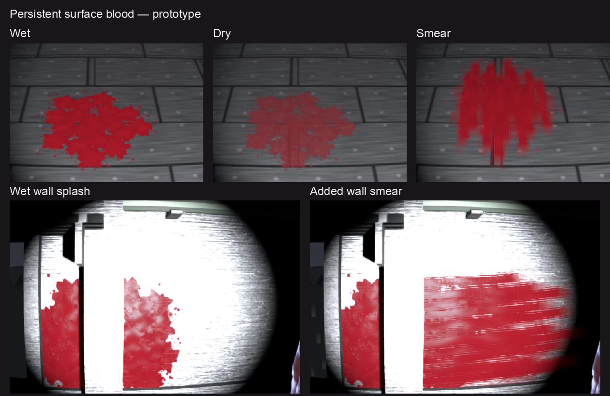

# Persistent surface blood candidate — 2026-09-30

Implemented in `codex/surface-blood`, based on `eec99cca5`. Default renderer remains unchanged; surface blood is opt-in.

## Try it

Run `npm run dev` from the surface-blood worktree. Use `/sdf-game.html?level=night-train&surfaceblood=1`, or open the **Surface blood · candidate** panel at bottom left and enable **Persistent stains**. Shoot an actor: the existing wound/goo droplets feed real world impacts. The appearance selector affects subsequent impacts; auto chooses wet splats or smears from tangential impact speed. Wet deposits dry over 120 seconds, but their colour remains until cleared or evicted. Clear stains resets the independent ledger.

Console seams: `setSurfaceBlood`, `setSurfaceBloodLook`, `surfaceBloodStats`, `surfaceBloodTrace`, `surfaceBloodStains`, `clearSurfaceBlood`, `surfaceBloodBurst`. For a repeatable preview in the spawn carriage:

```js
__sdfGame.setSurfaceBlood(true);
__sdfGame.setBleed(true);
__sdfGame.setSurfaceBloodLook('wet');
__sdfGame.surfaceBloodBurst([0, 0.8, -8], [0, -1, -8], 24);
```

## Implementation

`blood-surface.ts` is renderer-free: local triangle BVHs, swept nearest front-face hits, impact-oriented stain records and clipped decal triangles. The optional fifth `stepBlood` argument deposits only on a real hit. Midair expiry creates no mark, mist evaporates and chain-driven guts stay with their existing owner. No extra random-stream draws; absent callback retains existing simulation behavior.

`surface-blood-view.ts` indexes visible opaque level art once when enabled, transforms world sweeps into receiver coordinates and uploads clipped geometry only when the ledger changes. Stains follow their receiving mesh matrix. One geometry batch per receiver, shared material per room, existing room lights/shadows. Hand-written WGSL supplies seeded splash satellites, streaks, wetness/roughness, relief and a colour shoulder under the carried lamp. No extracted image assets added.

Budget: **192 stains**, oldest first eviction, nearby same-style/same-receiver merging, **65,536 uploaded vertices**. Projection caches discard evicted IDs. A mark is persistent within this budget, not an unlimited lifetime guarantee. Transparent glass, scenery and independently swaying art are excluded. The ledger is separate from `setBleed(false)`'s particle clearing.

## Visual verification



Headless Chrome, 1000×750, seeded/frozen Night Train; all screenshots inspected. The train is stopped during the comparison, with practical-light clocks, VHS, smear and dynamic probes frozen/disabled. Shots use real droplets and the real simulation, not direct decal injection.

- The floor capture retains **36 marks / 384 vertices** after disabling bleed and clearing airborne effects.
- After wall splashes, smears and dry marks: **120 marks / 1,800 vertices**, no clipped/evicted marks. Indexed **161 receivers / 109,729 triangles**. Receiver snapshots contain both floor-up and wall-facing normals.
- Consecutive frozen controls and off→on restoration: **0 differing pixels**. Stains-on vs off changes **40,565 pixels (5.4087%)**, isolating the visible stain layer.
- Same seeded floor impact, wet vs dry: **35,560 differing pixels**. Wet vs smear: **55,623**. Shapes and material responses visibly differ.
- [Oblique wall capture](legacy-wall-oblique.png) shows attachment and receiver clipping at the door/frame. Automated bridge tests cover raised/rotated floor and moving receiver attachment.

The gate is `bash scripts/sdf-game-surface-blood-gate.sh`; it owns and cleans up its Vite/Chrome pair, requires warm-ready and rejects renderer errors. `RENDERERS=legacy,deferred` requests both renderer legs. `BOOT_ONLY=1 BOOT_QUERY='level=night-train'` measures an individual fresh-profile boot when `LAB_TMP` names a new directory.

## Cost and boot evidence

Fresh browser profile per run, one run per leg, same machine/headless pipeline. OS/driver shader caches were **not** purged: this is a fresh-profile startup comparison, not a full cold-driver claim.

| Leg | Synchronous boot | Warm steps | drawOnce | Surface precompile |
| --- | ---: | ---: | ---: | ---: |
| Base eec99cca5 | 149 ms | 4546 ms | 3475.7 ms | 0.0 ms |
| Candidate off | 139 ms | 4482 ms | 3462.3 ms | 0.2 ms |
| Candidate on | 257 ms | 4966 ms | 3599.8 ms | 238.8 ms |

Raw records: [base](boot-base/metrics.json), [off](boot-off/metrics.json), [on](boot-on/metrics.json). On adds roughly 0.42 seconds to warm steps and 0.124 seconds to drawOnce relative to base in these single runs. The first run after the final shader edit needed **11.64 seconds** of warm steps, so compile-cache sensitivity remains material. Live enabling after an off boot builds the index/materials on demand and can incur a first-use hitch; boot with the flag for the precompiled preview.

Alternating hidden/visible legs in one frozen page, 18 smear marks, nine fenced draws per leg:

| Round | Off | On | Difference |
| --- | ---: | ---: | ---: |
| 1 | 12.80 ms | 13.40 ms | 0.60 ms |
| 2 | 12.40 ms | 13.80 ms | 1.40 ms |
| 3 | 13.00 ms | 13.70 ms | 0.70 ms |

These are `timeDraws` whole fenced draw measurements, **not isolated GPU timestamps** or a full 192-mark combat stress benchmark. Collision CPU cost under heavy live bleeding has not been separately benchmarked.

## Checks and limits

Focused tests: 206 passing across blood simulation, goo, stain logic, renderer bridge and VFX state. `npx tsc --noEmit` and `git diff --check` pass. No full suite/build or manual gameplay acceptance claimed.

`game-context-coverage` reports the existing `actorFill` main-binding mismatch (3 pass / 1 fail), also reproduced in the unchanged primary checkout. The new handle lives on `ctx.vfx` and introduces no main binding.

Deferred startup fails with `renderPipeline_MeshBasicNodeMaterial_416: Color target has no corresponding fragment stage output`. The same failure reproduces on unchanged **eec99cca5** with no surface blood feature: [baseline error](base-deferred/failure.json). The candidate group is registered with the forward route, but deferred visuals remain **unverified** until that baseline renderer error is repaired.

Initial scope: opaque world/art receivers and level mesh motion. No actor decals, footprints, body dragging, blood flow or projection across separate material/receiver boundaries. Mirrors/glass and swaying instanced props need explicit receiver policies later. Current visual evidence is Night Train plus synthetic bridge tests; other authored levels have not been captured.

## PR integration update — 2026-09-30

Merged current `origin/main` (`27797f70`) into the candidate before publishing the PR. Preserved both the new melee status and surface-blood status when resolving the sole documentation conflict. Re-ran the five focused files: **207 tests pass**; TypeScript passes; the feature diff against current main passes whitespace checks. The complete merge includes an existing upstream blank line at EOF in `game-head-damage.ts`, preserved unchanged.

Re-ran the forward headless gate on the integrated branch: **36 floor marks / 384 vertices**, **120 final marks / 1,800 vertices**, **0 toggle-restoration pixel differences**, **40,554 visible-layer pixels**. Inspected the new floor capture. [Integrated metrics](integration-main-metrics.json) include noisy fenced timing samples; earlier base comparisons above belong to the original feature base, not a new performance claim against current main. Deferred was not retested in this publishing step.
