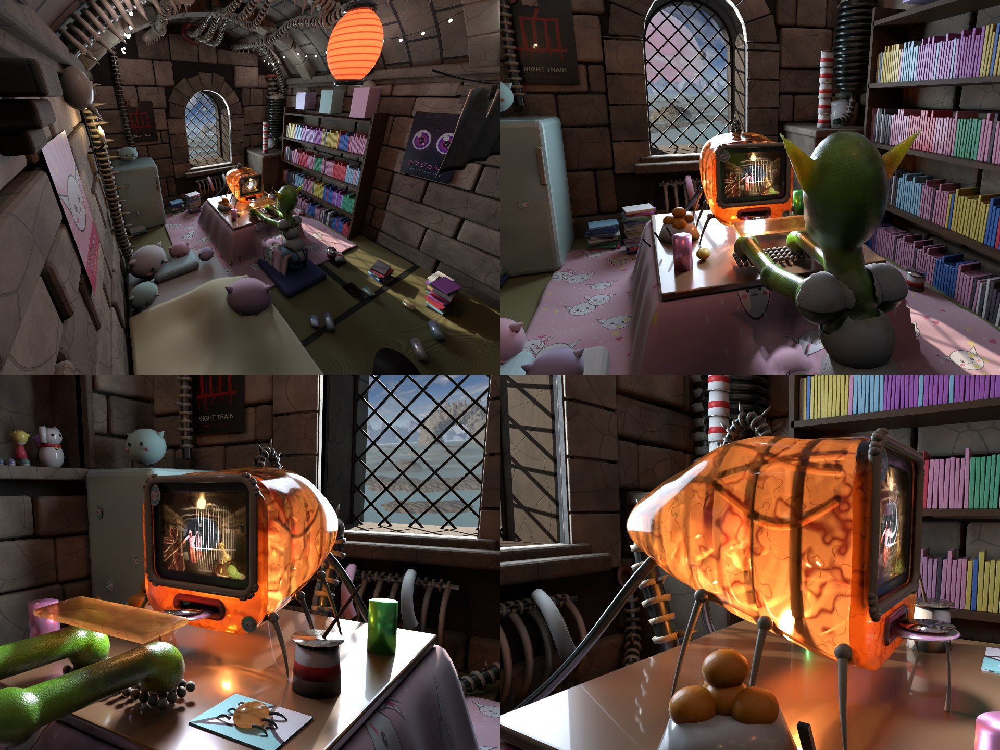

# The Flat's room, the goblin at home, the "Giger iMac": look-dev (2026-10-01)



A Cycles look-dev of the room in the 90s ray-tracer mode (`RT94`: direct light only, hard shadows, Standard view), after
the owner's brief: *"a combination of Gigeresque industrial decay and medieval castle stone, but with a Japanese Tokyo
otaku clutteredness and cuteness"*. The machine is shown at its last stage (design statement §3.4), the "Giger iMac".
**Preview only**: the owner wants the Flat in the engine; this is for direction.

| File | What |
| --- | --- |
| `room-sheet.jpg` | The four shots on one sheet |
| `wide.png` | The establishing shot from the south-west corner: the vault and its vertebral rib, the lantern, the window, the manga wall, the futon of plushies, the goblin at the kotatsu |
| `shoulder.png` | Behind the goblin: the machine, the window onto the Bryce idyll, the fridge, the shelf |
| `imac.png`, `skull.png` | The Giger iMac from the front and from the side, candled by the window behind it |
| `room.py` | The Blender generator (all of it: walls, vault, conduits, clutter, the iMac, the goblin's clothes, the lights, the shots) |
| `textures.py` | The otaku textures, drawn with PIL: the kawaii quilt (tileable), three posters, a sticker, a mousepad |
| `pose.sh` | Prints a `.blob` pose's joint positions, for tuning bone-angle overrides without meshing |

## How the three things combine (the room's rule)

One layer each, by what it does in the room:

1. **The bones are castle stone.**
   - Ashlar walls of irregular courses.
   - A low segmental barrel vault with transverse ribs on stepped corbels, and an impost course where the vault springs.
   - A deep round-arched window with voussoirs, quoins, a splayed-in sill and a diamond iron lattice. The lattice is a leaded window with the glass gone, and the cell's bars.
   - A stone niche, and flagstones under the tatami.
   - All of it in the **baked Bryce rock** (`assets-source/levels/kit-textures/rock-color.png`, box-projected), the first use of the kit's new textures.
   - It ties the Flat to Blood's gothic world, and quietly suggests the Flat is inside the game too (the gestation secret, statement §1.3).
2. **The veins are Giger's industrial decay.**
   - Every service is biomechanical: **vertebral conduits** (an oily gunmetal core, bone rings, dorsal spines) hug the vault, bundle along the crown, and plunge into the stone through wet, fleshy collars.
   - A ribbed lung of a boiler sits over the stone sink, a ribcage radiator under the window, a duct as thick as a thigh in the corner.
   - Wet and rust runs down the stone under every entry point (numpy-painted stain maps per wall, read by the stone shader in wall coordinates).
   - **The bridge between the two:** a gothic rib and Giger's rib are the same shape, so the middle rib of the vault is already vertebrae, hung with spines.
3. **The skin is otaku cute.**
   - Six tatami (one cut short over the kitchen's stone floor).
   - A kotatsu under a kawaii quilt, with a bowl of mikan, cup noodles and energy drinks.
   - A futon heaped with plushies of **Gob-chan**, the goblin's own mascot (a round white blob with goblin ears). It is also on the posters, the stickers and the mousepad.
   - A manga wall, anime figures, a beckoning cat and gashapon capsules in the castle niche.
   - Posters: Gob-chan, an idol's sparkly eyes, and a red 血 for *Night Train*.
   - Fairy lights strung along the vault, a red paper lantern, a candle in an iron sconce.
   - Socks drying on the ribcage, the goblin's three identical vests on the line.
   - **The cute is the goblin's tenderness.** It is what makes tending the creature believable, and the contrast makes the grotesque funny rather than grim (the slapstick principle, statement §3.3).

**Colour:** grey-brown stone, oily gunmetal and bone, against candy pastels. The window is the only cool light, and the
machine is the only amber.

## The Giger iMac

The iMac G3 (translucent coloured plastic, a rounded body, the handle, the screen sunk in a dark bezel, the CD slot in the
chin), merged with **the xenomorph's translucent dome**: the body sweeps back into an elongated cranium over a ribbed
skull frame.

- **Shell:** frosted "bile amber" plastic with veins. Mostly transmission, plus translucency and a little transparency. It
  is lit from inside by two lamps, and from behind by the window, so the bone hoops, the keel, the vessels and the curled
  creature read through it. **This is the candled egg's rule again**, so the egg and the machine rhyme.
- **Face:** the screen lip is studded with small bone teeth. The CD tray is a tongue with a disc on it and a strand of
  drool to the board. The speakers are gill slits. Stickers, because it is loved.
- **Body:** six beetle legs ("more bugs"), a vertebral handle and a bone crest down the cranium, and an umbilicus from
  the tip across the floor into the wall by the window.

## The goblin at home

- **Pose:** sitting at the kotatsu, legs under the quilt. The quilt is a heightfield that rides up over its thighs.
  `.blob` bone overrides:
  `spine1=pitch=18 chest=pitch=22 neck=pitch=26 skull=pitch=-4 thigh=pitch=70 shin=pitch=88 upperarm=pitch=75 forearm=pitch=90 hand=pitch=60`.
- **Clothes:**
  - A **stained ribbed singlet** with straps, and **faded blue polka-dot boxers**.
  - Both are offset shells cut from the meshed SDF goblin, each vertex classed by its nearest bone: the torso and the clavicle tops make the vest; the pelvis and the top of the thighs make the shorts.
  - **It does not read yet:** with the arms reaching forward, the nearest-bone split puts the back on the arms. The
    singlet comes out as grey shoulder caps and a grey seat, not a vest. Not chased, since the body is being redone. In the
    engine the clothes want to be cloth prims or a kit mesh anyway.
- **What it shows:** the goblin needs its refinement pass (owner, same day). The shoulder and elbow nubs read as orbs and the hands as sausages. A
  [separate audit](../../tasks/characters.md) has the causes.

## Findings and gotchas

- **Bone pitches above about 90° do not take** in the `blob-mesh.ts` / `blob-bones.ts` overrides (`forearm=pitch=120` came
  out as pitch 0). So the 2026-10-01 recoil pose's arms (150, 172, 175) were probably never posed. Keep pitch at 90° or
  less, or switch `dir=`.
- **In zsh an unquoted `$POSE` does not word-split.** Run the mesh and bones scripts under `bash` (as `pose.sh` does).
- **Blender aborts outright** (`std::out_of_range: stoi`) on an object name that ends in a long float after a dot, such as
  `crown_collar3.5700000000000003`: it parses the suffix as a duplicate number. Format numbers in names.
- **Lights trapped in an opaque lampshade** light nothing. The paper lantern is translucent and casts no shadow, so its
  bulb reaches the room.

## Commands (from the repo root)

```bash
D=docs/dev-notes/2026-10-01-flat-room-lookdev; E=docs/dev-notes/2026-10-01-flat-emergence-lookdev; OUT=.lab-tmp/room; mkdir -p $OUT
python3 $D/textures.py $OUT/tex      # needs Pillow; Hiragino Sans GB for the kana
# the CRT image: any 4:3 PNG at $OUT/tex/screen.png (look-dev used a Night Train frame)
P="spine1=pitch=18 chest=pitch=22 neck=pitch=26 skull=pitch=-4 thigh=pitch=70 shin=pitch=88 upperarm=pitch=75 forearm=pitch=90 hand=pitch=60"
bash -c "npx tsx $E/blob-mesh.ts src/lab/sdf-zombie/characters/goblin.blob $OUT/goblin-kotatsu.ply 0.006 $P && npx tsx $E/blob-bones.ts src/lab/sdf-zombie/characters/goblin.blob $OUT/bones-kotatsu.json $P"
TEX=$OUT/tex GOBLIN_DIR=$OUT REPO=$PWD SAMPLES=48 RES_X=960 RES_Y=720 blender --background --factory-startup --python $D/room.py -- $OUT wide shoulder imac skull
```

Iterate at `SAMPLES=16 RES_X=480 RES_Y=360` (about 20 s a shot on Metal). `NORENDER=1` builds the scene and prints the
clothes' bounding boxes without rendering.

## Owner decisions (2026-10-01, after the first renders)

- **The room grows with the machine.** At stage 1 the services are ordinary rusted pipes and every rib is stone. By stage 3
  the conduits are vertebrae, a rib has turned, and the collars weep. The room is part of the progress clock.
- **It gets fleshier too** (owner: "maybe it gets also more fleshy somehow"). Not yet designed. Candidates: the mortar
  turns to gristle, collars spread into the stone like wet tissue, the tatami stains and grows a nap of fine hair.
- **The machine stays amber, "bondi bile"** (owner's term now), and gets bloodier with each stage.
- **The room is good for now.** Next is the goblin refinement pass.

## Open

- **The engine route:** the room as kit meshes through the Blender kit pipeline (ashlar with the baked rock), and the shell
  as a translucent WGSL material that reuses the candled egg's analytic lamp-and-shadow term.
