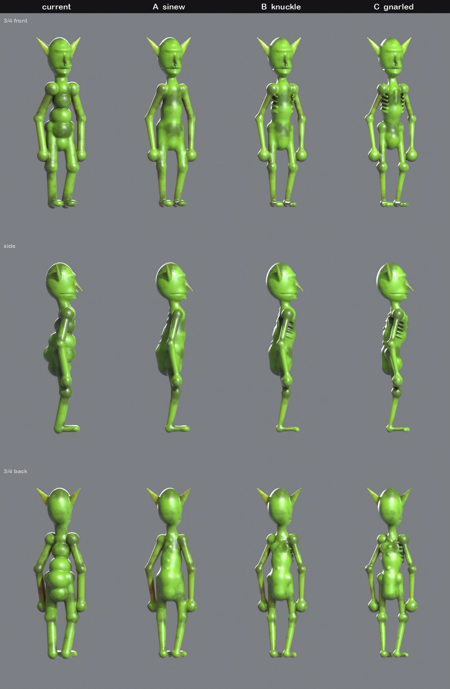
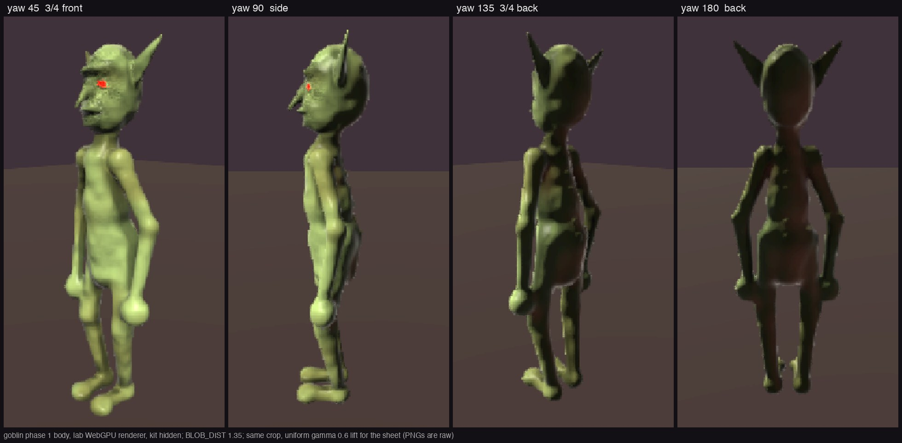

# Goblin body variants: look-dev (2026-10-01)

Three wiry bodies for the [goblin refinement pass](../../superpowers/specs/2026-10-01-goblin-refinement-design.md),
written as scratch copies of `goblin.blob`. Each replaces the torso, neck, arms and legs and keeps everything else. They
are meshed from the game's own CPU SDF and rendered in the 90s ray-tracer mode. **The owner picked A, "sinew".**



| File | What |
| --- | --- |
| `variants.jpg` | Current, then A, B and C, from three yaws |
| `goblin-a-sinew.blob` | The chosen variant as a whole `.blob` (orphaned comments from the old body are left in): phase 1's starting point |
| `variants.py` | Writes the three variant `.blob`s from `goblin.blob` (`python3 variants.py REPO OUTDIR`) |
| `turn.py` | The turnaround: PLYs in a row, three yaws, the 90s look (`blender -b --factory-startup --python turn.py -- OUTDIR a.ply ...`; `RES_Y=880` for a 1.3 m figure) |

Mesh each with `../2026-10-01-flat-emergence-lookdev/blob-mesh.ts <file.blob> <out.ply> 0.005`.

## The variants

- **A, sinew:** three continuous tapered torso bars, tapered limbs, no joint orbs but the hands, spine beads and neck cords. 41 prims.
- **B, knuckle:** wiry shafts with modest early-3D joint orbs, raised ribs (bent prims), shoulder blades, a small pot gut and two-toed feet.
  - The first pass detached both arms: the shoulder blob was too small for the narrower chest. That is the race the skill describes.
- **C, gnarled:** skeletal shafts, knobbly joints, elbow spurs, a keeled breastbone over a pot gut, five ribs and three toes.

**Known flaw, all three:** `deep=` scales front and back alike, so the torso bulges at the back of the waist in profile.
The spec's phase 1 fixes it in A.

## Built (phase 1)

The rebuilt body in the lab renderer (`npm run blob:shot -- goblin` with the kit hidden, BLOB_DIST 1.35), from `lab/`.
It is variant A plus three fixes found while measuring:
- the gut is pushed forward and the back flattened (gut +27 mm at the belly);
- the shoulder round is marked `core` (at r 0.038 without it, `fusedOf` read +3.4 mm because the probe started at the
  hand, not because anything detached);
- the chest is wide=1.00 (at 1.06 the upper-arm daylight sat on the 15 mm line).

`blob:render-check`: exit 0 (0 hole clusters, worst 0 px across; the WebGPU march agrees with the CPU field).



The lab dresses the goblin in its glTF kit (cuirass, tabard, greaves, boots, goggles, axe and shield), which covers the
torso, gut, spine and knees. The body frames were shot with the kit hidden through the turntable's own probe hook (no
code change):

```bash
LAB_TMP=.lab-tmp BLOB_DIST=1.35 \
BLOB_PROBE='(()=>{const L=window.__sdfLab;const hid=[];L.scene.children.forEach((c,i)=>{let s=0;c.traverse(o=>{if(o.isSkinnedMesh)s++;});if(s>0){c.visible=false;hid.push(i);}});return {hid};})()' \
npm run blob:shot -- goblin .lab-tmp/blob-shot/goblin-bare
```

The turntable shoots 8 frames 45 degrees apart (`yaw = i/8 * 360`, yaw 0 is the face), so `frame-01..04` are kept as
`lab-yaw045/090/135/180.png`. The lab's light comes from the front, so the back frames are dark: the sheet uses one crop
and one gamma lift for all four, and the PNGs are raw. `lab-kit-yaw045.png` is the dressed 3/4 front: the kit still sits
on the new body and no flesh pokes through it at any yaw.

1. **Torso rings:** none from any yaw. One continuous mass with a gentle waist; the small bumps on it are the skin
   mottle (`lab-yaw045.png`, turntable frames 00 and 07).
2. **Orbs:** only the hands, the shoulder rounds, the small ankle knobs and the toe pads (`lab-yaw045.png`,
   `lab-yaw090.png`). No ball at the elbows or knees, just a slight swelling where the forearm (r 0.027) and the shin
   (r 0.034) start a little fatter than the bar above them ends (0.024, 0.031).
3. **Profile: partly.** The back is flatter than A's: the bulge at the back of the waist is down to a gentle slope
   (`lab-yaw090.png`). On the CPU field's midline the waist's back sits at z -76 to -80 mm against A's -102 to -104,
   with the front unchanged at about +102. The spine beads show along it (`lab-yaw090.png`, and as a row of bumps up
   the back in `lab-yaw180.png`, visible only on the lifted sheet). **But the gut does not read in front:** the front
   runs straight from chest to belly (the belly front is 16 mm behind the chest front), the hanging arm covers the belly
   in exact profile, and the lower back is still the furthest-back point of the torso (32 mm behind the shoulder-blade
   line, against 50 in A). `blob:silview` of the CPU field shows the same profile, so this is the shape, not the
   renderer.
4. **Arms:** separate from every yaw. There is daylight from shoulder to hand at yaw 0, 45, 180 and 315
   (`lab-yaw045.png`, `lab-yaw180.png`), and a dark crease runs along the arm where it overlaps the torso in profile
   (`lab-yaw090.png`).
5. **Head:** unchanged against the variants sheet: big swept ears, hooked nose and lips (`lab-yaw045.png`,
   `lab-yaw090.png`). The red eyes and the face texture are the lab's own, as before.
