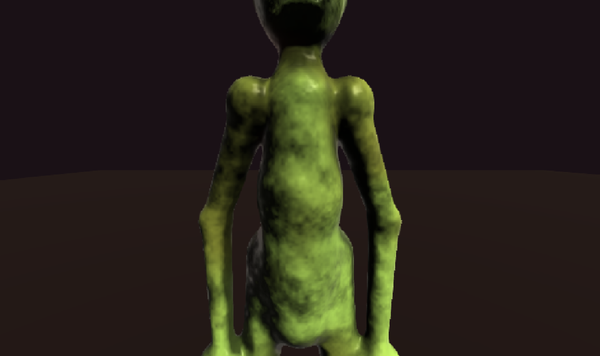
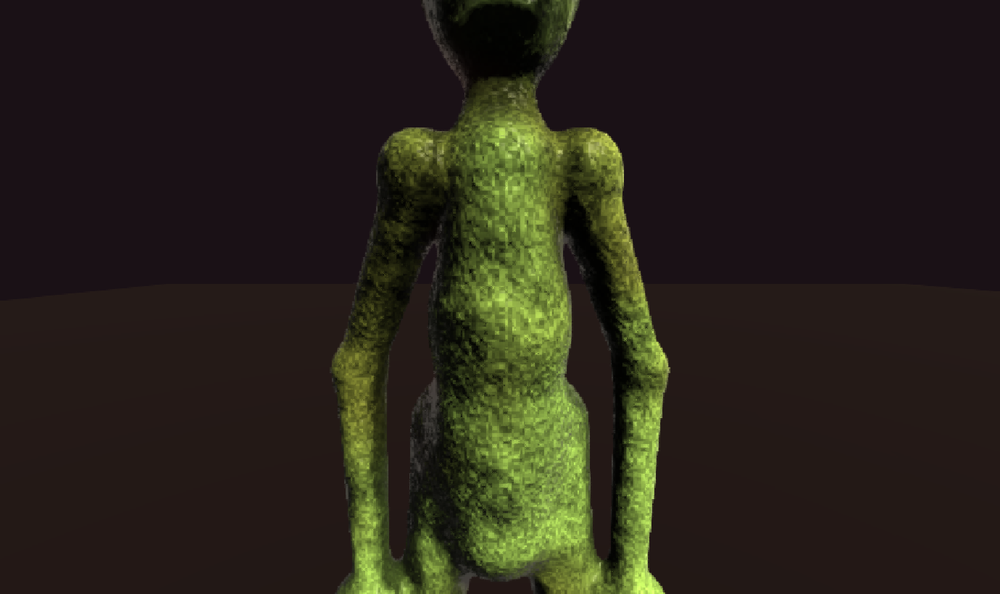
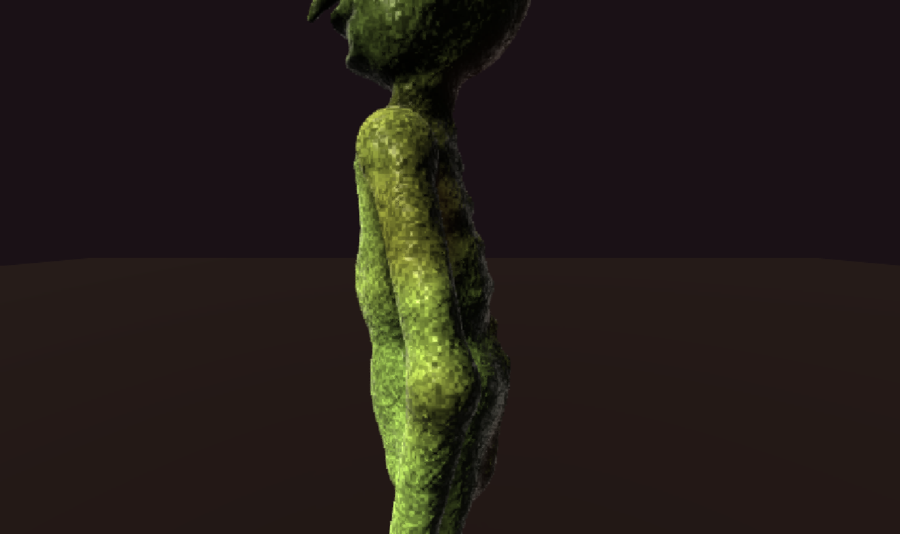
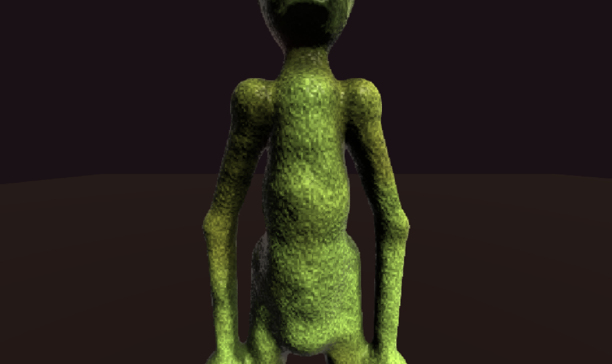
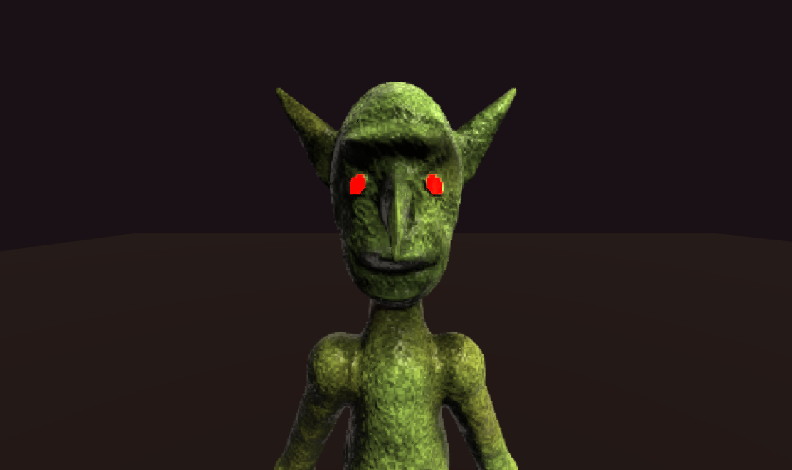
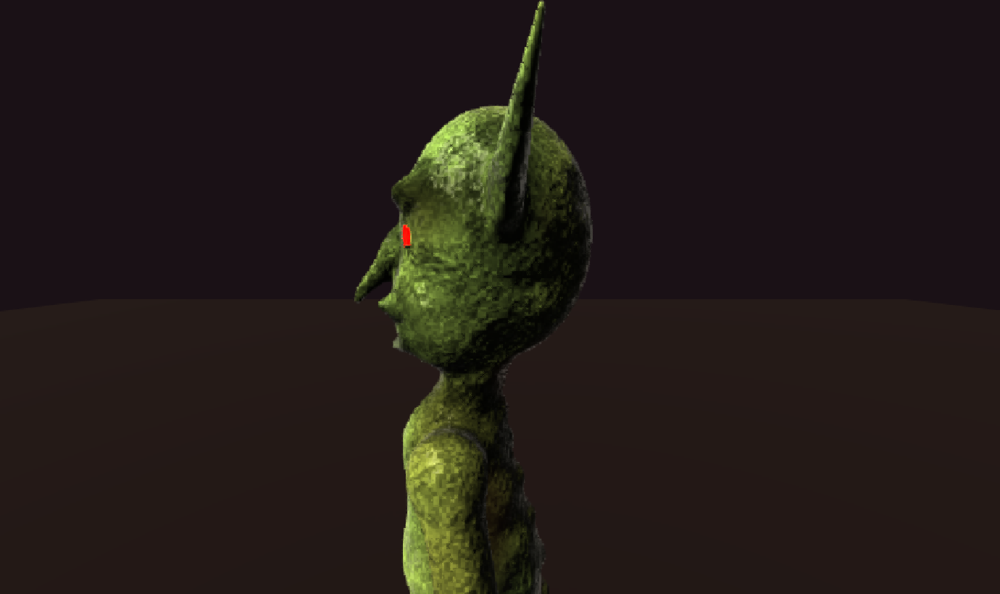
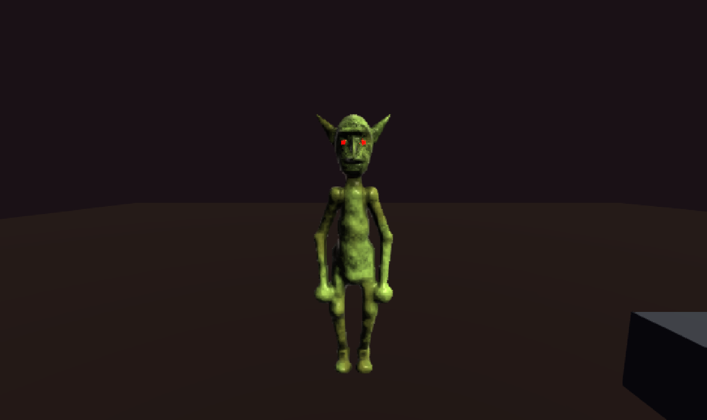
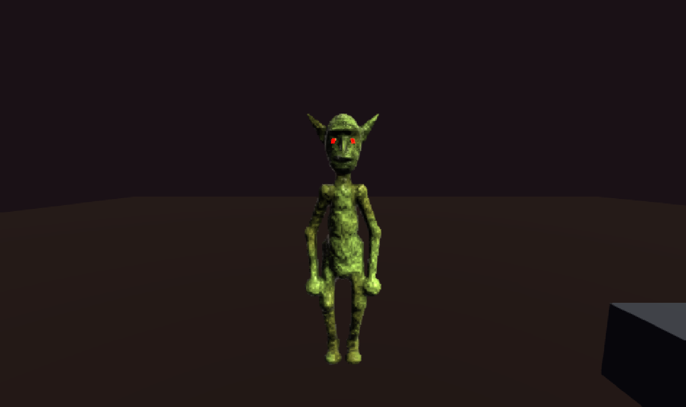
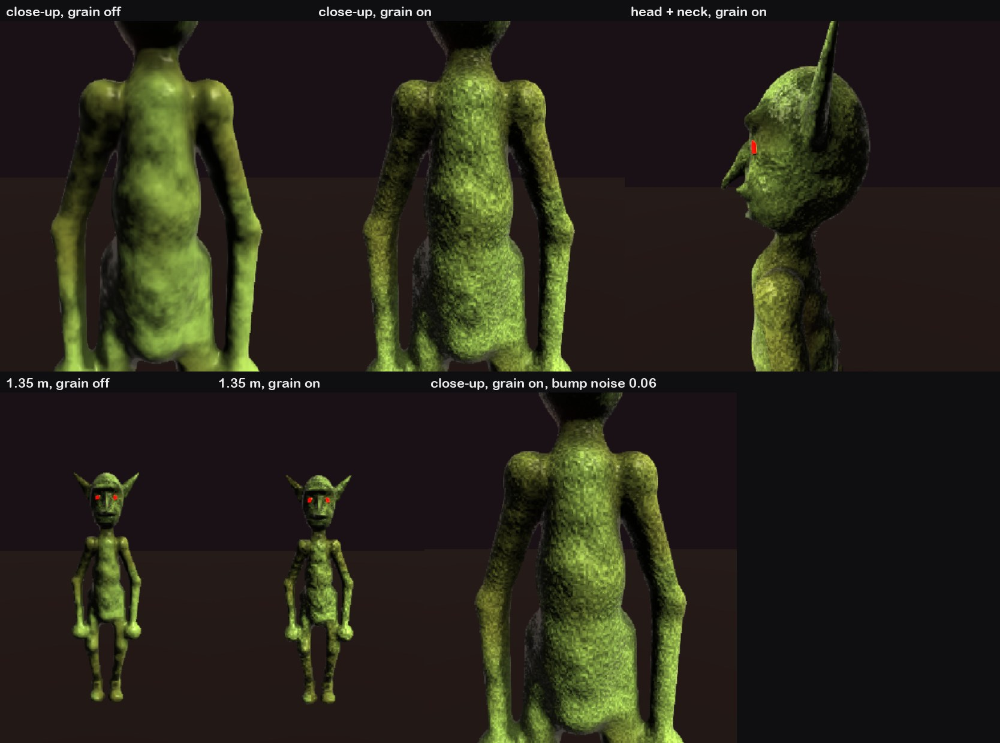

# Body grain: build notes (2026-10-02)

Spec: ../../superpowers/specs/2026-10-02-body-grain-design.md. Plan: ../../superpowers/plans/2026-10-02-body-grain.md.

## Baselines (Task 0, before any code)

- BASE commit: 34e3630cc02e54b1b2203c682d259383acda199b
- BASE Chrome: 154.0.8037.93
- BASE load: 1:25  up 6 days, 13:12, 2 users, load averages: 12.56 5.59 4.03
- BASE k: 0.002029965576663916
- BASE sdf pass: 636x378, fov 75
- Lab fade distances full / half / gone (m): fine 3.5 mm 0.43 / 0.57 / 0.86; coarse 12 mm 1.48 / 1.97 / 2.96
- BASE march-hash room1: d7392d5234c98ddc1babb3b29860abc3a02ced84
- BASE march-hash room1-wounded: 76bd51aa6eb281297999463529a0b782ce2b67f6
- BASE boot drawOnce: 1663.1 1654.4
- npx tsc --noEmit at the base: one pre-existing error (pack-golden.test.ts, node:crypto).

## Progress

- Task 0 done: baselines recorded.
- Task 1 done: FleshMaterial.grain, 0 in every preset; palette parses it (68 tests pass).
- Task 2 done: body-grain.ts (two octaves: fine 3.5 mm, coarse 12 mm; summed deviations; 13 tests pass).
- Task 3 done: BODY_GRAIN_BLOCK written and pinned (10 tests), not spliced yet.
- Task 4 done: applyMaterial writes grain to meltCfg.w and syncs the record; lane comments updated; lab slider (0..0.3).
- Task 5 done: BODY_GRAIN_BLOCK spliced between the face layer and gore in MARCH_TRACE_POST (marchBody, refineBody,
  marchSurface); the face layer leaves faceSheetCover = facing * tex.a; march golden re-pinned on exactly
  FACE_LAYER_WGSL, MARCH_BODY, MARCH_BODY_TRACE, MARCH_TRACE_POST, REFINE_BODY; GPU compile smoke passed (goblin, grain 0).
- Task 6 done: goblin.blob palette sets grain 0.10 (= its sheet's grain); surfaceNoiseAmp left at 0.22 for the owner.

## In the lab (Task 7)

Goblin, kit hidden, `npm run blob:shot`, 1380x820. Close-ups `BLOB_DIST=0.45` (torso `BLOB_TARGET_Y=0.85`, head `1.15`;
fine octave). Owner's framing `BLOB_DIST=1.35` (coarse octave at full strength). Off = `meltCfg.w` zeroed by the probe;
n06 = grain on with `surfaceNoiseAmp` 0.06.

- `blob:render-check -- goblin`: exit 0.
- Speckle (mean |dL| 3 px apart inside the body mask), ratio to off:
  - torso: off 5.57, on 12.381 (x2.223, mean x0.992), on + noise 0.06 12.022 (x2.158)
  - 1.35 m: off 14.853, on 18.756 (x1.263)
- Observed (for the owner, not a verdict):
  - Torso close-up, on vs off: the smooth body with soft broad mottling gains a dense field of small hard-edged light
    and dark cells across the whole torso and arms, in the face sheet's speckle style.
  - Head close-up (yaw 0 and 90), the face-to-neck crossing: the face sheet's speckle continues into the neck and ears
    at the same cell size with no visible seam or band at the crossing, from the front and in profile.
  - 1.35 m framing, on vs off: the body's soft mottling becomes a stronger blotchy light-and-dark patterning (the
    coarse octave) while the head keeps its face speckle; subtler than the close-up but clearly present.
  - Torso with surfaceNoiseAmp 0.06 vs 0.22: the broad soft mottling fades so the fine speckle reads cleaner and more
    uniform; the fine grain itself looks about the same (speckle x2.158 vs x2.223).

 
 
 
 

- Task 7 done: lab frames and speckle numbers recorded.

## Cost and the pixel gate (Task 8)

- Load at start: 1:47 up 6 days, 13:34, 2 users, load averages: 3.45 4.42 4.25.
- GPU, lab, `BLOB_DIST=0.65` (both octaves drawn, 14 hashes per pixel), `benchGpu` alternating on/off x3:
  on 32.61 / 32.1 / 31.98 ms, off 32.55 / 32.39 / 32.21 ms; delta -0.153 ms, noise 0.34 ms, hidden 0 -> PASS.
- `march-hash` room 1 (Chrome 154.0.8037.93): MATCH (base d7392d5234c98ddc1babb3b29860abc3a02ced84, head
  d7392d5234c98ddc1babb3b29860abc3a02ced84; room1-repeat and room1-wounded also matched the base).
- Cold boot `drawOnce`: base 1663.1 / 1654.4 ms, head 1980.1 / 2272.7 ms, ratio 1.282 -> FAIL (first pair
  2052.6 / 2324.0 ms, ratio 1.319; both head runs rerun once per the step, still fails; warmMs 2901-3438, no
  Vite pre-bundle).
- Cold boot re-checked by the controller (2026-10-02, after Task 8): the FAIL above compared a head measured in this run
  against a base measured hours earlier in another session. Measured A/B instead, base (`34e3630c`) and head
  (`0529bf59`) alternating in one session, a fresh profile each run, load 2.4-3.7: base 1641 / 1645.8 / 1644.1 ms
  (mean 1643.6), head 1597.8 / 1686.2 / 1716.2 ms (mean 1666.7). Ratio 1.014 -> PASS (gate 1.10).
- Task 8 done: cost PASS, march-hash MATCH, cold boot PASS on the controller's A/B re-check (the in-run ratio of 1.28
  was session drift).
- Task 9 done: directory suite 463 files, 6638 tests, all pass (6637 passed, 1 pre-existing skip in game-actor-soldier).

## Owner gate (Task 10)

The frames above (kit hidden) and the numbers in Tasks 7–8. Questions for the owner:

1. **Up close, does the body read like the face?** `torso-off` vs `torso-on`, and `head-on` for the face-to-neck
   crossing (fine octave, 3.5 mm cells).
2. **At your usual 1.35 m framing:** `full-off` vs `full-on`. The coarse octave (1.2 cm cells, about 2.3 SDF px) is at
   full strength there. Does it read as the same grain?
3. **How far it reaches.** With `GRAIN_CELL_COARSE = 0.012` the lab is full to 1.48 m, half at 1.97 m, and gone
   beyond 2.96 m. The game estimate is about 1.6 / 2.2 / 3.25 m. To be textured at 3–4 m, the options are:
   - `0.016`: lab 1.97 / 2.63 / 3.94 m, with chunkier 3.1 px cells at 1.35 m. One constant in `body-grain.ts`.
   - A third octave at about 0.04 m: plus 7 hashes, drawn only in its own band.

   Keep 0.012, or which?
4. **`surfaceNoiseAmp`:** keep the 2026-10-01 preview's 0.22, or go back toward 0.06 now that the grain carries the
   texture? Compare `torso-on` with `torso-on-n06`.
5. **Two optional fades** (beyond the spec): the grain is off on painted (`color=`) prims and inside wounds. Keep them?
6. **Motion:** stills cannot show crawl. To look live, run `npx vite`, open `/sdf-lab-webgpu.html?character=goblin`,
   and use the material panel's `grain` slider; "save skin → repo" writes it.

Each answer becomes an edit with a number behind it:
- the coarse cell is `GRAIN_CELL_COARSE` in `body-grain.ts` (the tests read the constant);
- the noise is `surfaceNoiseAmp` in `goblin.blob`, with its comment rewritten to the owner's verdict;
- the fades are `grainMask` in `body-grain.ts` and the `grainMask` line in `body-grain.wgsl.ts`, with their tests.

Re-shoot only the frames an edit affects.

- Task 10 done: task board, reference and gate questions written; awaiting the owner.
