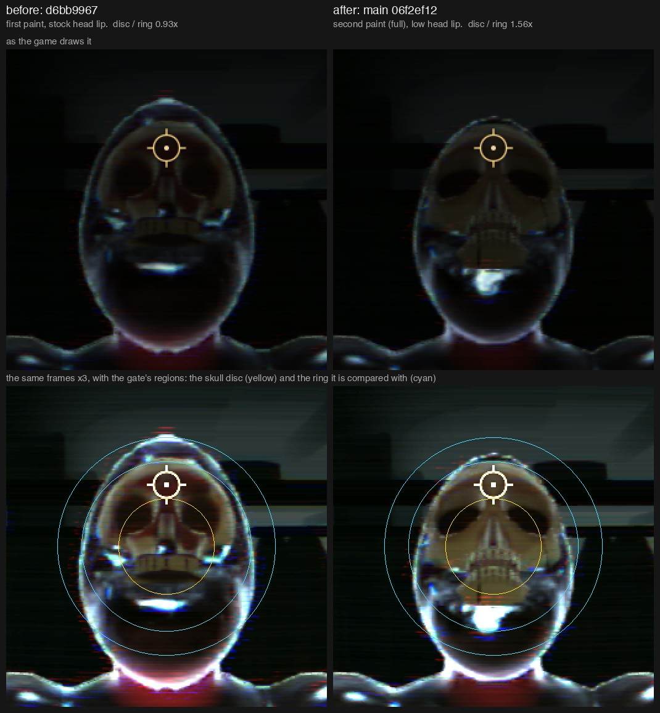
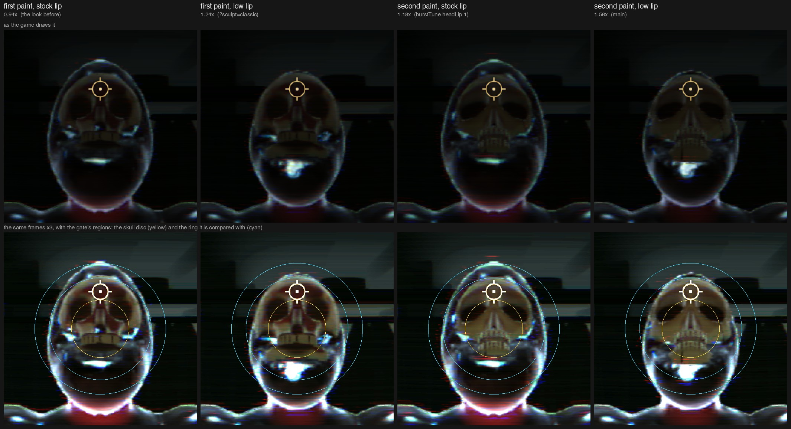

# The light gate's "skull glows in the dark" check after the skull stack (2026-10-08)

`scripts/sdf-game-light-gate.mjs` failed on main at `06f2ef12`, after PRs 32, 33 and 39 (the anatomical skull, its
split, the sculpted skull `full`) merged:

```
FAIL: skull glows in the dark: skull 0.083 vs surrounding flesh 0.053 (1.56x > 1.5x)
```

**The skull does not glow.** Its dark-room response is what it was. The number moved for two reasons that are not
lighting, the bound was re-derived (1.5 to 2.0), and the gate passes. No game code changed. The look is the owner's
to judge on the frames below.

## The frames



The gate's own scene: the dark coat check on Night Train (its lamps dead, nothing picks the body), the nearest zombie's
face opened by one slug (`hitMeshSkull`), seen from 0.9 m, no flash. Left, the commit before the skull stack
(`d6bb9967`). Right, main. The top row is as the game draws it. The bottom row is the same frames at three times the
brightness, with the two regions the check compares: the skull disc (yellow) and the ring round it (cyan).



The same scene with the two changes made one at a time, all on main.

## What the check measures, and what moved

The check (shared light list, Task 11b) is for one bug: the bone's ambient was seeded once at spawn and did not
follow its room, so a skull stayed pale in a body gone dark. The fix scales the bone ambient by the body's room
fill (0.25 with every lamp dead). The check takes the mean of a disc inside the skull, the mean of a ring outside it,
and holds disc / ring under a bound. It was calibrated at 1.18x with a bound of 1.5x; the bug read 1.73x.

Two changes of 2026-10-07 moved the ratio, each by about 1.3x:

| | Stock head lip | Low head lip (main) |
| --- | --- | --- |
| First paint (`?sculpt=classic`) | 0.067 / 0.071 = **0.94x** (`d6bb9967`: 0.067 / 0.072 = 0.93x) | 0.067 / 0.054 = **1.24x** |
| Second paint (`full`, the default) | 0.082 / 0.069 = **1.18x** | 0.083 / 0.053 = **1.56x** |

- **The ring is not flesh round a skull.** The gate calls it the hood ring, but the zombie has no hood: at these
  radii the ring holds the raised lip of the head's crater, the shoulders and the room behind them. A gun crater on a
  head keeps 0.3 of the stock lip since the gun and head rules (`head-burst.ts headLip`), so that the skull shows
  from the side. The head's outline is narrower and the ring lost most of its wet lip: 0.071 to 0.054, with the skull
  in the disc unchanged. (The stock lip on main is `__sdfGame.head.burstTune({ headLip: 1 })`.)
- **The second paint is paler bone.** Its notes say so: drier and more yellow, fewer blood blotches on a head. The
  disc reads 0.067 under the first paint and 0.083 under the second. `?sculpt=paint` (the first sculpt under the
  second paint) reads 1.58x and `?sculpt=shape-fine` (the second sculpt under the first paint) 1.07x: it is the
  paint, not the shape.

## Why this is not a glow

Measured on the bone's own pixels (the ones that change when the bone meshes are hidden in the same frame), in
linear light, on the 4,232 pixels of the disc that are bone under both paints:

| | First paint | Second paint | Second / first |
| --- | --- | --- | --- |
| Dark coat check | 0.0077 | 0.0090 | 1.18x |
| The same frame in the muzzle flash | 0.143 | 0.217 | 1.51x |
| Dark, bone ambient off (what does not follow the room: the fresnel rim) | 0.0038 | 0.0030 | 0.79x |
| Dark, fresnel off (what follows the room) | 0.0060 | 0.0068 | 1.14x |

- The second paint is paler in every light, and less so in the dark (1.18x) than in the flash (1.51x).
- The part of the skull's light that does not follow the room is the fresnel rim, which rides the key colour when
  nothing is picked. Flesh keeps the same rim in the dark on purpose (the pale wet outline in the frames). Under the
  second paint the skull's rim is smaller than under the first.
- Every bone instance carries the body's fill, 0.250, in every boot. The gate asserts it.
- With the bones hidden, the skull's pixels on main show the open head's wet inside and read 0.025: 2.7 times the
  skull that covers it.

The two "off" rows are mutations of `boneShade` made in copies of the tree, never in the working tree.

## The bound

`SKULL_FLESH_MAX` is 2.0 now. The reading on main is 1.54x to 1.56x over five boots (three of the whole gate, two of
this scene alone). The first calibration left 1.27 times its reading as headroom (1.5 / 1.18), and 1.56 x 1.27 is 2.0.

The bug the check exists for still fails it. With the bone ambient not following the room (`ambient * fill` made
`ambient` in a copy of the tree):

| | Reading | Under the bound of 2.0 |
| --- | --- | --- |
| Second paint (the default) | 0.161 / 0.054 = 2.99x | FAIL |
| First paint (`?sculpt=classic`) | 0.130 / 0.056 = 2.31x | FAIL |

The gate's own `?lightlist=0` boot (the old key path, which never had the fix and is left alone on purpose) reads
0.159 / 0.057 = 2.76x (2.75x in a second run). It is reported, not held.

The ratio will move again with any change to the head's lip or to the paint. `LIGHT_GATE_ONLY_SKULL=1` runs this
scene alone in about 30 s, `LIGHT_GATE_SKULL_QUERY='&sculpt=classic'` adds to its boot, and with `LIGHT_GATE_DEBUG=1`
it prints the disc and the ring split into the bone's pixels and the rest, which says which region moved.

## For the owner to judge

- **The skull is easier to see in a dark carriage than it was.** On screen the disc is a quarter brighter than under
  the first paint, and it is tan where the first paint was red-brown, so it reads as a pale face in a black head.
  That is the paint picked on 2026-10-07 in the light it gets with every lamp dead. If it should sit darker in the
  dark, the lever is the paint's head albedo (`sculpt-paint.ts`, `boneBase` and the brown mottling), which changes
  it in every light and moves the paint's pins.
- **The anatomical skull reads higher still.** The same scene under `?skull=anatomical` reads 0.097 / 0.052 = 1.86x
  on the zombie. The zombie does not draw the plates by default, but the eight ball-headed humanoids do. The plates
  go through the same shade and carry the same fill (the gate's fill assert passed in that boot); the atlas is paler.
  The gate measures no ball-headed character.

## Not done

- The ring was not redefined. A ring of the body's own flesh pixels (a march-debug mask, as section 7b takes the
  body) would stop the lip and the room behind the head from moving the ratio.
- A lit carriage was not measured on the same head. Under a third-class tube the slug opened a far smaller crater on
  that actor (166 to 391 bone pixels in the disc against 4,400 here), too few to compare.

## How it was run

```
export LAB_TMP=.lab-tmp LAB_VITE_PORT=5297 LAB_CDP_PORT=9297; . scripts/lab-servers.sh; trap lab_servers_down EXIT; lab_servers_up
node scripts/sdf-game-light-gate.mjs 5297 9297                                  # the whole gate
LIGHT_GATE_ONLY_SKULL=1 LIGHT_GATE_DEBUG=1 node scripts/sdf-game-light-gate.mjs 5297 9297   # this scene alone
```

`d6bb9967` was served from a second checkout on its own ports and driven by the same gate script.
