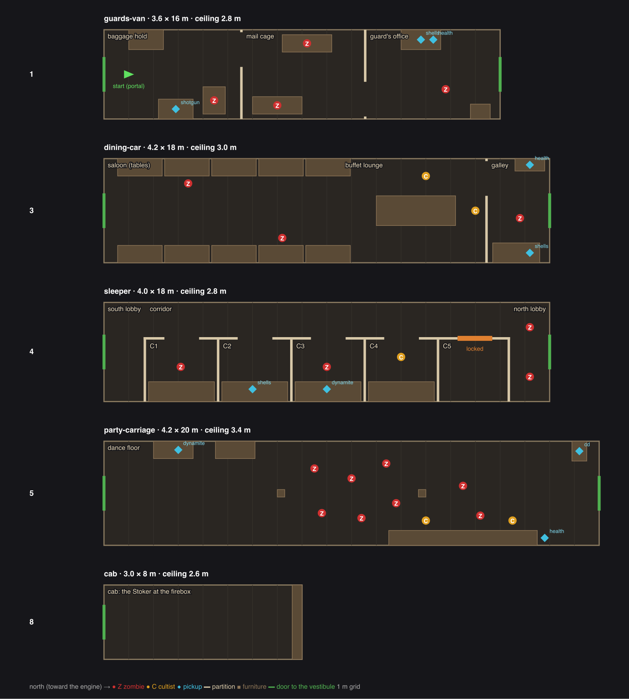

# Night Train: layout (first slice)

**Date:** 2026-09-25 · **Status:** draft 1 **approved by the owner 2026-09-25** (dynamite in C3, five compartments, three van rooms) · **Design:** [design.md](design.md)
· **Study:** [reference-study-re0.md](reference-study-re0.md) · **Guide:** [level design guide](../level-design-guide.md) §5
· **Kit:** [carriage kit spec](../../../superpowers/specs/2026-09-25-train-carriage-kit-design.md)

**Tables:** `scripts/levels/night_train_layout.py` holds them (the build script will read them);
`--json` writes a level file for the tests and `level_plan.py`, `--svg` draws the plan above.

## 0. The idea (owner, 2026-09-25)

RE0's train works because it is a **chain of distinct rooms**, not a tube: a side corridor,
compartments, a day room, a lounge. We cheat the same way. No one sees the train from outside,
so its inside can be wider and more divided than a real carriage. **Width is a pacing tool:**
tight rooms, then an open saloon, then a corridor, then the biggest open room, then the cab.

The first slice grows to five carriages: the **sleeper** (carriage 4) joins it.

## 1. Carriages

Each carriage is one level-format room (`shell: "art"`). Rooms inside a carriage are made with
**thin partitions** (0.1 m `solids` drawn by the kit), not separate level rooms: separate rooms
would need 0.6 m walls between them, which a carriage can't spare. Doorways are at least 1.4 m
(the enemy navigation minimum). Vestibules between carriages are 1.2 m long, 1.4 m wide, centred.

| # | Carriage | Width × length | Ceiling | Rooms inside (south to north) |
| --- | --- | --- | --- | --- |
| 1 | Guard's van | 3.6 × 16 m | 2.8 m | **baggage hold** (arrival) → door west → **mail cage** → door east → **guard's office** |
| 3 | Dining car | 4.2 × 18 m | 3.0 m | **saloon** (5 tables each side) → **buffet lounge** (a central island) → door west → **galley** |
| 4 | Sleeper | 4.0 × 18 m | 2.8 m | **south lobby** → a **side corridor** (west, 1.4 m) with **five compartments** C1–C5 (east, 2.5 m deep) → **north lobby** |
| 5 | Party carriage | 4.2 × 20 m | 3.4 m | one open room: favour tables (west), **dance floor**, two pillars, the **bar** (east), the jukebox (NW corner) |
| 8 | Cab | 3.0 × 8 m | 2.6 m | the Stoker at the firebox; the boiler backhead fills the north end |

Game z: the van's south end is z = 0; carriages run toward −z (van 0…−16, dining −17.2…−35.2,
sleeper −36.4…−54.4, party −55.6…−75.6, cab −76.8…−84.8).

## 2. Encounters (zombies and cultists)

| Where | Who | What wakes them | Teaches |
| --- | --- | --- | --- |
| Baggage hold | 1 zombie in the big trunk | the player passes it (trigger) | first bodies, the sawn-off (on the trunk opposite) |
| Mail cage | 2 zombies in coffins | entering the cage | close quarters, two at once |
| Guard's office | the guard (zombie), standing | sight | a clean shot at range |
| Saloon | 2 zombie waiters, seated | the first shot | crowds between tables |
| Buffet lounge | **2 cultists**: one behind the island, one at the lounge's west wall | line of sight on entering the lounge | **first firefight**: cover, the loop round the island |
| Galley | 1 zombie cook | noise | the back route |
| Sleeper C1, C3 | 1 zombie each, in the bunks | the player passing the door (trigger) | ambush from the side |
| Sleeper C4 | **1 cultist** | the player in the corridor | a shooter down a long corridor; compartments as cover |
| Sleeper north lobby | 2 zombies | the cultist's shots | mop-up |
| Party carriage | 8 dancers (zombies) + **2 cultists at the bar** | the first shot | everything together; circling the pillars |
| Cab | the Stoker (not an enemy) | — | the set piece (later) |

**Total:** 19 zombies (van 4, dining 3, sleeper 4, party 8), 5 cultists (the format's `cultist` spawn kind).

## 3. Sightlines (what each doorway shows first)

- **Arrival (hold):** the trunks, the shotgun on the east stack, the west doorway ahead.
- **Mail cage:** the coffins, the office doorway on the far (east) side: the path zig-zags.
- **Dining car:** the whole saloon to the buffet island and the first cultist behind it.
- **Sleeper:** the full corridor and its row of compartment doors; the C4 cultist steps out
  into it.
- **Party carriage:** the dance floor, the bar lit on the right, the jukebox glowing at the far end.
- **Cab:** the Stoker's back and the firebox glow.

## 4. Loops

- **The buffet island** (dining car): lanes 1.5 m each side, round the island: the firefight's
  circle.
- **The galley** is a second route from the lounge to the north door (lounge → galley → exit).
- **The two pillars** (party carriage): circle the dancers.
- The van and the sleeper are deliberately linear (close quarters, ambushes).

## 5. Secrets (first pass)

- **C5, the locked compartment:** holds the emergency brake cord and the under-bunk crawl
  (later, design §5.2, §9). Locked in the first slice.
- **The galley:** the design's claim ticket belongs here (later).

## 6. Pickups

| Where | What |
| --- | --- |
| Hold, on the east trunk stack | **sawn-off** (the player arrives with melee only) |
| Guard's office desk | shells, health |
| Galley | health, shells |
| Sleeper C2 | shells |
| Sleeper C3 | **the new weapon** (dynamite in the draft; see §8) |
| Party, a favour table | dynamite (party favours) |
| Party, behind the bar | health |
| Party, the jukebox | **the CD** (its pickup starts the pull-back, later) |

## 7. Checks (draft 1)

- The draft level file parses (`parseLevelJson`) and needs only the `art` capability.
- **Enemy navigation reaches every room** from the start, through all four vestibules, both
  lanes round the buffet island, and every compartment. (Moving the island 0.5 m north was
  needed: the last tables and the island pinched both lanes shut.)

## 8. Decisions (owner, 2026-09-25)

1. **The new weapon** in sleeper C3 is **dynamite** for now (the tommy gun as a player weapon
   is a later idea).
2. **Five compartments** in the sleeper, as drawn.
3. **Three rooms** in the guard's van, as drawn.
