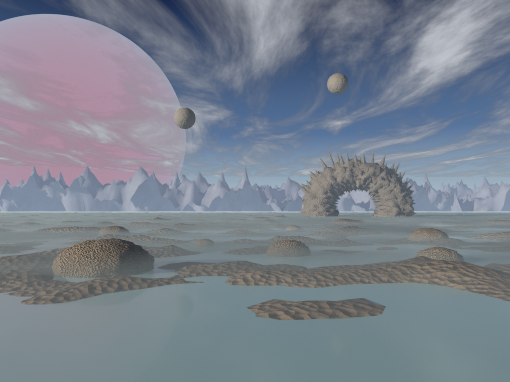

# Retro CGI recipes: the Bryce / POV-Ray look, and how to bring it into the game

**Date:** 2026-10-01 · **Source:** look-dev for the Flat's window view, after the owner's references (a Bryce render of
a gas giant over a rocky sea, the CS 348B and IRTC stills). **Status:** reference notes. The owner liked the rock, the
sand, the spiky arch and the skies, and wants them usable in the game.
**Scripts and frames:** [`docs/dev-notes/2026-10-01-flat-emergence-lookdev/`](../dev-notes/2026-10-01-flat-emergence-lookdev/)
(`bryce.py` is the one to start from; `PREVIEW=1` renders 400 × 300 at 16 samples in seconds).

## Why it reads as 90s and not as a modern landscape

The first attempt (physical sky, volumetric clouds, AgX tone mapping) read as "a landscape". What made it read as Bryce
was doing what Bryce did, not what reality does:

1. **The sky is painted**, not simulated: a gradient with a sun glow, a disc, a few stars.
2. **Clouds are flat, textured layers**, noise stretched along one axis into streaks.
3. **Every surface is procedural with heavy bump**: two-tone noise colour, a bump from noise plus Voronoi. Slightly too
   clean, slightly repetitive.
4. **Haze is a colour mixed in by distance**, and **fog is a colour mixed in by height**, both emissive, both per
   surface. No volumetric scattering needed for the look.
5. **Fantastical primitives**: a giant banded planet, floating spheres, a torus with cones along it. Arranged, not
   grown.
6. **Display: "Standard", not AgX or Filmic.** The modern tone mappers desaturate and soften; the period look has clipped,
   saturated colour. Expose a little low (−0.15 to −0.35) and let the highlights clip.
7. **A low, raking sun** for long shadows on the bump; few lights; no soft bounce to speak of.

## The recipes (values from `bryce.py`)

### The painted sky

- **Gradient** on the view direction's height (world `Generated` z): horizon `(0.68, 0.80, 0.80)` (the fog's milk, so the
  sea fades into the sky seamlessly), 0.05 `(0.45, 0.58, 0.68)`, 0.2 `(0.12, 0.22, 0.42)`, zenith at 0.5
  `(0.01, 0.025, 0.09)`.
- **Sun glow and disc** from `dot(view, sunDir)`: the glow maps 0.90 → 1.0 (smootherstep) and adds a warm
  `(1.0, 0.7, 0.35)`; the disc maps 0.9993 → 0.9996 to 0..25 and adds `(1.0, 0.85, 0.6)`.
- **Stars:** a Voronoi distance at scale 260, mapped 0.035 → 0 to 0..3, times the view height (none at the horizon),
  added white.

### Stratus streaks

A flat plane high up (z 2600 m, 60 × 40 km), emission plus transparency. The noise is stretched by a mapping with scale
`(14, 3.5, 1)` and a 12° rotation; noise scale 2, detail 10, roughness 0.62, distortion 0.6. Alpha maps 0.42 → 0.66;
emission strength maps 0.45 → 0.8 to 0.25 → 0.95, so thin parts are greyer (moody). Colour `(0.82, 0.86, 0.95)`. Turn
off its shadow.

### Bryce rock (the rock, the sand and the boulders)

One function, `rock(name, c0, c1, scale, bump)`:

- **Colour:** a noise (scale `scale`, detail 12, roughness 0.7) in object space mixes two tones `c0` → `c1`.
- **Relief:** the height is noise + Voronoi distance (Voronoi at `scale × 6`) into a bump node, strength `bump`, distance
  1.0. The Voronoi gives the pitted cells and the sand-ripple look at a grazing angle.
- **Roughness** 0.75.

| Use | c0 | c1 | scale | bump |
| --- | --- | --- | --- | --- |
| Near shelf ("sand") | (0.09, 0.07, 0.05) | (0.42, 0.34, 0.25) | 0.06 | 1.8 |
| Boulders | (0.14, 0.11, 0.08) | (0.48, 0.40, 0.30) | 0.25 | 1.0 |
| The arch | (0.10, 0.09, 0.08) | (0.32, 0.29, 0.25) | 0.05 | 1.4 |
| Moons | (0.12, 0.11, 0.10) | (0.42, 0.40, 0.38) | 0.03 | 1.2 |
| Far range | (0.12, 0.14, 0.20) | (0.40, 0.42, 0.50) | 0.004 | 0.6 |

### Terrain

- **The far range:** a grid (400 × 400 over 20 km) displaced by a legacy **MUSGRAVE, RIDGED_MULTIFRACTAL** texture with
  **GLOBAL** coordinates. Its `noise_scale` is in metres: **1600–2600 gives mountains; 5 gives a spiky crystal
  fringe** (the bug of the second Terragen attempt). Octaves 6–7, gain 2, offset 1, strength 900, `mid_level` 1.2 (median
  near sea level, peaks to about 700 m).
- **The near shelf:** a 3.6 km grid (420 × 420) displaced by a **CLOUDS** texture, noise scale 70 m, depth 6, strength
  46, `mid_level` 0.43, against water at z 4: about half the shelf breaks the surface. (HETERO_TERRAIN spikes far too high
  for this.)
- **Boulders:** subdivided icospheres squashed `(1.25, 1, 0.7)`, displaced by CLOUDS at 25 % of the radius, half
  sunk.

### The spiky arch

A torus (major 95 m, minor 34 m) stood upright, stretched 1.15 across, displaced by a ridged multifractal (noise scale
0.35, strength 20), and **26 cones** along its back (radius 6–12 m, 15–45 m long, tilted outward and up). Primitives,
arranged: the rule of the whole look, and an SDF natural (a torus smooth-unioned with cones).

### The gas giant and the moons

- **Planet:** a 9 km sphere 35 km away. A **wave texture, BANDS along Z**, scale 3, distortion 9, detail 8, detail scale
  2.5, into a ramp (plum `(0.55, 0.25, 0.45)`, red `(0.85, 0.22, 0.30)`, rose `(0.95, 0.60, 0.62)`, lavender
  `(0.45, 0.42, 0.75)`, pale `(0.92, 0.82, 0.90)`); a layer-weight rim fades it to the haze blue at the edge. Emission
  0.75, mixed 94 % with transparency so the sky shows faintly through.
- **Moons:** icospheres with CLOUDS displacement and the dark rock.

### Milky water

A plane at z 4: base `(0.40, 0.66, 0.66)`, roughness 0.3, coat 0.3, subsurface 0.4 (radius `(0.6, 1, 1)`), a noise bump
(scale 0.08, strength 0.35).

### Haze and altitude fog (`hazed()`)

Every landscape material is wrapped:

- **Haze:** `f = 1 − exp(−viewDistance / D)` mixes the surface toward an **emissive** haze colour `(0.42, 0.52, 0.66)`.
  D = 6 km near, 14 km for the far range.
- **Ground fog:** a second mix toward the milky fog colour `(0.60, 0.71, 0.74)` with
  `smoothstep(FOG_TOP=15 m → 3 m, z) × (1 − exp(−viewDistance / 700 m)) × bank`, where `bank` is a noise (scale 0.004 on
  world position) mapped to 0.55..1 so the fog lies in banks.
- **Wisps:** one thin volume slab on the water (z 3–21 m) with a stretched noise density (0..0.05), fading with height.
  Optional; the shader fog carries the look.

## Bringing it into the game

The game's rule is hand-written WGSL (or TSL) for rendering; level art comes from Blender through the kit pipeline.
Three routes, from cheapest:

1. **Bake the materials to tileable textures** (rock, sand, boulder, arch): Cycles bake of the colour and a normal map from
   the bump, on a tiling plane, into `assets-source/levels/kit-textures/` like the train kit's. Usable on level art at
   once; costs nothing at runtime. Best first step for "use the rock and sand in game".
2. **Port the procedural material to WGSL**: noise, Voronoi and a bump are a few functions; the two-tone mix and the bump
   recipe above are the whole material. Live, tunable, no texture memory, and it matches the SDF characters' procedural
   skin. The haze and the ground fog become a per-pixel term on level materials, or a depth-based post pass (distance from
   depth, height from the reconstructed world position).
3. **Skies:** the painted gradient, the sun, the stars, the stratus and the planet are all analytic, so they port to WGSL
   directly. Precedents: `webgpu/sky.wgsl.ts` (the sky) and `webgpu/train-window.wgsl.ts` (the train's window scenery).
   Or prerender panoramas in Blender for the Flat's window, period-correct and free at runtime.

The spiky arch and the boulders work as kit meshes with baked textures, or as SDF: a torus smooth-unioned with cones is
exactly the primitive language the characters already use.

## Gotchas found on the way

- Blender's **physical sky** went dark under a cloud deck: the sun sat behind it. A painted sky is easier to art-direct.
- **Legacy texture `noise_scale` with GLOBAL coordinates is in metres.** Mountain-scale features need values in the
  thousands.
- **AgX and Filmic** wash the period look out; use Standard.
- **Metaball ellipsoid sizes are relative multipliers**, not metres (from the goblin look-dev).
- **The glTF importer leaves objects in quaternion rotation mode**; `rotation_euler` is ignored until you switch the mode.
- Iterate with `PREVIEW=1` (seconds), and print terrain height bounds before rendering.
